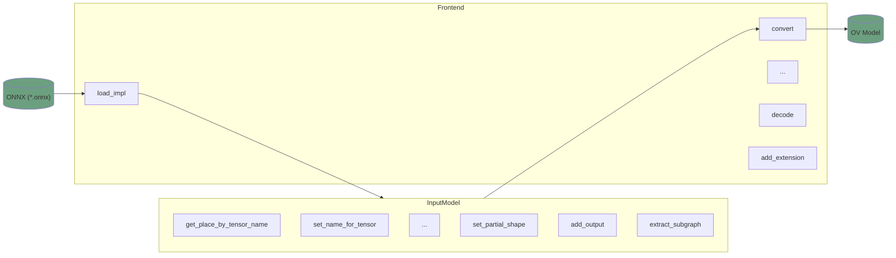

# OpenVINO ONNX Frontend

The main responsibility of ONNX Frontend is import of ONNX models and conversion of these into the `ov::Model` representation. 
Other capabilities of the ONNX Frontend:
* modification of tensors properties (like data type and shapes)
* changing topology of the models (like cutting subgraphs, inserting additional inputs and outputs)
* user-friendly searching the models (via tensors and operators names)

The component is written in `C++`, `Python` bindings are also available.
If you want to contribute, please follow [the common coding style rules](../../../docs/dev/coding_style.md).

## Key contacts

In case of any questions, review and merge requests, please contact [openvino-onnx-frontend-maintainers](https://github.com/orgs/openvinotoolkit/teams/openvino-onnx-frontend-maintainers) group.

## Components

ONNX Frontend implements an interface common for all frontends defined in [Frontends API](./src/frontends/common/include/openvino/frontend).
For backward compatibility reasons, the ONNX importer API (more lower-level abstraction approach) is still maintained. It can be found in [ONNX Importer](.src/frontends/onnx/frontend/include/onnx_import/onnx.hpp).

The crucial place in ONNX Frontend is [the directory](.src/frontends/onnx/frontend/src/op) where the operators are implemented. Each operator handler has to be registered in [ops bridge](.src/frontends/onnx/frontend/src/ops_bridge.cpp). More details about it you can find in [How to add an new operation](./docs/how_to_add_op.md). Expect that ONNX frontend has capabilities to register a custom op by a user. It can be achieved via [ConversionExtension](.include/openvino/frontend/onnx/extension/conversion.hpp).

API of ONNX Frontend can be called directly, but it is also used internally by [Model Optimizer](https://github.com/openvinotoolkit/openvino/tree/master/tools/mo) during ONNX to IR (Intermediate Representation) conversion. What's more capabilities of ONNX Frontend are used by [ONNX Runtime via OpenVINO Execution Provider](https://onnxruntime.ai/docs/build/eps.html#openvino).

ONNX Frontend is tested in many places (both `C++` and `Python` tests). More details about testing you can find in [ONNX FE tests](./docs/tests#places)

## Architecture
The overview of components responsible for the basic flow which is a model importing is shown on the diagram below:

## Tutorials
* [How to add an new operation](./docs/how_to_add_op.md)
* [How ONNX FE is tested](./docs/tests.md)

## See also
 * [OpenVINO™ README](../../../README.md)
 * [OpenVINO Core Components](../../README.md)
 * [Developer documentation](../../../docs/dev/index.md)
 * [ONNX standard repository](https://github.com/onnx/onnx/blob/main/README.md)
 * [ONNX operators list](https://github.com/onnx/onnx/blob/main/docs/Operators.md)
 * [ONNX Runtime OpenVINO Provider](https://github.com/microsoft/onnxruntime-openenclave/blob/openenclave-public/docs/execution_providers/OpenVINO-ExecutionProvider.md)
