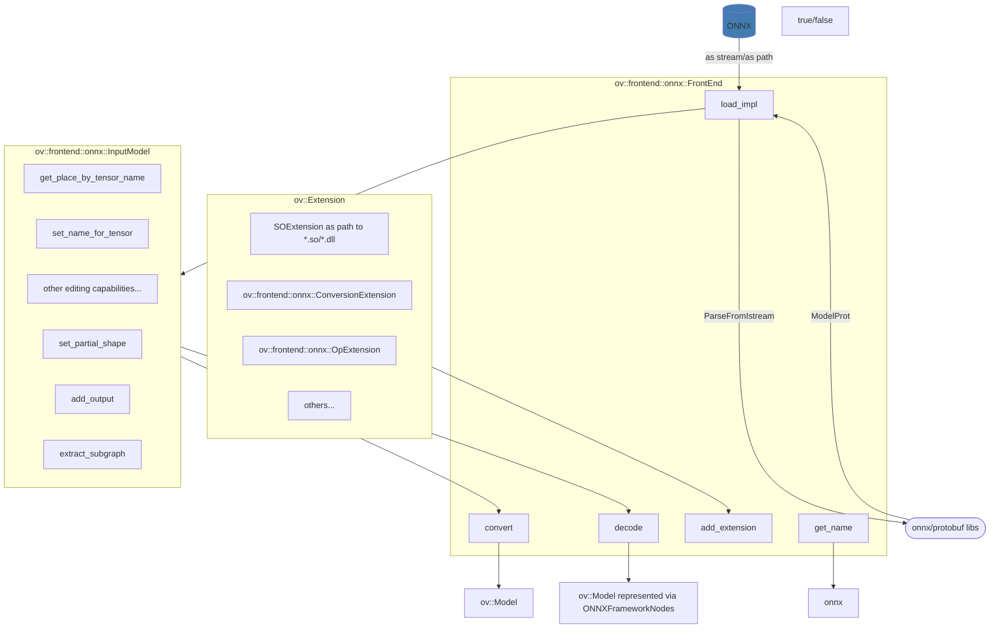

# ONNX Frontend architecture

The class diagram below shows the structure and relations between the basic classes of ONNX Frontend:

## See also
 * [OpenVINO ONNX Frontend README](../README.md)
 * [OpenVINO™ README](../../../../README.md)
 * [Developer documentation](../../../../docs/dev/index.md)