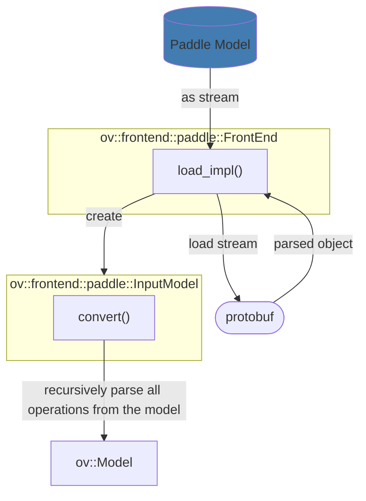

# OpenVINO™ Padddle Frontend Architecture

The diagram below shows the Paddle Frontend architecture and its interaction with OpenVINO Frontend API and Core APIs.

* The input to the Paddle Frontend is the PaddlePaddle protobuf model, and the output is the `ov::Model` which is semantically equivalent to the input.
* Paddle Frontend is the implementation of the OpenVINO Frontend, which implements two major interfaces. The first interface is `load` that reads the Paddle protobuf model and represents it to `InputModel` with `OpPlaces` and `TensorPlaces`. The second interface is `convert` that represents `InputModel` with `ov::Model` by semantically mapping these Places into OpenVINO opset.

## See also
 * [OpenVINO™ Paddle Frontend README](../README.md)
 * [OpenVINO™ Frontend README](../../README.md)
