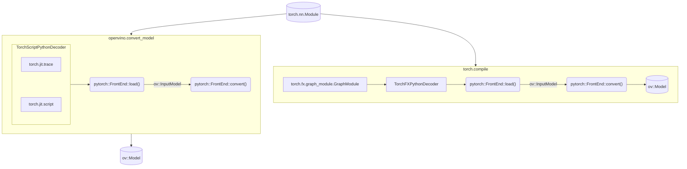

# OpenVINO PyTorch Frontend

The PyTorch Frontend (PT FE) is a C++ based OpenVINO Frontend component that is
responsible for reading and converting a PyTorch model to an `ov::Model` object
that further can be serialized into the Intermediate Representation (IR) format.

## Key contacts

People from the [openvino-pytorch-frontend-maintainers](https://github.com/orgs/openvinotoolkit/teams/openvino-pytorch-frontend-maintainers)
have the rights to approve and merge PRs to the PyTorch Frontend component.
They can assist with any questions about the component.

## Components

The structure of OpenVINO PyTorch Frontend sources includes the following
directories:

* [include](./include) is a public frontend API.
* [src](./src/) folder contains the sources of the component.

## Architecture

OpenVINO PyTorch Frontend is a C++ component that uses [TorchScriptPythonDecoder](../../bindings/python/src/openvino/frontend/pytorch/ts_decoder.py)
in Python code to parse PyTorch model from Python object. Usually frontend will
be used inside [openvino.convert_model](../../../tools/ovc) in Python code or inside
openvino backend in `torch.compile_model`, in which case `TorchFXPythonDecoder`
is used to decode `torch.fx.graph`. The whole workflow of model conversion
looks like the following diagram shows.



OpenVINO PyTorch Frontend supports extensions. To add an extension, use
`ov::frontend::pytorch::Frontend::add_extension()` API.
The next extension types are supported:

* `ov::frontend::tensorflow::ConversionExtension` or `ov::frontend::ConversionExtension` - add new Loader into the conversion pipeline
* `ov::TelemetryExtension` - enable telemetry for the frontend
* `ov::BaseOpExtension` - enable support of a custom operation
* `ov::detail::SOExtension` - allow to support `ov::BaseOpExtension` extensions loaded from the external library.

## How to implement support of a new PyTorch operation

PyTorch conversion into the OpenVINO opset operations consists of 2 stages:
1. Converting of pytorch operations to OpenVINO opset using [translators](./src/op/)
   which directly transforms PyTorch operation into a sub-graph of OpenVINO
   opset. This is 1->N conversion.
2. [Internal Transformations](./src/transforms), which transform sub-graph of
   operations into sub-graph of OpenVINO opset. This is N->N conversion.

### Operation translation

Most PyTorch operations can be converted by a single `translator`. The
dictionary of `translators` is placed in the [op_table.cpp](./src/op_table.cpp)
file and each translator is located in [op](../tensorflow_common/src/op/)
directory:

https://github.com/openvinotoolkit/openvino/blob/491454103ea2f29b242587c6084c19868a879a82/src/frontends/pytorch/src/op_table.cpp#L222-L227

The main rules for translator implementation:
1. Support dynamic shapes and ranks, undefined types, including for the future
   support of new types, such as strings and complex numbers.
2. Try to save the same algorithmic complexity of the decomposition. Less the
   number of operations is usually the better.
3. Use the latest OpenVINO opset version for the translation.
4. Use helpers routines for operation check and construction of a graph from `utils.hpp`.
5. Call `NodeContext::mark_mode()` for each node created.

#### Inplace and mutable operations

Some PyTorch operations modify input tensor rather then output. For example
`aten::add` writes result of addition to output, but `aten::add_` writes result
to its first input. To correctly convert such operation:
* Make sure output tensor produced by translation have same type and shape as initial input.
* Call `NodeContext::mutate_input()` to change input tensor with new value.

#### PtFrameworkNode primitive

`PtFrameworkNode` is used to represent unconverted operation from original
model. You can use `FrontEnd::convert_partially()` instead of `Frontend::convert()`
to get `ov::Model` containing unconverted operations.

#### Operations accepting strings

At the moment strings are not supported by OpenVINO core, fortunately in models
strings are usually constants, so we can extract them as `std::string` directly
from Python using `NodeContext::const_input<std::string>()`. 

#### Operations with lists, tuples, dicts

These types are also not supported by OpenVINO core and generally require
implementing transformation for N->N conversion, but in some simple cases lists
and tuples can be processed. There are helpers to work with lists in `utils.hpp`
for example `get_list_as_outputs` allows to get list elements to work with them
in translator or transformation.

### Internal Transformations

In rare cases, PyTorch operation conversion require transformation. The main
difference of transformation from translator is that it works on graph rather
then on `NodeContext` of a single operation. That mean that some functionality
provided by `NodeContext` is not accessible in transformation and usually
require to work with `PtFramworkNode` directly. [General rules](https://docs.openvino.ai/2023.1/openvino_docs_transformations.html)
to write transformations apply to PT FE transformations too.

### PyTorch Frontend layer tests

The layer tests are Python-based tests and check that a PyTorch operation is
supported by PT FE. The testing pipeline of the layer tests consists of four
steps:
1. Create a simple model containing PyTorch operation to test.
2. Convert this model into OpenVINO Model.
3. Infer the original model using PyTorch and infer OpenVINO Model.
4. Compare the inference results between both frameworks.

To set up environment for running the layer tests, follow these [instructions](../../../tests/layer_tests/README.md).

To test the whole suite of the PyTorch operation set support, run the following command:
```bash
python -m pytest layer_tests/pytorch_tests
```

## See also
 * [OpenVINO README](../../../README.md)
 * [OpenVINO Core Components](../../README.md)
 * [Developer documentation](../../../docs/dev/index.md)
