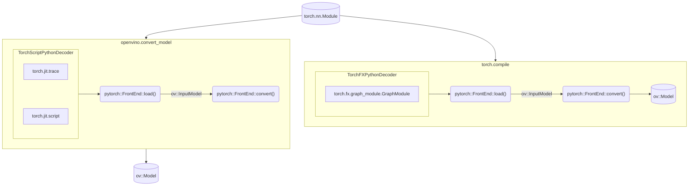

# OpenVINO PyTorch Frontend

The PyTorch Frontend (PT FE) is a C++ based OpenVINO Frontend component that is
responsible for reading and converting a PyTorch model to an `ov::Model` object
that can be further serialized into the Intermediate Representation (IR) format.

## Key Contacts

People from the [openvino-pytorch-frontend-maintainers](https://github.com/orgs/openvinotoolkit/teams/openvino-pytorch-frontend-maintainers)
have the rights to approve and merge PRs to the PyTorch Frontend component.
They can assist with any questions about the component.

## Components

The structure of OpenVINO PyTorch Frontend sources includes the following
directories:

* [include](./include) is a public frontend API.
* [src](./src/) folder contains the sources of the component.

## Architecture

OpenVINO PyTorch Frontend is a C++ component that uses [TorchScriptPythonDecoder](../../bindings/python/src/openvino/frontend/pytorch/ts_decoder.py)
in Python code to parse a PyTorch model from a Python object. Usually, the frontend is
used inside [openvino.convert_model](../../../tools/ovc) in Python code or inside
openvino backend in `torch.compile_model`, in which case `TorchFXPythonDecoder`
is used to decode `torch.fx.graph`. The entire model conversion workflow can be
represented by the following diagram.



OpenVINO PyTorch Frontend supports extensions. To add an extension, use
`ov::frontend::pytorch::Frontend::add_extension()` API.
The following extension types are supported:

* `ov::frontend::tensorflow::ConversionExtension` or `ov::frontend::ConversionExtension` - add a new Loader into the conversion pipeline.
* `ov::TelemetryExtension` - enable telemetry for the frontend.
* `ov::BaseOpExtension` - enable support for a custom operation.
* `ov::detail::SOExtension` - allow support for `ov::BaseOpExtension` extensions loaded from an external library.

## How to Implement Support for a New PyTorch Operation

PyTorch conversion into the OpenVINO opset operations consists of two stages:
1. Conversion of PyTorch operations to OpenVINO opset using [translators](./src/op/),
   which directly transforms a PyTorch operation into a sub-graph of the OpenVINO
   opset. This is a 1->N conversion.
2. [Internal Transformations](./src/transforms) that transform a sub-graph of
   operations into a sub-graph of the OpenVINO opset. This is an N->N conversion.

### Operation Translation

Most PyTorch operations can be converted by a single `translator`. The
dictionary of `translators` is placed in the [op_table.cpp](./src/op_table.cpp)
file and each translator is located in the [op](../tensorflow_common/src/op/)
directory:

https://github.com/openvinotoolkit/openvino/blob/491454103ea2f29b242587c6084c19868a879a82/src/frontends/pytorch/src/op_table.cpp#L222-L227

The main rules for translator implementation:
1. Support dynamic shapes and ranks, undefined types, including future support of new types, such as strings and complex numbers.
2. Try to maintain the same algorithmic complexity of the decomposition. Fewer operations are usually better.
3. Use the latest OpenVINO opset version for the translation.
4. Use helper routines for operation checks and graph construction from `utils.hpp`.
5. Call `NodeContext::mark_mode()` for each created node.

#### Inplace and Mutable Operations

Some PyTorch operations modify the input tensor rather than the output. For example,
`aten::add` writes the result of addition to the output, but `aten::add_` writes the result
to its first input. To correctly convert such an operation:
* Ensure that the output tensor produced by the translation has the same type and shape as the initial input.
* Call `NodeContext::mutate_input()` to change the input tensor with the new value.

#### PtFrameworkNode Primitive

`PtFrameworkNode` is used to represent unconverted operation from the original
model. You can use `FrontEnd::convert_partially()` instead of `Frontend::convert()`
to get an `ov::Model` containing unconverted operations.

#### Operations Accepting Strings

At the moment, OpenVINO core does not support strings. However, since strings in models are usually constants, you can extract them as `std::string` directly from Python using `NodeContext::const_input<std::string>()`. 

#### Operations with lists, tuples, dicts

These types are also not supported by OpenVINO core and generally require
implementing transformation for N->N conversion. However, in some simple cases, lists
and tuples can be processed. Helpers for working with lists can be found in `utils.hpp`.
For example, `get_list_as_outputs` enables you to get list elements to work with them
in the translator or transformation.

### Internal Transformations

In rare cases, converting PyTorch operations requires transformation. The main
difference between transformation and translation is that transformation works on the graph rather
than on the `NodeContext` of a single operation. This means that some functionality
provided by `NodeContext` is not accessible in transformation and usually
requires working with `PtFramworkNode` directly. [General rules](https://docs.openvino.ai/2023.2/openvino_docs_transformations.html)
for writing transformations also apply to PT FE transformations.

### PyTorch Frontend Layer Tests

The layer tests are Python-based tests that check if a PyTorch operation is
supported by PT FE. The testing pipeline of the layer tests consists of four
steps:
1. Create a simple model containing the PyTorch operation to be tested.
2. Convert this model into an OpenVINO Model.
3. Infer the original model using PyTorch and infer the OpenVINO Model.
4. Compare the inference results between both frameworks.

To set up the environment for running the layer tests, follow these [instructions](../../../tests/layer_tests/README.md).

To test the entire suite of the PyTorch operation set support, run the following command:
```bash
python -m pytest layer_tests/pytorch_tests
```

## See Also
 * [OpenVINO README](../../../README.md)
 * [OpenVINO Core Components](../../README.md)
 * [Developer documentation](../../../docs/dev/index.md)
