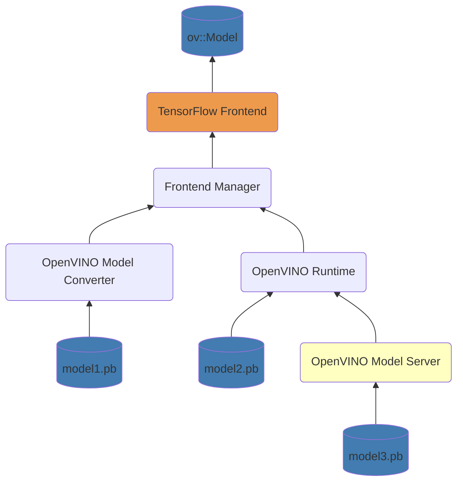
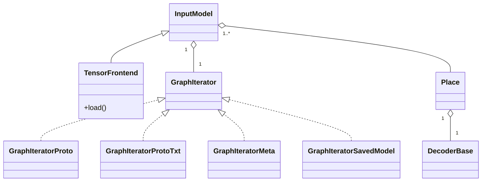
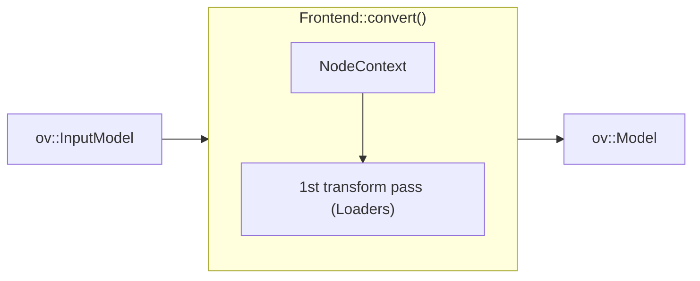

# OpenVINO TensorFlow Frontend

The TensorFlow Frontend (TF FE) is a C++ based OpenVINO Frontend component that is responsible for reading and converting a TensorFlow model to an `ov::Model` object
that further can be serialized into the Intermediate Representation (IR) format.
This is an internal API for OpenVINO that is used to implement user-facing API such as OVC tool, Model Conversion API, and OpenVINO Runtime `read_model` function
for reading TensorFlow models of the original format in run-time. Also, OpenVINO Model Server uses the frontend for serving models.
Regular users should not use the frontend directly.



The OVC tool and model conversion API now use the TensorFlow Frontend as the default path for conversion to IR.

## Key contacts

People from the [openvino-tf-frontend-maintainers](https://github.com/orgs/openvinotoolkit/teams/openvino-tf-frontend-maintainers) have the rights to approve and merge PRs to the TensorFlow Frontend component.
They can assist with any questions about the component.

## Components

The structure of OpenVINO TensorFlow Frontend sources includes the following directories:

* [include](./include) is a public frontend API.
* [src](./src/) folder contains the sources of the component.
* [tests](./tests) cover internal transformations.

Additionally, there is a shared [TensorFlow Common](../tensorflow_common) directory with same structure and purposes.
Its content depend only on common FrontEnd APIs thus is free to use in other FrontEnds.

## Architecture

OpenVINO TensorFlow Frontend uses [TensorFlow Protobuf files](./src/proto) to read and parse different TensorFlow model formats.
The whole workflow can be split into two steps: model loading and conversion.

During loading, the `FrontEnd::load()` method creates `InputModel` that encapsulates the `GraphIterator` object.
`GraphIterator` is a reader that iterates through the graph nodes in the topological order.
`GraphIterator::get_decoder()` provides a decoder for the current graph node to read its attributes.
Each TensorFlow model format has its implementation of `GraphIterator`. Currently, the frontend supports SavedModel, MetaGraph (`.meta`), and frozen protobuf (`.pb` and `.pbtxt`) formats.
The base class `GraphIteratorProto` is used for reading and parsing these formats. The architecture of the loading step is shown in the picture below:



After the loading step, `InputModel` includes a container of topologically sorted operation `Place` objects.
During conversion, each `Place` provides a `DecoderBase` object to retrieve attributes of the current operation to be transformed into the OpenVINO opset.
`Frontend` converts operations in topological order and requires `NodeContext` for the current operation node,
which includes `Decoder` and `OutputVector` inputs from already converted nodes.

The workflow of the conversion step is presented in the diagram below:



OpenVINO TensorFlow Frontend supports extensions. To add an extension, use `ov::frontend::tensorflow::Frontend::add_extension()` API.
The next extension types are supported:

* `ov::frontend::tensorflow::ConversionExtension` or `ov::frontend::ConversionExtension` - add new Loader into the conversion pipeline
* `ov::TelemetryExtension` - enable telemetry for the frontend
* `ov::BaseOpExtension` - enable support of a custom operation
* `ov::detail::SOExtension` - allow to support `ov::BaseOpExtension` extensions loaded from the external library.

## How to implement support of a new TensorFlow operation

TensorFlow conversion into the OpenVINO opset operation requires one pass or two passes:
* One pass using [Loaders](../tensorflow_common/src/op/) directly transforms TF operation into a sub-graph of OpenVINO opset.
* Two passes consist of [Loaders](../tensorflow_common/src/op/) and [Internal Transformations](../tensorflow_common/include/helper_transforms),
where the first pass transforms a TF operation into a sub-graph with [Internal Operations](../tensorflow_common/include/src/helper_ops),
and the second pass avoids internal operations. Two transformation passes are used when a TensorFlow operation
cannot be mapped into a sub-graph of the OpenVINO opset, and the conversion depends on the succeeding operations in the graph.

In most cases, it is sufficient to use just one pass for TensorFlow operation conversion.

### One transformation pass using Loader

Most TensorFlow operations can be converted by one transformation pass using `Loader`.
The dictionary of `Loaders` is placed in the [op_table.cpp](./src/op_table.cpp) file and loaders are in the [op](../tensorflow_common/src/op/) directory:

https://github.com/openvinotoolkit/openvino/blob/7f3c95c161bc78ab2aefa6eab8b008142fb945bc/src/frontends/tensorflow/src/op_table.cpp#L129-L134

Here is an example of `Loader` for TensorFlow `Einsum` operation:

https://github.com/openvinotoolkit/openvino/blob/7f3c95c161bc78ab2aefa6eab8b008142fb945bc/src/frontends/tensorflow/src/op/einsum.cpp#L15-L28

In this example, the loader checks the consistency of the operation by using `default_op_checks` and retrieves an attribute of the equation by using the `NodeContext::get_attribute()` method.
The loader uses [OpenVINO Core API](../../core/README.md) for building the OpenVINO sub-graph to replace the TensorFlow operation.

The support of a new TensorFlow operation requires implementing a new `Loader` in a separate file in the [op](../tensorflow_common/src/op/) directory and registering it into the dictionary of `Loaders`.

The main rules for loaders implementation:
1. Support dynamic shapes and ranks, undefined types, including for the future support of new types, such as strings and complex numbers.
2. Try to save the same algorithmic complexity of the decomposition.
3. Use information about operation types. For example, input data with an undefined rank to `Conv2D` must be of rank equal to 4.
4. Use the latest OpenVINO opset version for the transformation.
5. Preserve output tensor names.
6. Use helpers routines for operation check and construction of a graph from `util.hpp`.

### Two transformation passes using Loader and Internal Transformation

In rare cases, TensorFlow operation conversion requires two transformations (`Loader` and `Internal Transformation`).
In the first step, `Loader` must convert a TF operation into [Internal Operation](../tensorflow_common/helper_ops) that is used temporarily by the conversion pipeline.
The internal operation implementation must also contain the `validate_and_infer_types()` method as similar to [OpenVINO Core](https://docs.openvino.ai/2025/api/c_cpp_api/group__ov__ops__cpp__api.html) operations.

Here is an example of an implementation for the internal operation `SparseFillEmptyRows` used to convert Wide and Deep models.

https://github.com/openvinotoolkit/openvino/blob/7f3c95c161bc78ab2aefa6eab8b008142fb945bc/src/frontends/tensorflow/src/helper_ops/sparse_fill_empty_rows.hpp#L17-L55

In the second step, `Internal Transformation` based on `ov::pass::MatcherPass` must convert sub-graphs with internal operations into sub-graphs consisting only of the OpenVINO opset.
For more information about `ov::pass::MatcherPass` based transformations and their development, read [Overview of Transformations API](https://docs.openvino.ai/2025/documentation/openvino-extensibility/transformation-api.html)
and [OpenVINO Matcher Pass](https://docs.openvino.ai/2025/documentation/openvino-extensibility/transformation-api/matcher-pass.html) documentation.
The internal transformation must be called in the `ov::frontend::tensorflow::FrontEnd::normalize()` method.
It is important to check the order of applying internal transformations to avoid situations when some internal operation
breaks a graph pattern with an internal operation for another internal transformation.

## OpenVINO TensorFlow Frontend tests

There are two types of tests for the TensorFlow Frontend (TF FE): layer tests and unit tests.

The layer tests are used to validate support of TensorFlow operation by the frontend.

The unit tests cover TensorFlow format reading functionality, conversion pipeline, and internal transformations
for Transpose Sinking and conversion of sub-graphs with TF FE internal operations into the OpenVINO opset.

For operation conversion that requires just `Loader`, implement layers tests:
* For support of TensorFlow 1 operation: [TensorFlow 1 Layer Tests](../../../tests/layer_tests/tensorflow_tests)
* For support of TensorFlow 2 Keras operation: [TensorFlow 2 Keras Layer Tests](../../../tests/layer_tests/tensorflow2_keras_tests)

In case of two transformation passes using `Loader` and `Internal Transformation`, implement them in addition to the layer tests:
* [Unit tests](./tests) to cover the helper transformation

### How to build and run unit tests

For building the TF FE unit tests, use the CMake target `ov_tensorflow_frontend_tests`. CMake automatically runs
[generation scripts](./tests/test_models/gen_scripts) to create TensorFlow models used in the testing.

Once the build is complete, launch the `ov_tensorflow_frontend_tests` (`ov_tensorflow_frontend_tests.exe` for Windows)
executable file to run all tests for the TensorFlow Frontend. The unit tests use the GoogleTest framework for execution.

To get a tests coverage report for the TensorFlow Frontend, read the page
on [measuring coverage](../../../docs/dev/test_coverage.md).

### How to run TensorFlow Frontend layer tests

The layer tests are Python-based and check that a TensorFlow operation is supported by TF FE.
The testing pipeline of the layer tests consists of four steps:
1. Create a single-layer model with tested operation using TensorFlow.
2. Convert this model into IR with TF FE.
3. Infer the original model using TensorFlow and infer the IR model using OpenVINO.
4. Compare the inference results from both frameworks.

The layer tests include two suites for [TensorFlow 1](../../../tests/layer_tests/tensorflow_tests)
and [TensorFlow 2 Keras](../../../tests/layer_tests/tensorflow2_keras_tests) operation set support.

To set up environment for running the layer tests, follow these [instructions](../../../tests/layer_tests/README.md).

To test the whole suite of the TensorFlow 1 operation set support, run the following command:
```bash
py.test tensorflow_tests
```

The command line for one operation:
```bash
py.test tensorflow_tests/test_tf_Unique.py
```

## See also
 * [Supported Operations](./docs/supported_ops.md)
 * [OpenVINO README](../../../README.md)
 * [OpenVINO Core Components](../../README.md)
 * [Developer documentation](../../../docs/dev/index.md)
