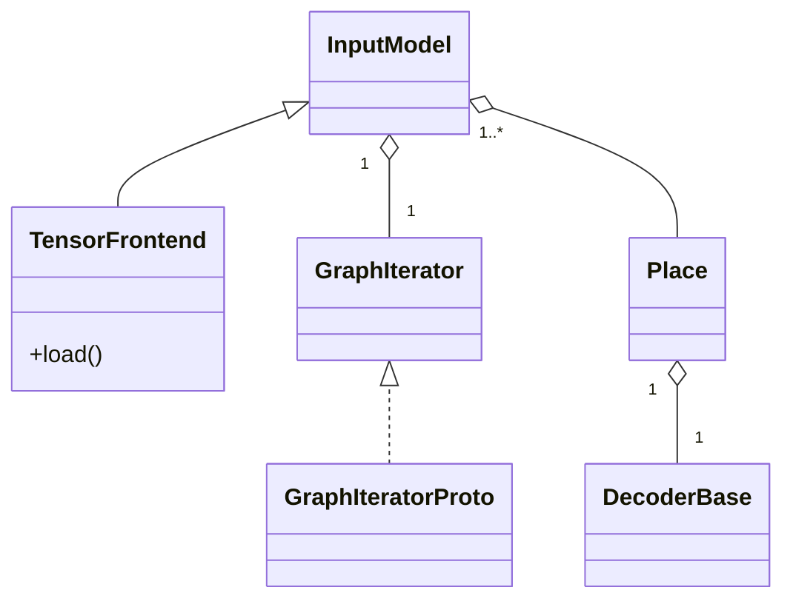
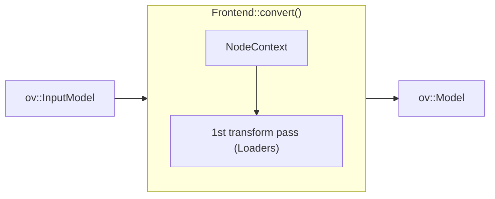

# OpenVINO TensorFlow Frontend

The TensorFlow Frontend (TF FE) is a C++ based OpenVINO Frontend component that is responsible for reading and converting a TensorFlow model to an `ov::Model` object
that further can be serialized into the Intermediate Representation (IR) format.

Currently, it is only used by [OpenVINO Integration with TensorFlow](https://github.com/openvinotoolkit/openvino_tensorflow).
Model Optimizer for now relies on the legacy [TensorFlow Frontend] (https://docs.openvino.ai/latest/openvino_docs_MO_DG_prepare_model_convert_model_Convert_Model_From_TensorFlow.html) developed in Python.

## Key contacts

People from the [openvino-tf-frontend-maintainers](https://github.com/orgs/openvinotoolkit/teams/openvino-tf-frontend-maintainers) have the rights to approve and merge PRs to the TensorFlow Frontend component.
They can assist with any questions about the component.

## Components

The structure of OpenVINO TensorFlow Frontend sources includes the following directories:

* [include](./include) is a public frontend API.
* [src](./src/) folder contains the sources of the component.
* [tests](./tests) cover internal transformations.

## Architecture

OpenVINO TensorFlow Frontend uses [TensorFlow Protobuf files](./src/proto) to read and parse different TensorFlow model formats.
The whole workflow can be split into two steps: model loading and conversion.

During loading, the `FrontEnd::load()` method creates `InputModel` that encapsulates the `GraphIterator` object.
`GraphIterator` is a reader that iterates through the graph nodes in the topological order.
`GraphIterator::get_decoder()` provides a decoder for the current graph node to read its attributes.
Each TensorFlow model format has its implementation of `GraphIterator`. Currently, the frontend supports only binary frozen format `.pb`,
and `GraphIteratorProto` is used for reading and parsing this format. The architecture of the loading step is shown in the picture below:

After the loading step, `InputModel` includes a container of topologically sorted operation `Place` objects.
During conversion, each `Place` provides a `DecoderBase` object to retrieve attributes of the current operation to be transformed into the OpenVINO opset.
`Frontend` converts operations in topological order and requires `NodeContext` for the current operation node,
which includes `Decoder` and `OutputVector` inputs from already converted nodes.

The workflow of the conversion step is presented in the diagram below:

OpenVINO TensorFlow Frontend supports extensions. To add an extension, use `ov::frontend::tensorflow::Frontend::add_extension()` API.
The next extension types are supported:

* `ov::frontend::tensorflow::ConversionExtension` or `ov::frontend::ConversionExtension` - add new Loader into the conversion pipeline
* `ov::TelemetryExtension` - enable telemetry for the frontend
* `ov::BaseOpExtension` - enable support of a custom operation
* `ov::detail::SOExtension` - allow to support `ov::BaseOpExtension` extensions loaded from the external library.

## Tutorials

 * [How to implement support of a new TensorFlow operation](./docs/support_new_op.md)
 * [OpenVINO TensorFlow Frontend tests](./docs/tests.md)

## See also
 * [OpenVINO README](../../../README.md)
 * [OpenVINO Core Components](../../README.md)
 * [Developer documentation](../../../docs/dev/index.md)
