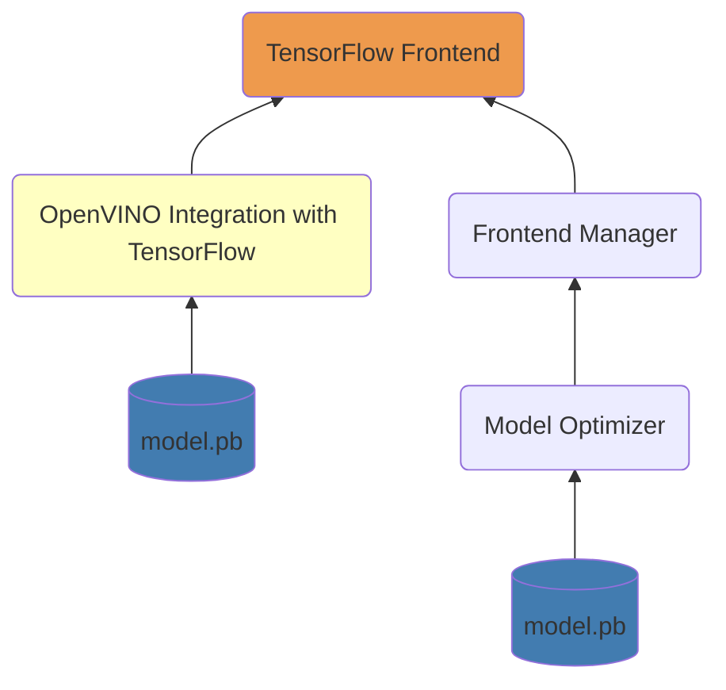

# OpenVINO TensorFlow Frontend

The TensorFlow Frontend (TF FE) is a C++ based OpenVINO Frontend component that is responsible for reading and converting TensorFlow models to the Intermediate Representation (IR) format.

Currently, it is only used by [OpenVINO Integration with TensorFlow Frontend](https://github.com/openvinotoolkit/openvino_tensorflow).
Model Optimizer for now relies on the legacy TensorFlow Frontend developed in Python.

TensorFlow Frontend uses [the common coding style rules](../../../docs/dev/coding_style.md).

## Key contacts

People from the [openvino-tf-frontend-maintainers](https://github.com/orgs/openvinotoolkit/teams/openvino-tf-frontend-maintainers) have the rights to approve and merge PRs to the TensorFlow Frontend component.
They can assist with any questions about the component.

## Components

The structure of OpenVINO TensorFlow Frontend sources includes the following directories:

* [include](./include) is a public frontend API.
* [src](./src/) folder contains the sources of the component.
* [unit tests](./tests) cover the internal transformations.

## Architecture

OpenVINO TensorFlow Frontend uses [TensorFlow Protobuf files](./src/proto) for reading and parsing TensorFlow model formats.

The conversion of the TensorFlow operation requires either one pass using [Loaders](./src/op) or two transformation passes
using [Loaders](./src/op) and [Internal Transformation](./src/helper_transforms).
It is often sufficient to use only [Loaders](./src/op). Two transformation pass is used when some TensorFlow operation cannot be mapped into a sub-graph of OpenVINO opset
and its conversion depends on the succeeding operations in the graph.

Read [TensorFlow Frontend Architecture and Workflow](./docs/architecture.md) for a detailed explanation of the component.

## Tutorials

 * [How to implement support of a new TensorFlow operation](./docs/contribute.md)
 * [OpenVINO TensorFlow Frontend tests](./docs/tests.md)

## See also
 * [OpenVINO README](../../../README.md)
 * [OpenVINO Core Components](../../README.md)
 * [Developer documentation](../../../docs/dev/index.md)
