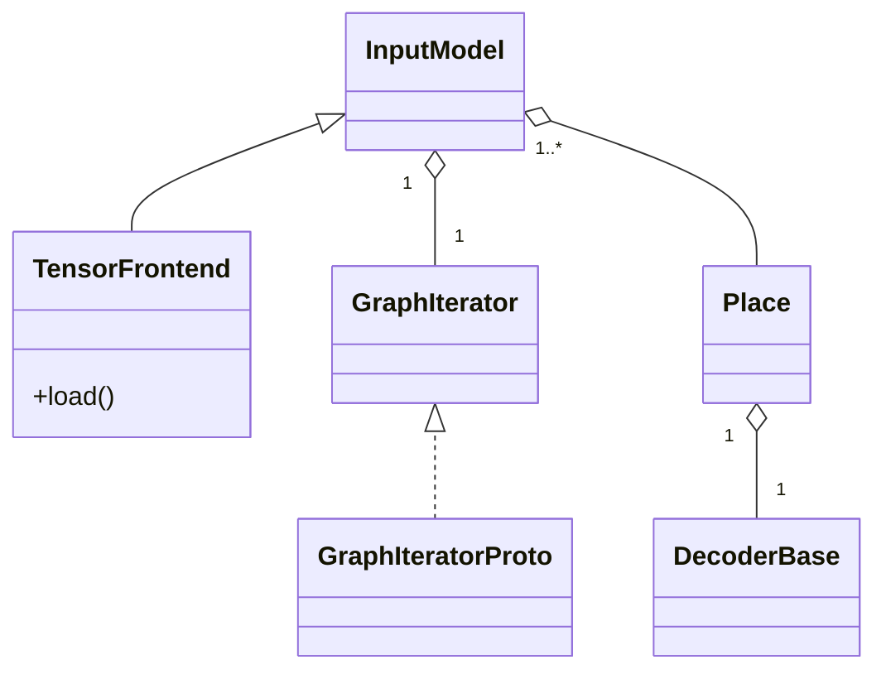
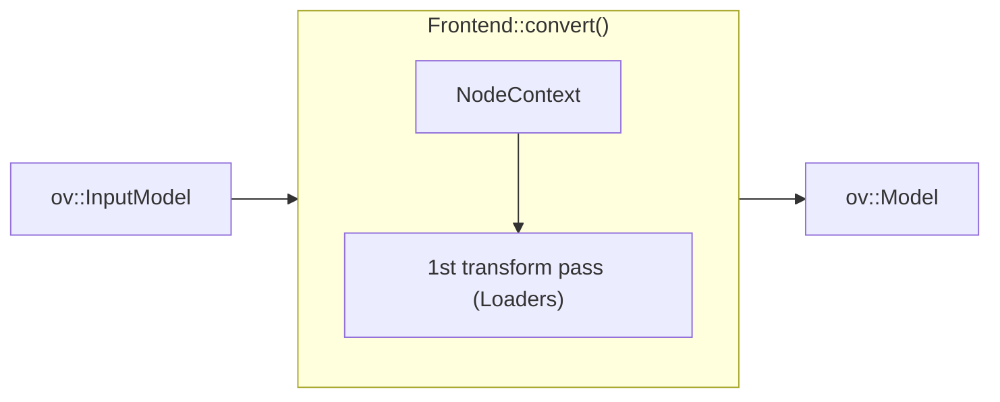

# OpenVINO TensorFlow Frontend Architecture and Workflow

OpenVINO TensorFlow Frontend uses [TensorFlow Protobuf files](../src/proto) to read and parse different TensorFlow model formats.
The whole workflow can be split into two steps: model loading and conversion.

```
ov::frontend::tensorflow::FrontEnd FE;
auto input_model = FE.load(ov::AnyVector{"model.pb"});
auto ov_model = FE.convert(inputModel);
```

During the loading the `FrontEnd::load()` method creates `InputModel` that encapsulates the `GraphIterator` object.
`GraphIterator` is a reader that iterates through the graph nodes in the topological order.
`GraphIterator::get_decoder()` provides a decoder for the current graph node to read its attributes.
Each TensorFlow model format has its implementation of `GraphIterator`. Currently, the frontend supports only binary frozen format `.pb`,
and `GraphIteratorProto` is used for reading and parsing this format. The architecture of the loading step is shown in the picture below:



After the loading step `InputModel` includes a container of topologically sorted operation `Place` objects.
During conversion, each `Place` provides a `DecoderBase` object to retrieve attributes of the current operation to be transformed into the OpenVINO opset.
`Frontend` converts operations in topological order and requires `NodeContext` for the current operation node,
which includes `Decoder` and `OutputVector` inputs from already converted nodes.

TensorFlow conversion into the OpenVINO opset operation requires one pass or two passes:
* One pass using [Loaders]((../src/op/)) directly transforms TF operation into a sub-graph of OpenVINO opset.
* Two passes consist of [Loaders](../src/op/) and [Internal Transformations](../src/helper_transforms),
where the first pass transforms a TF operation into a sub-graph with [Internal Operations](../src/helper_ops),
and the second pass avoids internal operations.

In the majority of cases, it is sufficient to use just one pass for TensorFlow operation conversion
The workflow of the conversion step is presented in the diagram below:



## Extensions

OpenVINO TensorFlow Frontend supports extensions. To add an extension, use `ov::frontend::tensorflow::Frontend::add_extension()` API.
The next extension types are supported:

* `ov::frontend::tensorflow::ConversionExtension` or `ov::frontend::ConversionExtension` - add new Loader into the conversion pipeline
* `ov::TelemetryExtension` - enable telemetry for the frontend
* `ov::BaseOpExtension` - enable support of a custom operation
* `ov::detail::SOExtension` - allow to support `ov::BaseOpExtension` extensions loaded from the external library.

## See also

 * [OpenVINO TensorFlow Frontend README](../README.md)
 * [OpenVINO™ README](../../../../README.md)
 * [Developer documentation](../../../../docs/dev/index.md)
