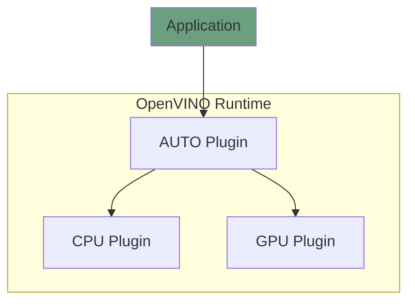

# OpenVINO™ AUTO Plugin

The main responsibility of the AUTO plugin is to provide a unified device that enables developers to code deep learning applications once and deploy them anywhere. 

Other capabilities of the AUTO plugin:
* Static device selection intelligently loads a network to one device or multiple devices
* CPU acceleration to start inferencing while the target device is still loading the network
* Model priority support for loading multiple networks to multiple devices

The component is written in `C++`. If you want to contribute to the AUTO plugin, follow [the common coding style rules](../../../docs/dev/coding_style.md).

## Key contacts

In case of any questions, review and merge requests, contact the [AUTO Plugin maintainer group](https://github.com/orgs/openvinotoolkit/teams/openvino-ie-auto-multi-maintainers) group.

## Components

AUTO plugin follow OpenVINO™ plugin architecture and consists of several main compoents:
* Plugin class
* Executable Network class
* Inference Request class
* Asynchronous Inference Request class

Please find more details in the [OpenVINO™ Plugin Developer Guide](https://docs.openvino.ai/latest/openvino_docs_ie_plugin_dg_overview.html).

`C++` tests are implemented for AUTO plugin. Read the [AUTO plugin tests](./docs/tests.md) page for more details. 

## Architecture
The diagram below shows an overview of the components responsible for the basic model importing flow:

Find more details in the [AUTO Plugin architecture](./docs/architecture.md) document.

## Tutorials
* [How AUTO Plugin is tested](./docs/tests.md)
* [How to integrate the new hardware plugin with AUTO plugin](./docs/integration.md)

## See also
 * [OpenVINO™ README](../../../README.md)
 * [OpenVINO Core Components](../../README.md)
 * [Developer documentation](../../../docs/dev/index.md)