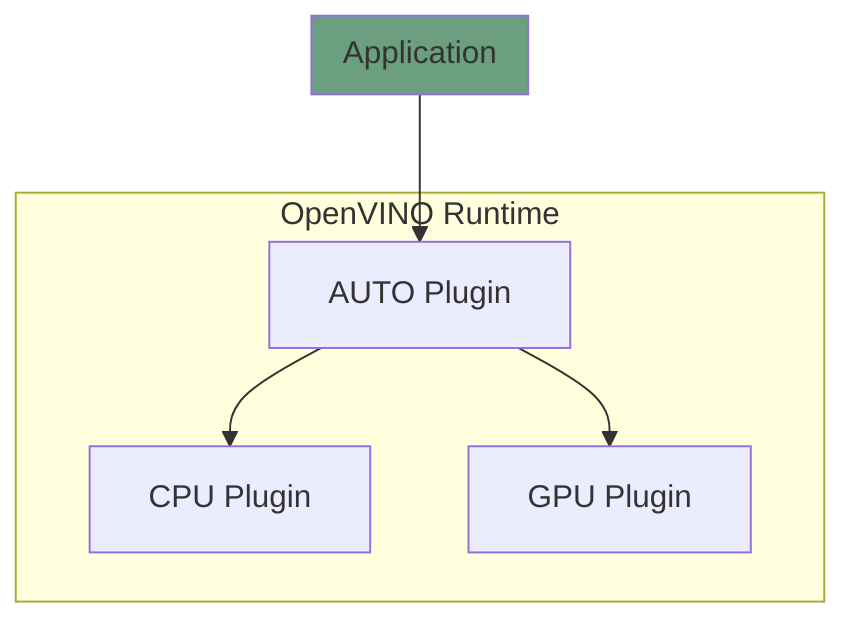

# OpenVINO™ AUTO Plugin

The main responsibility of the AUTO plugin is to provide a unified device that enables developers to code deep learning applications once and deploy them anywhere.

Other capabilities of the AUTO plugin include:
* Static device selection, which intelligently compiles a model to one device or multiple devices.
* CPU acceleration to start inferencing while the target device is still compiling the model.
* Model priority support for compiling multiple models to multiple devices.

The component is written in `C++`. If you want to contribute to the AUTO plugin, follow [the common coding style rules](../../../docs/dev/coding_style.md).

## Key contacts

In case of any questions, review and merge requests, contact the [AUTO Plugin maintainer group](https://github.com/orgs/openvinotoolkit/teams/openvino-ie-auto-multi-maintainers).

## Components

The AUTO plugin follows the OpenVINO™ plugin architecture and consists of several main components:
 * [docs](./docs) contains developer documentation for the AUTO plugin.
 * [src](./src/) - folder contains sources of the AUTO plugin.
 * [tests](./tests/) - tests for Auto Plugin components.

Learn more in the [OpenVINO™ Plugin Developer Guide](https://docs.openvino.ai/2025/documentation/openvino-extensibility/openvino-plugin-library.html).

## Architecture
The diagram below shows an overview of the components responsible for the basic inference flow:

Find more details in the [AUTO Plugin architecture](./docs/architecture.md) document.

## Tutorials
* [Testing the AUTO Plugin](./docs/tests.md)
* [Integrating a new hardware plugin with the AUTO plugin](./docs/integration.md)

## See also
 * [OpenVINO™ README](../../../README.md)
 * [OpenVINO Core Components](../../README.md)
 * [Developer documentation](../../../docs/dev/index.md)