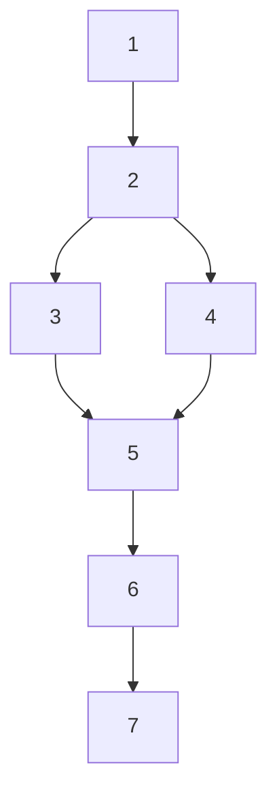

# OpenVINO Hetero Plugin Design Overview

## Subgraphs selection

Algorithm:

For each plugin
1. Select *root* node
    * A node not in a previously constructed subgraph
    * Affinity is equal to the plugin name
2. Select an adjacent node to any node in a present subgraph which is not on the *rejected* list
    * If there are no such nodes **end**
3. Verify that the selected node has the same affinity
4. Add a node to a subgraph if the check has been successful or add to the *rejected* list otherwise
5. Check a global condition
    * Nodes in the *rejected* list can never be added to a subgraph
    * Nodes not in a subgraph and not in the *rejected* list can possibly be added later
    * Check the subgraph topology (the only check now is whether there are no indirect subgraph self-references)
6. If a global condition has failed, remove the last node from a subgraph. Add it to the *rejected* list and go to step 5.
    * we can rollback multiple times here because rejected list is changed every time
7. Go to step 2

Example:

Nodes [1,2,3,5,6,7] are supported in the plugin, [4] is not

Possible roots: [1,2,3,5,6,7]
1. Select root [1]
    * Subgraph: [1]
    * Rejected: []
    * Global condition: ok
2. Merge [2]
    * Subgraph: [1,2]
    * Rejected: []
    * Global condition: ok
3. Merge [3]
    * Subgraph: [1,2,3]
    * Rejected: []
    * Global condition: ok
4. Merge [5]
    * Subgraph: [1,2,3,5]
    * Rejected: []
    * Global condition: There are possible self-references throughout a node [4] but they are not known yet, ok
5. Merge [6]
    * Subgraph: [1,2,3,5,6]
    * Rejected: []
    * Global condition: There are possible self-references throughout a node [4] but they are not known yet, ok
6. Merge [7]
    * Subgraph: [1,2,3,5,6,7]
    * Rejected: []
    * Global condition: There are possible self-references throughout a node [4] but they are not known yet, ok
7. Failed to merge [4]
    * Subgraph: [1,2,3,5,6,7]
    * Rejected: [4]
    * Global condition: There are self-references throughout a node [4], reject
8. Rollback [7]
    * Subgraph: [1,2,3,5,6]
    * Rejected: [4,7]
    * Global condition: There are self-references throughout a node [4], reject
9. Rollback [6]
    * Subgraph: [1,2,3,5]
    * Rejected: [4,6,7]
    * Global condition: There are self-references throughout a node [4], reject
10. Rollback [5]
    * Subgraph: [1,2,3]
    * Rejected: [4,5,6,7]
    * Global condition: ok
11. There are nodes to merge **end**

Possible roots: [5,6,7]
1. Select root [5]
    * Subgraph: [5]
    * Rejected: []
    * Global condition: ok
2. Merge [6]
    * Subgraph: [5,6]
    * Rejected: []
    * Global condition: ok
3. Merge [7]
    * Subgraph: [5,6,7]
    * Rejected: []
    * Global condition: ok
4. Merge [3]
    * Subgraph: [3,5,6,7]
    * Rejected: []
    * Global condition: ok
5. Merge [2]
    * Subgraph: [2,3,5,6,7]
    * Rejected: []
    * Global condition: There are possible self-references throughout a node [4] but they are not known yet, ok
6. Failed to merge [4]
    * Subgraph: [2,3,5,6,7]
    * Rejected: [4]
    * Global condition: There are self-references throughout a node [4], reject
7. Rollback [2]
    * Subgraph: [3,5,6,7]
    * Rejected: [2,4]
    * Global condition: ok
8. There are nodes to merge **end**

Possible roots: [] no roots, **END**

Subgraphs: [1,2,3], [3,5,6,7]

Select best subgraph:
* When there are multiple subgraphs, a larger one ([3,5,6,7]) is **always** selected.

Repeat previous steps with remaining nodes [1,2]

The final result is:
* First plugin: [3,5,6,7], [1,2]
* Second plugin: [4]

## Subgraphs self reference detection

1. For each node in a network build a list of reachable nodes (transitive closure).
2. For each pair of nodes in a subgraph find `path` nodes (nodes through one node in pair reachable to other).
    * assume `src` - one node in a pair, `dst` - other node in a pair
    * get all reachable nodes from `src`
    * in the nodes find nodes through which you can reach `dst`. These will be the `path` nodes.
3. Results for pairs are cached.
4. Check whether there is an intersection between `path` nodes set and rejected nodes set for each pair of nodes in a subgraph.
5. If an intersection happens, a self-reference occurs, and a subgraph is invalid.

## See also

 * [OpenVINO™ README](../../../README.md)
 * [OpenVINO Core Components](../../README.md)
 * [OpenVINO Plugins](../README.md)
 * [Developer documentation](../../../docs/dev/index.md)
