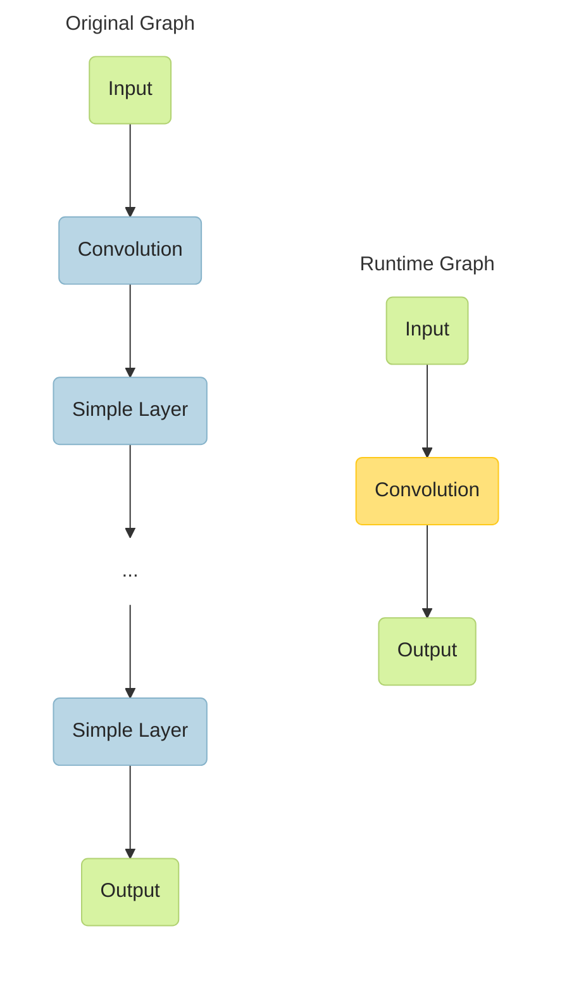
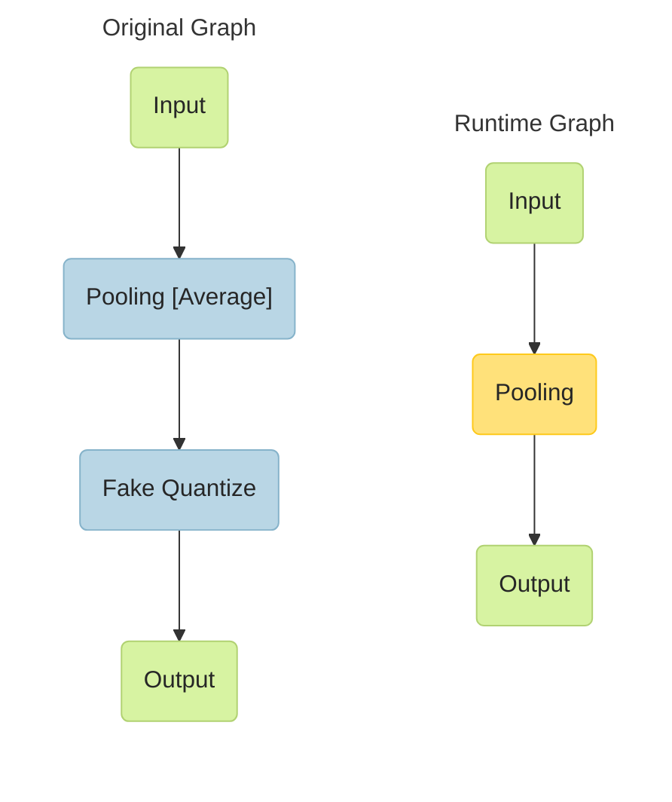
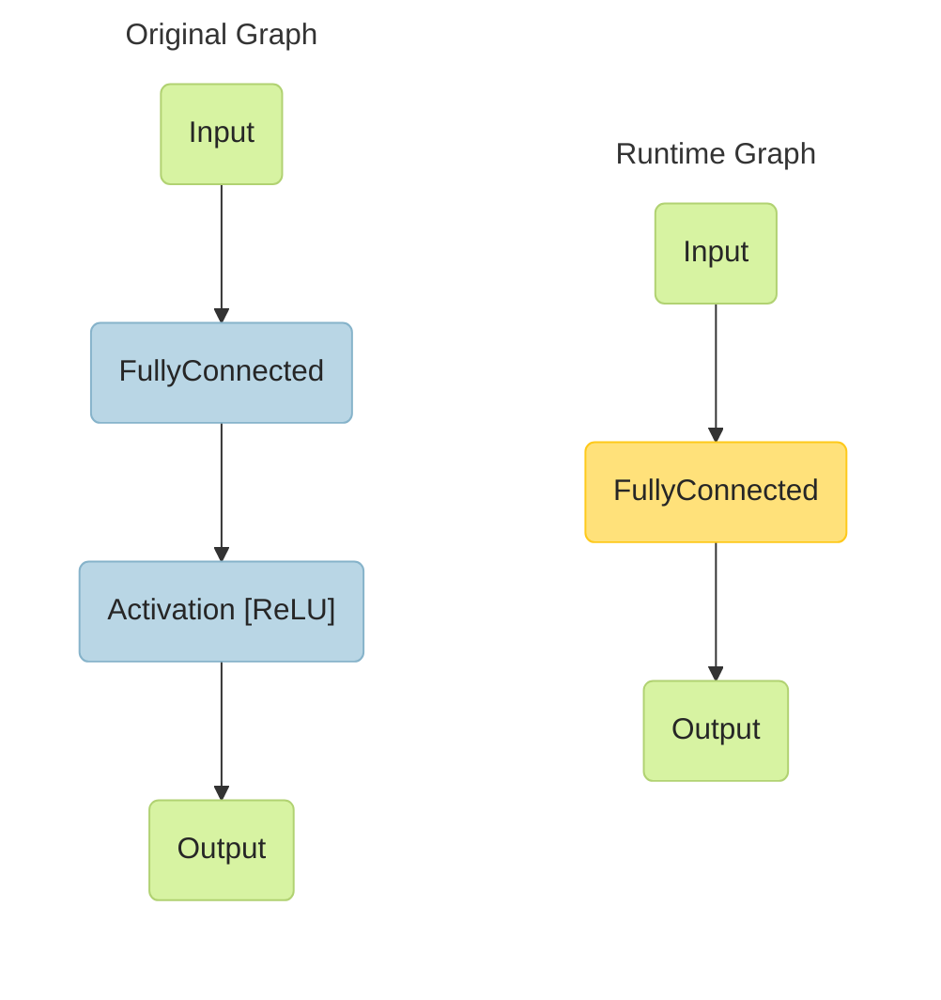
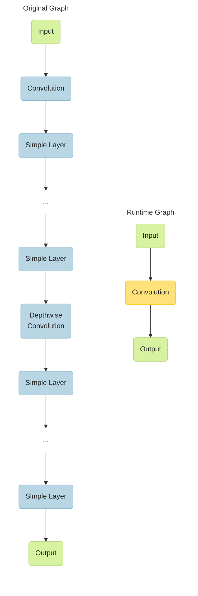
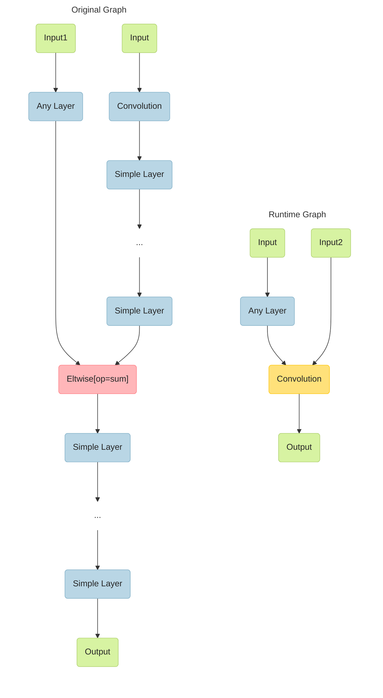
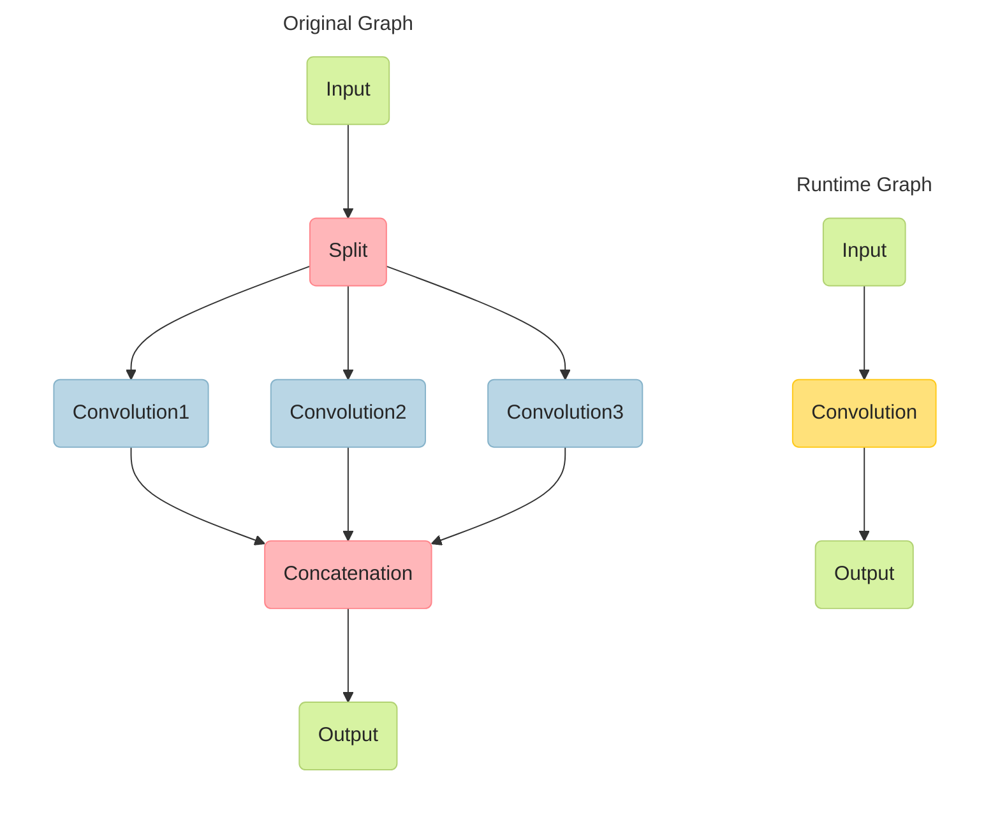

# Internal CPU Plugin Optimizations

The CPU plugin supports several graph optimization algorithms, such as fusing or removing layers.
Refer to the sections below for details.

> **NOTE**: For layer descriptions, see the [IR Notation Reference](https://docs.openvino.ai/2025/documentation/openvino-ir-format/operation-sets/available-opsets.html).

## Fusing Convolution and Simple Layers

Merge of a convolution layer and any of the simple layers listed below:
- Activation: ReLU, ELU, Sigmoid, Clamp
- Depthwise: ScaleShift, PReLU
- FakeQuantize

> **NOTE**: You can have any number and order of simple layers.

A combination of a convolution layer and simple layers results in a single fused layer called
*Convolution*:

## Fusing Pooling and FakeQuantize Layers

A combination of Pooling and FakeQuantize layers results in a single fused layer called *Pooling*:

## Fusing FullyConnected and Activation Layers

A combination of FullyConnected and Activation layers results in a single fused layer called
*FullyConnected*:

## Fusing Convolution and Depthwise Convolution Layers Grouped with Simple Layers

> **NOTE**: This pattern is possible only on CPUs with support of Streaming SIMD Extensions 4.2
> (SSE 4.2) and Intel AVX2 Instruction Set Architecture (ISA).

A combination of a group of a Convolution (or Binary Convolution) layer and simple layers and a group of a Depthwise Convolution
layer and simple layers results in a single layer called *Convolution* (or *Binary Convolution*):
> **NOTE**: Depthwise convolution layers should have the same values for the `group`, input channels, and output channels parameters.

## Fusing Convolution and Sum Layers

A combination of convolution, simple, and Eltwise layers with the sum operation results in a single layer called *Convolution*:

## Fusing a Group of Convolutions

If a topology contains the following pipeline, a CPU plugin merges split, convolution, and concatenation layers into a single convolution layer with the group parameter:

> **NOTE**: Parameters of the convolution layers must coincide.

## Removing a Power Layer

CPU plugin removes a Power layer from a topology if it has the following parameters:
  - <b>power</b> = 1
  - <b>scale</b> = 1
  - <b>offset</b> = 0

## See also

 * [OpenVINO™ README](../../../../README.md)
 * [OpenVINO Core Components](../../../README.md)
 * [OpenVINO Plugins](../../README.md)
 * [OpenVINO GPU Plugin](../README.md)
 * [Developer documentation](../../../../docs/dev/index.md)