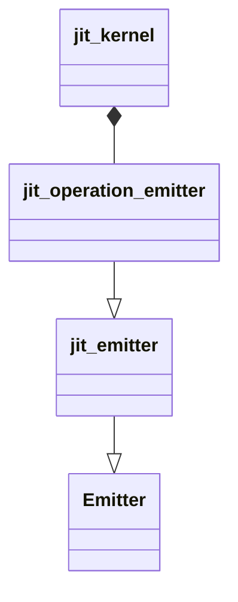
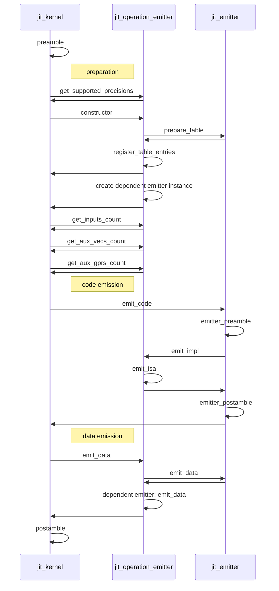

# JIT emitters

## Abstract

Emitter defines an interface for classes repsonsible for code emission. Emitters are designed to implement device specific Instruction Set Architecture (ISA) that might be used as common functions for complex primitives or building blocks for a tensor compiler.
Just-in-time (JIT) emitters is a type of emitter designed for just-in-time code generation. JIT emitters architecture involves the following basic principles:
 * Input and output arguments might be passed via register file, stack or immediates.
 * Callee (JIT Emitter) is required to preserve registers state which are out of arguments list, caller (e.g. JIT Kernel) is required to generate correct emitter call in accordance with its custom ABI.
 * JIT Emitters are designed as most efficient code generation basic blocks due to their ability to brake default ABI conventions and minimize (or even fully avoid) function call overheads.
 
For JIT source code generation `Xbyak JIT Assembler` is used:
 * [Xbyak for X64](https://github.com/herumi/xbyak)
 * [Xbyak for ARM64](https://github.com/fujitsu/xbyak_aarch64)

Emitters are splitted into two groups based on their usage model: common plugin emitters for complex kernels ([plugin emitters](https://github.com/openvinotoolkit/openvino/tree/master/src/plugins/intel_cpu/src/emitters/plugin)) and basic blocks for tensor compiler ([snippets emitters](https://github.com/openvinotoolkit/openvino/tree/master/src/plugins/intel_cpu/src/emitters/snippets)).

## Development

Each emitter is linked with OpenVINO operation. For example for `plugin emitters`:
 * Element-wise `plugin emitters` are linked in element-wise JIT kernel `jit_uni_eltwise_generic::create_eltwise_emitter` method which implementation depends on platform:
   * [X64 specific](https://github.com/openvinotoolkit/openvino/blob/master/src/plugins/intel_cpu/src/nodes/eltwise.cpp)
   * [ARM64 SIMD specific](https://github.com/openvinotoolkit/openvino/blob/master/src/plugins/intel_cpu/src/nodes/kernels/aarch64/jit_uni_eltwise_generic.cpp)

JIT emitters are inherited from `jit_emitter` base class. The base class implementation depends on architecture:
 * X64: [jit_emitter.hpp](https://github.com/openvinotoolkit/openvino/blob/master/src/plugins/intel_cpu/src/emitters/plugin/x64/jit_emitter.hpp)
 * ARM64: [jit_emitter.hpp](https://github.com/openvinotoolkit/openvino/blob/master/src/plugins/intel_cpu/src/emitters/plugin/aarch64/jit_emitter.hpp)

### Class diagram
JIT emitters should be inherited from `jit_emitter` base class and it's usage should be added in platform dependent JIT kernel.

### Sequential diagram

## Debugging

To start JIT emitter's source code debugging you should generate targets with `cmake` options:
   * `-DCMAKE_BUILD_TYPE=Debug`
   * `-DTHREADING=SEQ`

JIT source code debugging can be separated in two parts:
 1. JIT source code generation debugging. You can easily add breakpoint in JIT emitter `emit_impl` method and run code under a debugger.
 2. JIT source code execution debugging. Firstly, you can easily add breakpoint in appropriate platform dependent kernel before JIT generated code execution and run code under a debugger. JIT generated source code doesn't have debug symbols. As result, secondly, you need some additional steps to start JIT generated code debugging. Debugging steps depends on used IDE:
     * JetBrains CLion: [Debug disassembled code](https://www.jetbrains.com/help/clion/disassembly-view.html)
     * MS Visual Studio Code: [Visual Studio Code C++ July 2021 Update: Disassembly View, Macro Expansion and Windows ARM64 Debugging](https://devblogs.microsoft.com/cppblog/visual-studio-code-c-july-2021-update-disassembly-view-macro-expansion-and-windows-arm64-debugging/)
     * MS Visual Studio: [View disassembly code in the Visual Studio debugger](https://learn.microsoft.com/en-us/visualstudio/debugger/how-to-use-the-disassembly-window?view=vs-2022)

For additional debugging capabilities in `X64` you can use [register printer](https://github.com/openvinotoolkit/openvino/blob/master/src/plugins/intel_cpu/src/emitters/plugin/x64/utils.hpp). For additional details refer to `RegPrinter` class documentation.

## Tests

There are two types of tests instantiations which are used to test JIT emitters:
 * element-wise operations which are not used as activations: 
     * [platform independent element-wise operation tests](https://github.com/openvinotoolkit/openvino/blob/master/src/plugins/intel_cpu/tests/functional/custom/single_layer_tests/instances/common/eltwise.cpp)
     * [X64 specific element-wise operation tests](https://github.com/openvinotoolkit/openvino/blob/master/src/plugins/intel_cpu/tests/functional/custom/single_layer_tests/instances/x64/eltwise.cpp)
     * [ARM64 element-wise operation tests](https://github.com/openvinotoolkit/openvino/blob/master/src/plugins/intel_cpu/tests/functional/custom/single_layer_tests/instances/arm/eltwise.cpp)
 * element-wise operations which are used as activations: 
     * [platform independent activation operation tests](https://github.com/openvinotoolkit/openvino/blob/master/src/plugins/intel_cpu/tests/functional/custom/single_layer_tests/instances/common/activation.cpp)
     * [X64 activation operation tests](https://github.com/openvinotoolkit/openvino/blob/master/src/plugins/intel_cpu/tests/functional/custom/single_layer_tests/instances/x64/activation.cpp)
