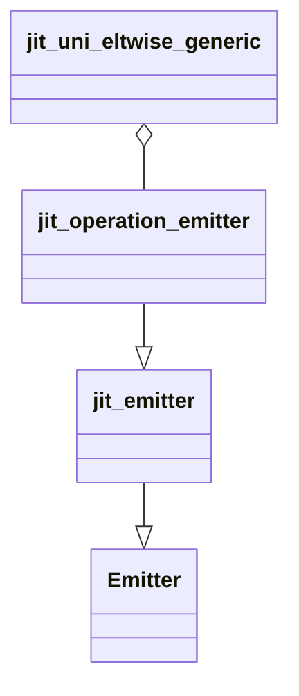
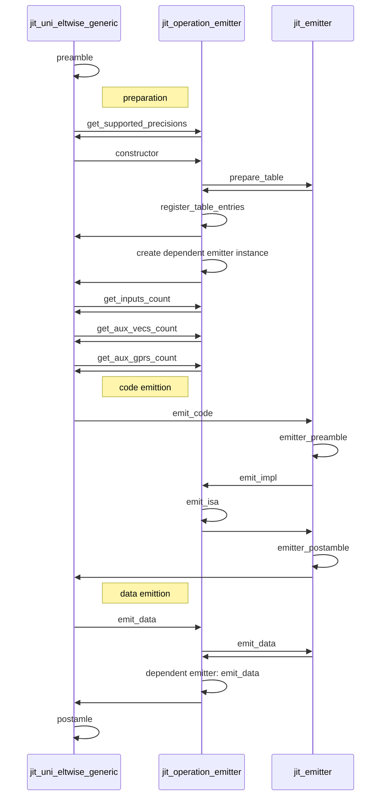

# CPU plugin JIT emitters

## Abstract
CPU plugin JIT emitters implement element-wise operations. The key features are:
 * implementation is based on just-in-time (JIT) code generation,
 * input and output data is stored in vector or scalar registers.
 
 Both features allows to use JIT emitters as pre or post-operations, fuse several emitters in one operation or in compilers approach frameworks.
 
For just in time source code generation `Xbyak JIT Assembler` is used:
 * [Xbyak for X64](https://github.com/herumi/xbyak)
 * [Xbyak for ARM64](https://github.com/fujitsu/xbyak_aarch64)

Emitter eimplementations are placed here: https://github.com/openvinotoolkit/openvino/tree/master/src/plugins/intel_cpu/src/emitters.  

There are two types of emitters:
 * [plugin emitters](https://github.com/openvinotoolkit/openvino/tree/master/src/plugins/intel_cpu/src/emitters/plugin)
 * [snippets emitters](https://github.com/openvinotoolkit/openvino/tree/master/src/plugins/intel_cpu/src/emitters/snippets)

Each emitter is linked with with OpenVINO operation:
 * plugin emitter is linked in JIT kernel `jit_uni_eltwise_generic::create_eltwise_emitter` method which implementation depends on platform:
   * [X64 specific](https://github.com/openvinotoolkit/openvino/blob/master/src/plugins/intel_cpu/src/nodes/eltwise.cpp)
   * [ARM64 SIMD specific](https://github.com/openvinotoolkit/openvino/blob/master/src/plugins/intel_cpu/src/nodes/kernels/aarch64/jit_uni_eltwise_generic.cpp)
 * snippet emitter is linked in [CPUTargetMachine](https://github.com/openvinotoolkit/openvino/blob/master/src/plugins/intel_cpu/src/emitters/snippets/x64/cpu_generator.cpp)

## Development

JIT emitters are inherited from `jit_emitter` base class. The base class implementation depends on architecture:
 * X64: [jit_emitter.hpp](https://github.com/openvinotoolkit/openvino/blob/master/src/plugins/intel_cpu/src/emitters/plugin/x64/jit_emitter.hpp)
 * ARM64: [jit_emitter.hpp](https://github.com/openvinotoolkit/openvino/blob/master/src/plugins/intel_cpu/src/emitters/plugin/aarch64/jit_emitter.hpp)

### Class diagram
JIT emitters should be inheritted from `jit_emitter` base class and it's usage should be added in `jit_uni_eltwise_generic` ARM64 kernel. 

### Sequential diagram

## Debugging

To start debugging JIT emitter's source code you should:
 * generate targets with `cmake` options:
   * `-DCMAKE_BUILD_TYPE=Debug`
   * `-DTHREADING=SEQ`
 * set breakpoint in ARM64 kernel `jit_uni_eltwise_kernel::operator()` method, line: `ker_(const_args, indexes);`

JIT code doesn't have C++ source code, as result you need some additional steps to debug. Debugging options depends on used IDE:
 * JetBrains CLion: [Debug disassembled code](https://www.jetbrains.com/help/clion/disassembly-view.html) 
 * MS Visual Studio Code: [Visual Studio Code C++ July 2021 Update: Disassembly View, Macro Expansion and Windows ARM64 Debugging](https://devblogs.microsoft.com/cppblog/visual-studio-code-c-july-2021-update-disassembly-view-macro-expansion-and-windows-arm64-debugging/)
 * MS Visual Studio: [View disassembly code in the Visual Studio debugger](https://learn.microsoft.com/en-us/visualstudio/debugger/how-to-use-the-disassembly-window?view=vs-2022)

## Tests

There are two types of tests instantiations which are used to test JIT emitters:
 * element-wise operations which are not used as activations: 
     * [platform independent element-wise operation tests](https://github.com/openvinotoolkit/openvino/blob/master/src/plugins/intel_cpu/tests/functional/custom/single_layer_tests/instances/common/eltwise.cpp)
     * [X64 specific element-wise operation tests](https://github.com/openvinotoolkit/openvino/blob/master/src/plugins/intel_cpu/tests/functional/custom/single_layer_tests/instances/x64/eltwise.cpp)
     * [ARM64 element-wise operation tests](https://github.com/openvinotoolkit/openvino/blob/master/src/plugins/intel_cpu/tests/functional/custom/single_layer_tests/instances/arm/eltwise.cpp)
 * element-wise operations which are used as activations: 
     * [platform independent activation operation tests](https://github.com/openvinotoolkit/openvino/blob/master/src/plugins/intel_cpu/tests/functional/custom/single_layer_tests/instances/common/activation.cpp)
     * [X64 activation operation tests](https://github.com/openvinotoolkit/openvino/blob/master/src/plugins/intel_cpu/tests/functional/custom/single_layer_tests/instances/x64/activation.cpp)
