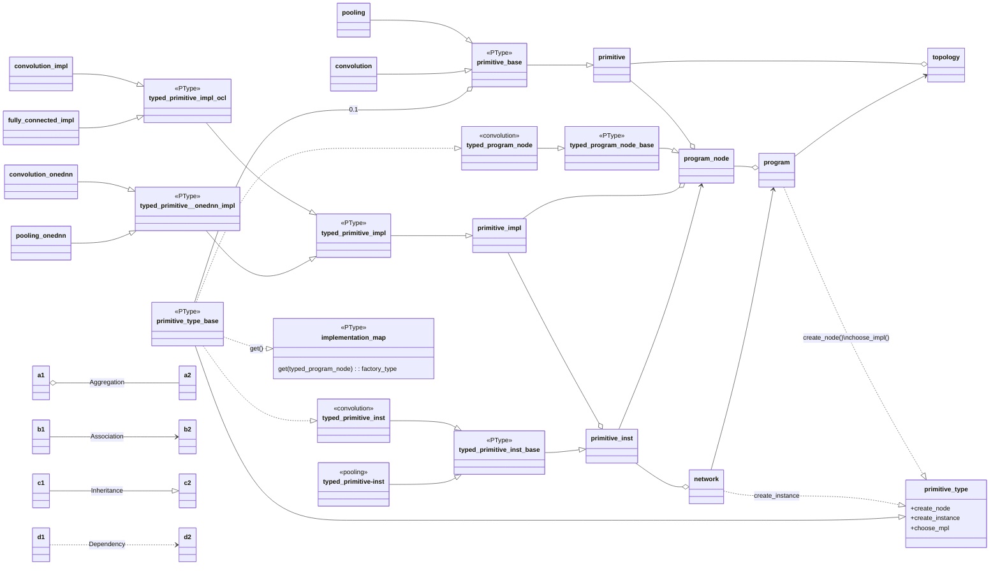

# Basic Data Structures of GPU Graph and Overall Flow

## Overall graph data structure
<a name="fig1"></a>



There are three levels of abstraction in the graph structures being used in the gpu plugin : *topology*, *program*, *network*. <br>
The above <a href="#fig1">figure</a> presents the overall data structures.

First, the original model should be presented as a corresponding *topology*, which consists of primitives and their connections. It can be regarded as a simple graph structure representing the original model.

Then the topology is to be converted to a *program*, which consists of *program_nodes* corresponding to the original primitives and their connections.
Here, the majority of the transformation and optimizations are performed on the *program*.
Also, the *primitive_impl* is created for each *program_node* at this stage, which holds the selected kernels for each *program_node* and the required information to run the kernels, such as work group sizes and kernel arguments, etc. The final source code of the kernels is decided and compiled at this stage, too.
Note that a *program* is common for the streams, that is, there is only one *program* created for all the streams.

Once the *program* is finalized, the *network* is built from the *program* for each stream.
A *network* consists of primitive instances (*primitive_inst*) that contain the required memory allocations for the kernels.
Finally, you can run the *network* using the `network::execute()` method.

A more detailed description of each component is described in the sections below.


## primitive
```cpp
struct primitive {
...
    const primitive_id id;
    const primitive_type* type;
    padding output_padding;
    std::vector<primitive_id> input;
...
};
```
A *primitive* is the primary representation of an operation in GPU plugin, which comprises a graph structure, that is, the *topology*. A *primitive* is to be created for a layer operation in the original model and holds the basic information about the operation, such as required input, output, attributes, as well as its own id (*primitive_id*). Here, the *primitive_id* is a unique string id assigned to each *primitive* throughout the processing. <br>

See the APIs of the available [primitives](https://github.com/openvinotoolkit/openvino/tree/master/src/plugins/intel_gpu/include/intel_gpu/primitives).<br>

An example creation of a `arg_max_min` primitive:
```cpp
cldnn::arg_max_min top_k_prim = cldnn::arg_max_min("top_k", { "input" }, arg_max_min::max, top_k, arg_max_min::y, arg_max_min::sort_by_values, false, "", padding(), data_types::f32);
```

In GPU plugin, the *primitives* are converted from OpenVINO [operations](https://github.com/openvinotoolkit/openvino/tree/master/src/plugins/intel_gpu/src/plugin/ops).

## topology
```cpp
struct topology{
...
    std::map<primitive_id, std::shared_ptr<primitive>> _primitives;
...
};
```

A *topology* is a graph structure consisting of *primitives* and their connections. Here, a connection is defined by input primitives assigned to a primitive.

A simple example of creating a topology, which consists of two poolings, one concatenation of the poolings, and a reorder primitive, is as follows:
```cpp
auto input0 = engine.allocate_memory({data_types::i8, format::bfyx, {1, 1, 8, 3}});
auto input1 = engine.allocate_memory({data_types::i8, format::bfyx, {1, 1, 8, 3}});
layout reorder_layout(data_types::i8, format::yxfb, {7, 2, 2, 1});
topology topology(input_layout("input0", input0->get_layout()),
                  input_layout("input1", input1->get_layout()),
                  pooling("pool0 /*primitive_id of this pooling*/", "input0 /*primitive_id of input primitive for pool0*/", pooling_mode::max, {1, 1, 2, 2}, {1, 1, 1, 1}),
                  pooling("pool1", "input1", pooling_mode::max, {1, 1, 2, 2}, {1, 1, 1, 1}),
                  concatenation("concat",
                                {"pool0", "pool1"},
                                concatenation::concatenation_axis::along_f,
                                data_types::i8,
                                "",
                                padding{{0, 0, 0, 0}, 0}),
                  reorder("reorder", "concat", reorder_layout));
```

In the example above, "pool0" is the *primitive_id* of the first pooling, and "input0" is the *primitive_id* of the input primitive of it. The  `pooling_mode::max, {1, 1, 2, 2}, {1, 1, 1, 1}` parameters stand for other properties for pooling: primitive, pooling_mode, tensor size, stride, respectively.

Note that topology is created from ngraph representation in the GPU plugin. Manual definition of a topology shown in the snippet above is usually for the purpose of a unit test.

## program_node (impl)

```cpp
struct program_node {
...
    program& myprog;
    std::unique_ptr<primitive_impl> selected_impl;
    layout output_layout;
    std::vector<program_node*> dependencies;
    std::list<program_node*> users;
    std::set<primitive_id> memory_dependencies;
    std::vector<fused_activation_params> fused_activations;
    std::vector<fused_primitive_desc> fused_prims;
...
};
```
A program consists of *program_nodes* which are created from primitives. ([link](https://github.com/openvinotoolkit/openvino/blob/4c01d6c50c6d314373dffd2a8ddbc294011b2508/src/plugins/intel_gpu/src/graph/program.cpp#L353)) A *program_node* is created by a factory for each *primitive type*, that is, *primitive_type*, which is associated to each primitive as a type ([link](https://github.com/openvinotoolkit/openvino/blob/173f328c53d39dd42ecdb9de9e04f9d2c266683f/src/plugins/intel_gpu/include/intel_gpu/primitives/primitive.hpp#L79)). Note that this *primitive_type* is used to create *primitive_inst* or call *choose_impl* too.

A *program_node* holds the following information which is to be decided throughout the transformation / optimization processes in a program:

* layout: output layout of a *program_node*. ([impl](https://github.com/openvinotoolkit/openvino/blob/master/src/plugins/intel_gpu/include/intel_gpu/runtime/layout.hpp))
* dependencies: a list of *program_nodes*, the outputs of which are used by the current *program_node* as the inputs
* memory dependencies : a list of *program_nodes*, the live ranges of their outputs of them overlap with that of the current *program_node*
* fused operations: fused operations to the current *program_node*
* selected impl: The *primitive_impl* object which holds the information for the selected kernel required to run it, such as the selected kernels, work group size, etc. Also, this object has the methods to set kernel arguments for a *primitive_inst* and execute the kernel by enqueueing it to the command queue.

## program (impl)

```cpp
struct program {
...
    uint32_t prog_id = 0;
    engine& _engine;
    std::unique_ptr<kernels_cache> _kernels_cache;
    std::list<program_node*> inputs;
    std::vector<program_node*> outputs;
    nodes_ordering processing_order;
    std::unique_ptr<pass_manager> pm;
    std::map<primitive_id, std::shared_ptr<program_node>> nodes_map;
...
};
```
The major tasks that are done while building a program are as follows:
([ref](https://github.com/openvinotoolkit/openvino/blob/4c01d6c50c6d314373dffd2a8ddbc294011b2508/src/plugins/intel_gpu/src/graph/program.cpp#L433))
* Init graph: Create an initial program consisting of *program_nodes* built from a given topology.
* Optimization (Major optimizations will be dealt with from another section TBD)
   * pre-optimization ([link](https://github.com/openvinotoolkit/openvino/blob/4c01d6c50c6d314373dffd2a8ddbc294011b2508/src/plugins/intel_gpu/src/graph/program.cpp#L474)): Optimizations done before *graph_compilation*. Notable passes are as follows:
        * *prepare_primitive_fusing*: decision of fusing
        * *reorder_inputs*: decision of preferred layout / impl (ocl vs onednn) and adding reorders w.r.t the decision
   * post-optimization ([link](https://github.com/openvinotoolkit/openvino/blob/4c01d6c50c6d314373dffd2a8ddbc294011b2508/src/plugins/intel_gpu/src/graph/program.cpp#L437)) Optimizations done after *graph_compilation* <br>
        * *post_optimize_weights*: Add reorder for the weights toward preferred formats (as generic nodes) <br>
        * *propagate_constants*: Transfer and reorder original weight data to the *generic_nodes* created at *post_optimize_weights*. Note that the constant propagation is doing a weight reorder by running the actual network (w/ is_internal = true). To this end, a temporal program is created/built/run within this pass. <br>

* Kernel selection and graph compilations ([link](https://github.com/openvinotoolkit/openvino/blob/4c01d6c50c6d314373dffd2a8ddbc294011b2508/src/plugins/intel_gpu/src/graph/program.cpp#L436)): Select best kernel for the *program_node* and create the impl (that is, *primitive_impl*), and collect the kernel source code strings to the kernels_cache.
* Kernel compilation ([link](https://github.com/openvinotoolkit/openvino/blob/4c01d6c50c6d314373dffd2a8ddbc294011b2508/src/plugins/intel_gpu/src/graph/program.cpp#L451)): JIT compilation of the collected kernels. Currently 9 kernels are combined as a batch and compiled at a time. Also the batches are compiled in parallel. See [here](https://github.com/openvinotoolkit/openvino/blob/4c01d6c50c6d314373dffd2a8ddbc294011b2508/src/plugins/intel_gpu/src/runtime/kernels_cache.cpp#L400).

## primitive_inst (impl)

```cpp
class primitive_inst {
...
    program_node const& _node;
    std::unique_ptr<primitive_impl> _impl;
    std::vector<std::shared_ptr<primitive_inst>> _deps;
    std::vector<std::shared_ptr<primitive_inst>> _exec_deps;
    memory::ptr _output;
    std::vector<memory::cptr> _intermediates_memory;

    event::ptr execute(const std::vector<event::ptr>& events);
    memory::ptr allocate_output();
...
};
```
Once all processing at a program level has been finished, a network is to be built from the program.
The *primitive_inst* is the basic component comprising a network.
While each *primitive_inst* object is still associated with the corresponding *program_node*, it holds the required memory objects, such as output memory objects and intermediate memory objects that are to be used by that node. A brief description of the two kinds of memory allocated for a *primitive_inst* is as follows:

* output memory: An output memory of a *primitive_inst* is allocated at the creation of each *primitive_inst* ([impl](https://github.com/openvinotoolkit/openvino/blob/4c01d6c50c6d314373dffd2a8ddbc294011b2508/src/plugins/intel_gpu/src/graph/primitive_inst.cpp#L210)), unless its output is reusing the input memory or the node is a mutable data to be used as a second output. The general output tensors are allocated by the memory pool, so that the memory could be reused by other nodes when it is not needed. Note that constants data is not reusable and should retain its own memory so that it could be shared by multiple streams. A more detailed description of the memory pool will be given in the dedicated section (TBD).
* intermediate memory ([impl](https://github.com/openvinotoolkit/openvino/blob/4c01d6c50c6d314373dffd2a8ddbc294011b2508/src/plugins/intel_gpu/src/graph/primitive_inst.cpp#L215)): Some kernels require intermediate memories in addition to the input/output memories such as [detection_output](https://github.com/openvinotoolkit/openvino/blob/4c01d6c50c6d314373dffd2a8ddbc294011b2508/src/plugins/intel_gpu/src/kernel_selector/core/actual_kernels/detection_output/detection_output_kernel_ref.cpp#L155). The allocation happens after all *primitive_insts* are finished ([link](https://github.com/openvinotoolkit/openvino/blob/4c01d6c50c6d314373dffd2a8ddbc294011b2508/src/plugins/intel_gpu/src/graph/network.cpp#L592)), since it needs to be processed in a *processing_order* to use the predecessors' allocation information while the creation of *primitive_inst* is done in an order sorted by *memory_size*.

## network (impl)
```cpp
struct network {
...
    program::ptr _program;
    stream::ptr _stream;
    std::unique_ptr<memory_pool> _memory_pool;
    std::map<primitive_id, std::shared_ptr<primitive_inst>> _primitives;
    std::vector<std::shared_ptr<primitive_inst>> _inputs;
    std::vector<std::shared_ptr<primitive_inst>> _outputs;
    std::list<std::shared_ptr<primitive_inst>> _exec_order;
    std::list<std::shared_ptr<primitive_inst>> _data_outputs;
    std::unordered_map<primitive_id, event::ptr> _events;
    output_chains_map _output_chains;
...
    std::map<primitive_id, network_output> execute(const std::vector<event::ptr>& dependencies = {});
    void set_arguments();
    void allocate_primitives();
};
```
When a network is built, the comprising primitives are allocated and dependencies among them are set ([link](https://github.com/openvinotoolkit/openvino/blob/4c01d6c50c6d314373dffd2a8ddbc294011b2508/src/plugins/intel_gpu/src/graph/network.cpp#L259)).

The major processes, done while a network is executed, are as follows ([impl]( https://github.com/openvinotoolkit/openvino/blob/3de428c7139fef69e37b406c3490c26b67b48026/src/plugins/intel_gpu/src/graph/network.cpp#L663)):
* set arguments of the primitives (that is, set the [kernel_args](https://github.com/openvinotoolkit/openvino/blob/master/src/plugins/intel_gpu/include/intel_gpu/runtime/kernel_args.hpp) required for running the kernels such as input/output memory address)

* [execute primitives](https://github.com/openvinotoolkit/openvino/blob/3de428c7139fef69e37b406c3490c26b67b48026/src/plugins/intel_gpu/src/graph/network.cpp#L849): Execute each primitive, that is, enqueue the kernels to the context queue.

## See Also

 * [OpenVINO™ README](../../../../README.md)
 * [OpenVINO Core Components](../../../README.md)
 * [OpenVINO Plugins](../../README.md)
 * [OpenVINO GPU Plugin](../README.md)
 * [Developer documentation](../../../../docs/dev/index.md)
