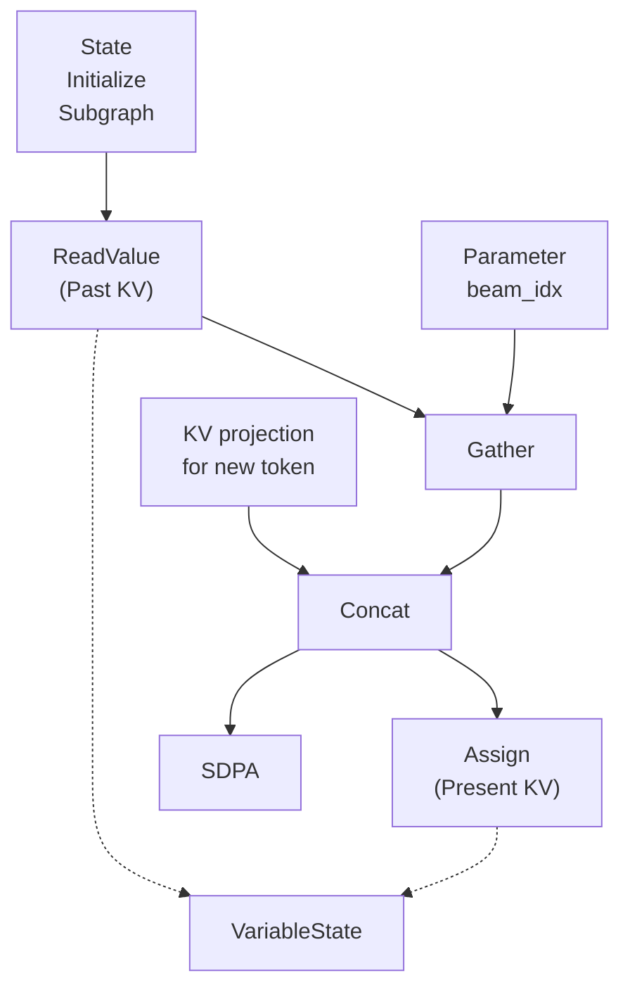
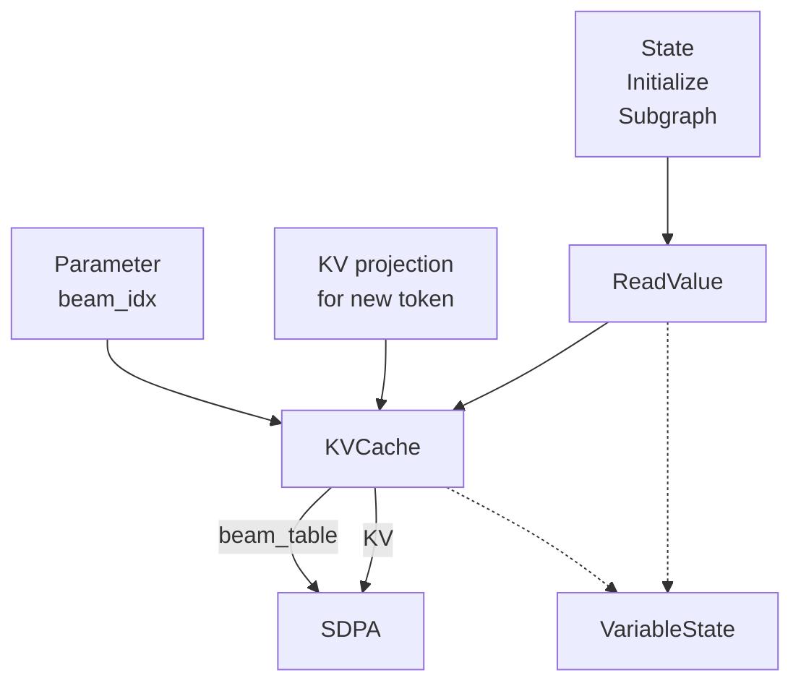

# KV cache management in stateful model
## Description

For auto-regressive transformer models, KV (key-value) cache plays a pivotal role to avoid duplicated computation for past tokens. In OpenVINO, management of the KV (key-value) cache differs between the [continuous batch (CB) pipeline](https://docs.openvino.ai/2025/model-server/ovms_demos_continuous_batching.html) and the non-CB pipeline. 

In CB pipeline with openvino_genai, an SDPA (Scaled Dot Product Attention) operation in the OV IR (intermediate representation) is converted to  a PagedAttention opertation. Then, the KV cache memories are managed by CB pipeline. CB pipeline is the default mode of openvino_genai for running LLMs.

On the other hand, we can use stateful model for Non-CB pipeline for KV cache optimization. In this case, KV cache memory is managed by the plugin. 

In this document, KV cache management in stateful model within a non-CB pipeline is explained.

## Basic structure of SDPA and kv cache in a stateful model

The following diagram shows a typical pattern of the KV cache in a stateful LLM model.

Here, the KV cache from previous tokens is stored in the VariableState's memory and loaded by the ReadValue operation. It is then concatenated with the KV produced from the new token. The combined KV is written back to the VariableState's memory via the Assign operation as the updated (present) KV cache. This present KV is consumed by the SDPA operation. Also you can see the Gather operation after the ReadValue operation, which is actually used only when the beam_idx input is given for a beam search sampling.

Here, the GPU plugin applied optimizations targeting the three key points : 
1. reducing the concatenation overhead
2. improving KV cache memory (VariableState) allocation efficiency, and
3. eliminating the gather operation for beam search (i.e., indirect SDPA). 

To this end, we introduced an internal operation of [ov::intel_gpu::KVCache](https://github.com/openvinotoolkit/openvino/blob/master/src/plugins/intel_gpu/include/intel_gpu/op/kv_cache.hpp).

First, the Concatenation and Assign operations are fused into a single KVCache operation by the [KVCacheFusion](https://github.com/openvinotoolkit/openvino/blob/master/src/plugins/intel_gpu/src/plugin/transformations/kv_cache_fusion.hpp) transform. Next, the [IndirectKVCache](https://github.com/openvinotoolkit/openvino/blob/master/src/plugins/intel_gpu/src/plugin/transformations/indirect_kv_cache.hpp) transform further fuses the Gather operation into the same KVCache operation. (You can refer to the diagrams in the header files of each pass for detailed fusion patterns.)

The resulting graph after the transformations is as follows: 

## Optimizations for KVCache operation

The following sections describe the policies and optimizations applied to the KVCache operation.

### In-place concatenation

As described above, the KV projection data used as the input to the current SDPA step is formed by concatenating the KV data from past tokens with that of the new token. In the original graph, this concatenation requires two memory copies : one for past KV and another for the new KV. With intel_gpu::KVCache, we reduce this to a single copy by:
1) allocating sufficient contiguous memory in advance,
2) applying appropriate padding so the new KV data is written directly to its target location, and
3) preserving the existing past KV data and copying only the new KV data.

The relevant code sections to enable in-place kv cache is as follows :
- [prepare_buffer_fusing](https://github.com/openvinotoolkit/openvino/blob/792ddf38fe3da130c2b3e11662374ec9ca3a2624/src/plugins/intel_gpu/src/graph/graph_optimizer/prepare_buffer_fusing.cpp#L913)
    - At compilation time, it sets dynamic padding for the seq_len dimension of a `kv_cache` node.
- [do_runtime_in_place_kv_cache](https://github.com/openvinotoolkit/openvino/blob/792ddf38fe3da130c2b3e11662374ec9ca3a2624/src/plugins/intel_gpu/src/graph/primitive_inst.cpp#L1448)
    - If sufficient memory is available to store the concatenated KV data of past and new tokens, it updates the VariableState's layout's padding to match the memory remaining after concatenation. Then, it sets the `kv_cache` primitive_inst’s `_can_be_optimized` flag to true.
- [kv_cache_inst::realloc_if_needed](https://github.com/openvinotoolkit/openvino/blob/792ddf38fe3da130c2b3e11662374ec9ca3a2624/src/plugins/intel_gpu/src/graph/primitive_inst.cpp#L699)
    - If the `kv_cache` primitive_inst's `_can_be_optimized` is true
        - It sets the `kv_cache` primitive_inst's output memory with the VariableState's memory. 
    - Otherwise, (i.e., `_can_be_optimized` is not true)
        - It allocates a new output memory for `kv_cache` inst and then set it as the VariableState's memory. At this time, we allocate larger memory for `kv_cache` than actually needed at that time (i.e., [preallocate](https://github.com/openvinotoolkit/openvino/blob/master/src/plugins/intel_gpu/docs/dynamic_shape/memory_preallocation.md)), and the detail of the policy is described in the next subsection.
- [kv_cache_inst::execute::concat_stage](https://github.com/openvinotoolkit/openvino/blob/792ddf38fe3da130c2b3e11662374ec9ca3a2624/src/plugins/intel_gpu/src/graph/impls/ocl/kv_cache.cpp#L87)
    - Basically, the kv_cache_inst concatenates the past and new KV data using two `concatenate` kernels.
    - When the instance’s `_can_be_optimized` flag is false, it launches one concatenate kernel per input (two in total for past and new KV), with each kernel copying its input data into the target memory region.
    - When the `_can_be_optimized` flag is true, execution of the `concatenate` (i.e., copy) of the first input (i.e., the past KV) is skipped, reducing the operation to a single concatenate kernel for the new KV input (see [link](https://github.com/openvinotoolkit/openvino/blob/792ddf38fe3da130c2b3e11662374ec9ca3a2624/src/plugins/intel_gpu/src/graph/impls/ocl/kv_cache.cpp#L501)). 

Suppose that the KV cache has shape [batch, num_heads, seq_len, head_size]. For example, let's consider a case when the past KV cache's data shape is [1, 32, **17**, 64] and the new KV projection data shape is [1, 32, **1**, 64]. If the preallocated memory can hold a data with shape [1, 32, **128**, 64], `do_runtime_in_place_kv_cache` sets the upper padding of the `kv_cache` inst to [0, 0, **111**, 0]. At the execution, the past KV data remains unchanged, and the new token’s KV values are written into the remaining space along the concat axis. As a result, the effective data shape becomes [1, 32, **18**, 64], and the updated upper padding becomes [0, 0, **110**, 0].

### Preallocate memory

To achieve `in_place_kv_cache` and reduce host overhead due to the memory allocation, GPU plugin allocates larger memory for KV cache than actually needed. In the general case, we preallocate only enough memory for 10 iterations, but for the KV cache we allocate somewhat more (around 128). 

However, we do not allocate same size for all layers, but we allocate different size. You can see how the allocation size is determined in this [function](https://github.com/openvinotoolkit/openvino/blob/fcb474cb3c38fbf1aa1faa3a133f3b3ec5c22f1c/src/plugins/intel_gpu/src/graph/kv_cache.cpp#L96).

We vary memory allocation across layers to prevent periodic peaks in overall memory usage. If every `kv_cache` instance used the same allocation size, their reallocation intervals would be same. When a reallocation occurs, the concatenation inside the `kv_cache` cannot be performed in place, so both the input and output buffers must coexist temporarily. This effectively doubles the required memory for that `kv_cache` inst. If all layers hit this reallocation point simultaneously, the combined effect produces a large memory spike. By staggering the allocation schedules across layers, we mitigate these synchronized peaks and significantly reduce overall memory pressure.
<!-- * ### Indirect SDPA (TBD)) -->
<!-- * ### KV Cache compression (TBD)) -->