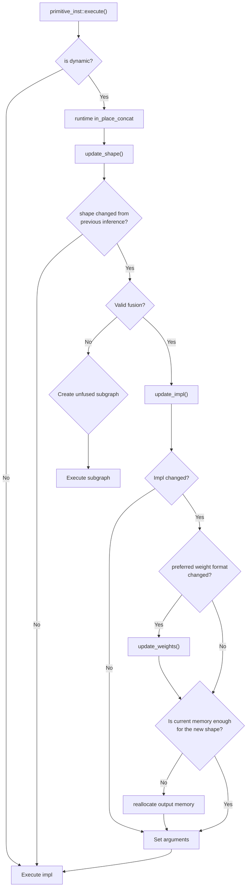

# Overall Flow of Dynamic-Shaped Model Execution

<a href="#Fig1">Figure 1</a> presents the basic flow of a primitive execution when its program_node has a dynamic shape. A brief explanation for each steps are as follows, and the more detailed explanation of which is to be found in the implementation details section.

* [update_shape](https://github.com/openvinotoolkit/openvino/blob/539b5a83ba7fcbbd348e4dc308e4a0f2dee8343c/src/plugins/intel_gpu/src/graph/primitive_inst.cpp#L798)
  * This checks if the input shape of the primitive has changed from the previous inference. If it has changed, it performs shape inference for the primitive.
    * If the byte size of the new output shape is empty, skip the execution of this primitive for the current inference.
    * Note that shape inference for some primitives is performed during the execution of other primitives' inference time optimization stage (e.g., in do_runtime_in_place_concat). In such cases, the update_shape_done_by_other flag is set to true. More detailed descriptions of these optimization stages will be provided in the near future.
* [Unfusion](https://github.com/openvinotoolkit/openvino/blob/539b5a83ba7fcbbd348e4dc308e4a0f2dee8343c/src/plugins/intel_gpu/src/graph/primitive_inst.cpp#L811C9-L811C9)
  * If the primitive has fused operations but the kernel does not support fusion for the current output shape, then it performs unfusion, i.e., creating a subgraph that decomposes the current primitive and the fused primitives.
* If either the input or output shapes are changed, the following processes are performed:
  * [update_impl](https://github.com/openvinotoolkit/openvino/blob/539b5a83ba7fcbbd348e4dc308e4a0f2dee8343c/src/plugins/intel_gpu/src/graph/primitive_inst.cpp#L845C22-L845C22)

    * Checks whether the expected primitive_impl can be obtained from the in-memory cache. If not, it checks whether there is a dynamic_impl (i.e., shape agnostic impl) available for the primitive. If a dynamic_impl is available, then it is selected and used. If not, it builds a new static_impl for the primitive and add it to the in_memory_cache.
    * When dynamic_impl is selected and the primitive is critical (e.g., fully_connected, gemm, convolution, deconvolution), a building task for the static kernel is enqueued to the async compilation context.
  * [update_weights](https://github.com/openvinotoolkit/openvino/blob/539b5a83ba7fcbbd348e4dc308e4a0f2dee8343c/src/plugins/intel_gpu/src/graph/primitive_inst.cpp#L846C44-L846C44)

    * If the impl is changed and the expected weight format is changed, the weights data are reordered to the corresponding format.
  * [realloc_if_needed](https://github.com/openvinotoolkit/openvino/blob/539b5a83ba7fcbbd348e4dc308e4a0f2dee8343c/src/plugins/intel_gpu/src/graph/primitive_inst.cpp#L849C11-L849C1)

    * If the current output memory is smaller than the required memory for the new shape, then allocate new memory.
* If any kernel arguments are changed (e.g., memory address, work group size, etc), set_argument() is performed.
* Finally, the selected impl is executed as a normal processing.