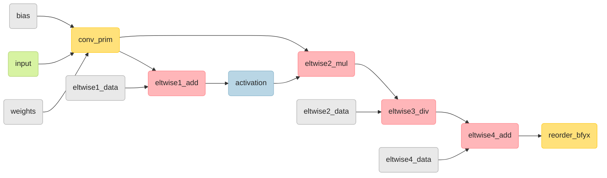

# GPU Plugin Unit Test

GPU plugin has two types of tests: functional and unit tests. This article is about the latter.

- The functional test is testing a single layer, behavior, subgraph and low-precision transformation on inference engine level for various layout and data types, such as FP16 and FP32.
- The unit test is testing clDNN primitive and core-type modules on GPU plugin level. Unlike the functional test, it is possible to test by explicitly specifying the format of the input, such as `bfyx` or `b_fs_yx_fsv16`.

# Structure of a unit test

Intel GPU unit test (aka clDNN unit test) is a set of unit tests, each of which is for testing all primitives, fusions, and fundamental core types of GPU plugin.
There are four subcategories of unit tests as below.

```bash
openvino/src/plugins/intel_gpu/tests	- root of Intel GPU unit test
|── fusions
|── module_tests 				
|── test_cases
└── test_utils
```

- ### fusions

  - Fusion is an algorithm that fuses several operations into one optimized operation. For example, two nodes of `conv -> relu` may be fused into a single node of `conv`.
  - Fusion unit tests checks whether the fusion is done as expected.
  - fusion_test_common.cpp
     - The base class for a fusing test, that is, [BaseFusingTest](https://github.com/openvinotoolkit/openvino/blob/master/src/plugins/intel_gpu/tests/unit/fusions/fusion_test_common.hpp#L20), is implemented here. It tests whether the fusing is successful or not by comparing the execution results of the two networks, one is the fused network, the other is non-fused network for the same topology.
       - [BaseFusingTest](https://github.com/openvinotoolkit/openvino/blob/master/src/plugins/intel_gpu/tests/unit/fusions/fusion_test_common.hpp#L20) has an important method called `compare()`.
       - `compare()` method has the following three tasks:
            - Execute two networks (fused network and not fused network)
            - Compare the actual number of executed primitives with the expected number of executed primitives in test params
            - Compare the results between fused network and non fused network
  - eltwise_fusing_test.cpp
       - Checks whether or not *eltwise* is fused to other primitives as expected
  - [primitive_name]_fusion_test.cpp
       - Checks that nodes such as *eltwise* or *activation* are fusing to the [primitive_name] as expected
  - The detail of how to add each instance is described [below](#fusions-1).

- ### test_cases

  - It is mainly checking whether clDNN primitives and topology creation are working as designed.
  - It also checks configurations for OpenCL functionalities such as *cl_cache*, *cl_mem allocation* and *cl_command_queue* modes

- ### module_tests

  - Unit tests for fundamental core modules such as `ocl_user_events`, format, layout, and USM memory:
    - check whether `ocl_user_event` is working as expected,
    - check whether all format is converted to the string and trait,
    - check whether various layouts are created as expected,
    - check `usm_host` and USM device memory buffer creation and read/write functionality.

- ### test_utils

  - Define base functions of a unit test, such as `get_test_engine()`, which returns `cldnn::engine`
  - Utility functions such as `Float16`, `random_gen` and `uniform_quantized_real_distribution`

# How to run unit tests

## Build unit test

1. Turn on `ENABLE_TESTS` in cmake option:

   ```bash
   cmake -DCMAKE_BUILD_TYPE=Release -DENABLE_TESTS=ON ..
   ```

2. Build

   ```bash
   make ov_gpu_unit_tests
   ```

3. You can find `ov_gpu_unit_tests` in *bin* directory after build

## Run unit test

You can run _`ov_gpu_unit_tests`_ in *bin* directory which is the output of OpenVINO build

If you want to run a specific unit test, you can use `gtest_filter` option as follows:

```
./ov_gpu_unit_tests --gtest_filter='*filter_name*'
```

Then, you can get the result similar to:

```bash
openvino/bin/intel64/Release$ export LD_LIBRARY_PATH=$LD_LIBRARY_PATH:$PWD
openvino/bin/intel64/Release$ ./ov_gpu_unit_tests --gtest_filter='*fusings_gpu/conv_fp32_reorder_fsv16_to_bfyx.basic/0*'
Running main() from /home/openvino/thirdparty/gtest/gtest/googletest/src/gtest_main.cc
Note: Google Test filter = *fusings_gpu/conv_fp32_reorder_fsv16_to_bfyx.basic/0*
[==========] Running 1 test from 1 test suite.
[----------] Global test environment set-up.
[----------] 1 test from fusings_gpu/conv_fp32_reorder_fsv16_to_bfyx
[ RUN      ] fusings_gpu/conv_fp32_reorder_fsv16_to_bfyx.basic/0
[       OK ] fusings_gpu/conv_fp32_reorder_fsv16_to_bfyx.basic/0 (84 ms)
[----------] 1 test from fusings_gpu/conv_fp32_reorder_fsv16_to_bfyx (84 ms total)
[----------] Global test environment tear-down
[==========] 1 test from 1 test suite ran. (85 ms total)
[  PASSED  ] 1 test.
```

# How to create new test case

## TEST and TEST_P (GoogleTest macros)

GPU unit tests are using two types of test macros (**TEST** and **TEST_P**)  in  [GoogleTest (aka gtest)](https://google.github.io/googletest/)

- ### **TEST**
  - **TEST** is a simple test case macro.
  - To make a test-case using **TEST**, define an individual test named `TestName` in the test suite `TestSuiteName`

    ```
    TEST(TestSuiteName, TestName) {
      ... test body ...
    }
    ```
  - The test body can be any code under the test. To determine the outcome within the test body, use assertion types, such as `EXPECT_EQ` and `ASSERT_NE`.

- ### **TEST_P**
  - **TEST_P** is used to set a test case using test parameter sets
  - To make a test case using **TEST_P**, define an individual value-parameterized test named `TestName` that uses the test fixture class `TestFixtureName`, which is the test suite name:

    ```
    TEST_P(TestFixtureName, TestName) {
      ... statements ...
    }
    ```
  - Then, instantiates the value-parameterized test suite `TestSuiteName`, which is defined with **TEST_P**
    ```c++
    INSTANTIATE_TEST_SUITE_P(InstantiationName,TestSuiteName,param_generator)
    ```


## module_test and test_cases

- *module_test* and *test_cases* are testing GPU plugin using both **TEST_P** and **TEST**.
- Refer to [the fusion test](#fusions-1) for the test case based on **TEST_P**
- **TEST** checks the test result by comparing the execution results with expected values after running network created from the target topology to check.
  - It is important to generate test input and expected output result in **TEST**
  - You can create input data and expected output data using these three approaches:
    - Generate simple input data and calculate the expected output data from input data manually, like [basic_deformable_convolution_def_group1_2](https://github.com/openvinotoolkit/openvino/blob/master/src/plugins/intel_gpu/tests/unit/test_cases/convolution_gpu_test.cpp#L224)
    - Generate random input and get the expected output, using reference function, which is made in the test codes like [mvn_test_across_channels_outside_sqrt_bfyx](https://github.com/openvinotoolkit/openvino/blob/master/src/plugins/intel_gpu/tests/unit/test_cases/mvn_gpu_test.cpp#L138)
    - Generate random input and get the expected output from another reference kernel which exists in clDNN kernels like [mvn_random_test_bsv32](https://github.com/openvinotoolkit/openvino/blob/master/src/plugins/intel_gpu/tests/unit/test_cases/mvn_gpu_test.cpp#L762)

- When you allocate input data, keep in mind that the layout order in `engine.allocation_memory` is not `bfyx` but `bfxy`. For example, if input is `{1,1,4,5}`, the layout should be as below:

  ```c++
  auto input = engine.allocate_memory({ data_types::f32, format::bfyx, { 1, 1, 5, 4 } });
  ```

## fusions

- It is implemented based on **TEST_P** because there are many cases where multiple layouts are tested in the same topology.
- If the fusing test class already exists, you can use it. Otherwise, you should make a new fusing test class, which is inherited [BaseFusingTest](https://github.com/openvinotoolkit/openvino/blob/master/src/plugins/intel_gpu/tests/unit/fusions/fusion_test_common.hpp#L20).
  - The new fusing test class should create the `execute()` method, which creates fused / non-fused networks and calls `compare` method after setting input.
- Create a test case, using **TEST_P**:
  - You can make the desired networks using create_topologies.

  - For example, if you design the networks like the one above, you can make the test code as follows:

    ```c++
    class conv_fp32_multi_eltwise_4_clamp : public ConvFusingTest {};
    TEST_P(conv_fp32_multi_eltwise_4_clamp, basic) {
        if (engine.get_device_info().supports_immad) {
            return;
        }
        auto p = GetParam();
        create_topologies(
            input_layout("input", get_input_layout(p)),
            data("eltwise1_data", get_mem(get_output_layout(p))),
            data("eltwise2_data", get_mem(get_output_layout(p))),
            data("eltwise4_data", get_mem(get_output_layout(p))),
            data("bias", get_mem(get_bias_layout(p))),
            data("weights", get_mem(get_weights_layout(p))),
            convolution("conv_prim", "input", { "weights" }, { "bias" }, p.groups, p.stride, p.pad, p.dilation),
            eltwise("eltwise1_add", "conv_prim", "eltwise1_data", eltwise_mode::sum),
            activation("activation", "eltwise1_add", activation_func::clamp, { 0.5f, 2.5f }),
            eltwise("eltwise2_mul", "activation", "conv_prim", eltwise_mode::prod),
            eltwise("eltwise3_div", "eltwise2_mul", "eltwise2_data", eltwise_mode::prod),
            eltwise("eltwise4_add", "eltwise3_div", "eltwise4_data", eltwise_mode::sum),
            reorder("reorder_bfyx", "eltwise4_add", p.default_format, data_types::f32)
        );
        implementation_desc conv_impl = { format::b_fs_yx_fsv16, "" };
        bo_fused.set_option(build_option::force_implementations({ { "conv_prim", conv_impl } }));
        tolerance = 1e-5f;
        execute(p);
    }
    
    ```

  - If you want to change some node's layout format to a specific format, you can change it using `build_option::force_implementations`.
    - In the sample codes, `conv_prim` is set to `format::b_fs_yx_fsv16` by `build_option::force_implementations`.
- `tolerance` is used as a threshold to check whether or not the output results are the same between a fused network and a non-fused network in the `compare` function.
- After the test case is implemented, use `INSTANTIATE_TEST_SUITE_P` to set the test suite for each parameter case as follows.
  - Check all variables in `convolution_test_params` to make `CASE_CONV_FP32_2`.
    - In `convolution_test_params`, all tensor, format, and `data_types` are used in common in all convolution fusing tests. Therefore, you can define `CASE_CONV_FP32_2` with all variables except `expected_fused_primitives` and `expected_not_fused_primitives`.

```c++
struct convolution_test_params {
    tensor in_shape;
    tensor out_shape;
    tensor kernel;
    tensor stride;
    tensor pad;
    tensor dilation;
    uint32_t groups;
    data_types data_type;
    format input_format;
    data_types weights_type;
    format weights_format;
    data_types default_type;
    format default_format;
    size_t expected_fused_primitives;
    size_t expected_not_fused_primitives;
};


// in_shape; out_shape; kernel; stride; pad; dilation; groups; data_type; input_format; weights_type; weights_format; default_type; default_format;
#define CASE_CONV_FP32_2 { 1, 16, 4, 5 }, { 1, 32, 2, 3 }, { 1, 1, 3, 3 }, tensor{ 1 }, tensor{ 0 }, tensor{ 1 }, 1, data_types::f32, format::b_fs_yx_fsv16, data_types::f32, format::os_is_yx_isv16_osv16, data_types::f32, format::bfyx


INSTANTIATE_TEST_SUITE_P(fusings_gpu, conv_fp32_scale, ::testing::ValuesIn(std::vector<convolution_test_params>{
    convolution_test_params{ CASE_CONV_FP32_2, 2, 3 }, // CASE_CONV_FP32_2, # of fused executed primitives, # of non fused networks
    convolution_test_params{ CASE_CONV_FP32_3, 2, 3 },
}));
```

## See also

 * [OpenVINO™ README](../../../../README.md)
 * [OpenVINO Core Components](../../../README.md)
 * [OpenVINO Plugins](../../README.md)
 * [OpenVINO GPU Plugin](../README.md)
 * [Developer documentation](../../../../docs/dev/index.md)