# GPU Plugin Workflow

The simplified workflow in the GPU plugin is shown in the diagram below (click it for higher resolution):

```mermaid
classDiagram

%% Public API classes
class `ov::CompiledModel`
class `ov::InferRequest`
class `ov::Core`

%% Plugin API interface %%
class `ov::IPlugin`
class `ov::ICompiledModel`
class `ov::IAsyncInferRequest`
class `ov::ISyncInferRequest`

%% Plugin API Impl %%
class `intel_gpu::Plugin` { OpenVINO plugin implementation for GPU }
class `intel_gpu::CompiledModel`
class `intel_gpu::AsyncInferRequest` { Asynchronous version of infer request }
class `intel_gpu::SyncInferRequest` { Inference request for specific executable network. Wrapper for input and output memory }

`intel_gpu::Plugin` --|> `ov::IPlugin`
`intel_gpu::CompiledModel` --|> `ov::ICompiledModel`
`intel_gpu::SyncInferRequest` --|> `ov::ISyncInferRequest`
`intel_gpu::AsyncInferRequest` --|> `ov::IAsyncInferRequest`
`intel_gpu::Plugin` --> `intel_gpu::CompiledModel` : Create
`intel_gpu::SyncInferRequest` "1" --* "1" `intel_gpu::AsyncInferRequest`

%% Plugin implementation details %%
class `intel_gpu::TransformationPipeline` {Set of ngraph-based transformations configured by GPU plugin }
class `intel_gpu::Graph` { Per stream copy of compiled graph with independent memory }
class `intel_gpu::ProgramBuilder` { Object for operations semantic translation and graph compilation }

`ov::Core` --> `intel_gpu::CompiledModel` : compile_model()
`ov::CompiledModel` -->`intel_gpu::AsyncInferRequest` : create_infer_request()
`ov::InferRequest` --> `intel_gpu::network` : start_async()
`intel_gpu::CompiledModel` --> `intel_gpu::AsyncInferRequest` : Create
`intel_gpu::TransformationPipeline` --> `ov::Model`
`intel_gpu::TransformationPipeline` --> `intel_gpu::CompiledModel`
`intel_gpu::Graph` "1..N" --* `intel_gpu::CompiledModel`
`intel_gpu::CompiledModel` --> `intel_gpu::ProgramBuilder` : Create
`intel_gpu::ProgramBuilder` "1" --o "N" `intel_gpu::Graph`

class `intel_gpu::convolution` {convolution operation descriptor}
class `intel_gpu::data` {Primitive representing constant data in a topology }
class `intel_gpu::input_layout` {Represents dynamic input data}
class `intel_gpu::primitive_base` {<<Interface>>}
`intel_gpu::convolution` ..<| `intel_gpu::primitive_base`
`intel_gpu::data` ..<| `intel_gpu::primitive_base`
`intel_gpu::input_layout` ..<| `intel_gpu::primitive_base`
`Any other primitive` ..<| `intel_gpu::primitive_base`
class `intel_gpu::topology` { Set of primitives. Each primitive knows operation parameters, it's inputs and outputs }
class `intel_gpu::program` { Class that contains compiled topology. All kernels are selected, memory dependencies are resolved, the only missing thing - memory for intermediate buffers }
`intel_gpu::primitive_base` "0..N" --o `intel_gpu::topology`
`intel_gpu::program` --> `intel_gpu::topology`
`intel_gpu::ProgramBuilder` --> `intel_gpu::topology` : Create
`intel_gpu::ProgramBuilder` --> `intel_gpu::program` : Create
class `intel_gpu::program_node` { Base class for representation of a single graph node }
class `intel_gpu::primitive_impl` { <<interface>> Base class for representation of a single graph node }
class `intel_gpu::typed_primitive_onednn_impl` {Implementations that use oneDNN library }
class `oneDNN library` { statically linked into GPU plugin }
class `intel_gpu::typed_primitive_ocl_impl` { OCL implementations that use kernels from kernel_selector }
class `intel_gpu::kernel_selector` { module that stores OCL kernels for primitives and has embed some rules for optimal kernel selection }
`intel_gpu::program_node` --o `intel_gpu::program`
`intel_gpu::primitive_impl` --o `intel_gpu::program_node`
`intel_gpu::typed_primitive_onednn_impl` ..<| `intel_gpu::primitive_impl`
`intel_gpu::typed_primitive_ocl_impl` ..<| `intel_gpu::primitive_impl`
`intel_gpu::typed_primitive_ocl_impl` ..> `intel_gpu::kernel_selector`
`intel_gpu::typed_primitive_onednn_impl` --> `oneDNN bridge` : Use
`intel_gpu::typed_primitive_onednn_impl` ..> `oneDNN library`
class `intel_gpu::build_options` { Set of options for graph compilations }
class `intel_gpu::pass_manager` { Helper to run graph transformations }
class `intel_gpu::base_pass` { <<Interface>> Base class for graph transformations}
`intel_gpu::program` --> `intel_gpu::build_options`
`intel_gpu::program` --> `intel_gpu::pass_manager` : Use
`intel_gpu::program` --> `intel_gpu::base_pass` : Use
`intel_gpu::pass_manager` --> `intel_gpu::base_pass` : Run
class `intel_gpu::prepare_primitive_fusing` { Pass that fuses multiple operations into single node }
class `intel_gpu::prepare_quantization` { Pass that prepares models for low precision execution }
class `intel_gpu::reorder_inputs` { Pass that is responsible for layout/impl selection }
class `intel_gpu::compile_graph` { Pass that selects and creates best implementation for each primitive }
class `intel_gpu::remove_redundant_reorders` { Pass that optimizes reorders in the graph }
`intel_gpu::prepare_primitive_fusing`--|> `intel_gpu::base_pass`
`intel_gpu::prepare_quantization`--|> `intel_gpu::base_pass`
`intel_gpu::reorder_inputs`--|> `intel_gpu::base_pass`
`intel_gpu::compile_graph`--|> `intel_gpu::base_pass`
`intel_gpu::layout_optimizer`--|> `intel_gpu::base_pass`
`intel_gpu::remove_redundant_reorders`--|> `intel_gpu::base_pass`
`intel_gpu::reorder_inputs`--> `intel_gpu::layout_optimizer` : Use
class `intel_gpu::network` { A program with allocated memory.Can be executed on the device }
`intel_gpu::AsyncInferRequest` --> `intel_gpu::network` : Set input/output memory and run execution
`intel_gpu::network` --> `intel_gpu::AsyncInferRequest` : Return inference result
class `intel_gpu::tensor` { Size of memory buffer }
class `intel_gpu::format` { Order of elements in memory }
class `intel_gpu::data_type` { elements precision }
class `intel_gpu::memory_pool` { Object that tracks memory allocations and tries to reuse memory buffers }
class `intel_gpu::layout` { Memory descriptor }
class `intel_gpu::memory` { GPU memory object }
class `intel_gpu::stream` { Abstraction for queue. Knows how to submit kernels and provide some synchronization   }
class `intel_gpu::event` { Synchronization primitive }
class `intel_gpu::kernel` { Holds kernel handle }
class `intel_gpu::engine` { Engine for specific device, responsible for memory allocations }
class `intel_gpu::device` { Holds context/device handles for selected backend }
class `intel_gpu::device_info` { Storage for device capabilities and info }
class `intel_gpu::engine_configuration` { Options for engine }
class `intel_gpu::device_query` { Detects available devices for given backend }
`intel_gpu::tensor` --o `intel_gpu::layout`
`intel_gpu::format` --o `intel_gpu::layout`
`intel_gpu::data_type` --o `intel_gpu::layout`
`intel_gpu::layout` --o  `intel_gpu::memory`
`intel_gpu::memory` --o "0..N" `intel_gpu::memory_pool`
`intel_gpu::memory` --o `intel_gpu::data`
`intel_gpu::memory_pool` --* `intel_gpu::network`
`intel_gpu::stream` --* `intel_gpu::network`
`intel_gpu::stream` --> `intel_gpu::event`
`intel_gpu::stream` --> `intel_gpu::kernel`
`intel_gpu::engine` --> `intel_gpu::stream` : Create
`intel_gpu::engine` --> `intel_gpu::memory` : Create
`intel_gpu::engine` --> `intel_gpu::engine_configuration`
`intel_gpu::engine` -- `oneDNN library` : Share context/device/queue handles
`intel_gpu::device` --o `intel_gpu::engine`
`intel_gpu::device_info` --o `intel_gpu::device`
`intel_gpu::device_query` --> `intel_gpu::device`
```

## See also

 * [OpenVINO™ README](../../../../README.md)
 * [OpenVINO Core Components](../../../README.md)
 * [OpenVINO Plugins](../../README.md)
 * [OpenVINO GPU Plugin](../README.md)
 * [Developer documentation](../../../../docs/dev/index.md)
