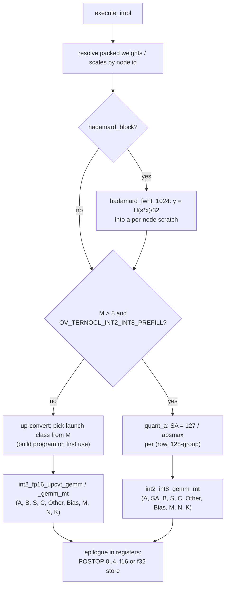

# TernOCL int2 FullyConnected — Architecture

How 2-bit (ternary) `FullyConnected` layers are executed by the TernOCL OpenCL
kernels inside the OpenVINO GPU plugin.

---

## 1. Overview

Ternary models store each weight as one of `{-1, 0, +1}` with one fp16 scale
per group of 128 along K. OpenVINO has no signed 2-bit type, so they are carried
in the IR as unsigned `u2` codes `{0,1,2}` with a scalar zero point of 1,
dequantized as `(code - 1) * scale`.

The implementation:

1. **At compile time** converts those constants once into the layout the
   kernels read, so inference performs no unpacking or reordering.
2. **At execution time** enqueues one OpenCL GEMM per layer on the plugin's own
   command queue, applying the fused post-op in the kernel epilogue and writing
   the output type the consumer wants.
3. **Per shape and M** selects a tile configuration from tuned tables.

The kernels come from the TernOCL kernel collection, which carries its own
standalone drivers, validation and tuning scripts. Two GEMM families read the
same packed weights:

| Family | Source | Math | Used for |
|---|---|---|---|
| **int2 x f16 up-convert** | `int2_fp16_upcvt/int2_fp16_upcvt.cl` | 2-bit weights dequantized to fp16 in registers (group scale folded in with integer ops), fp16 DPAS, fp32 accumulation, native fp16 activations | all M (default) |
| **int2 x int8 DPAS** | `int2_via_int2_x_int8_dpas/int2_int8_dpas.cl` | activations quantized to int8 per (row, 128-group), native s8 x s2 DPAS on the 2-bit codes, int32 accumulation, per-group rescale | M > 8 with `OV_TERNOCL_INT2_INT8_PREFILL=1` (off by default) |

Both share the epilogue (`common/epilogue.clh`); rotated-basis checkpoints add
the input transform `hadamard/hadamard_fwht.cl` in front of either.

| File | Role |
|---|---|
| `impls/ocl_v2/ternocl_int2/fully_connected_ternocl_int2.hpp` | Registration, acceptance rules, fused-chain -> epilogue mapping |
| `impls/ocl_v2/ternocl_int2/fully_connected_ternocl_int2.cpp` | Weight packing, program cache, tile tables, execution of both GEMM families |
| `impls/ocl_v2/CMakeLists.txt` | Embeds the TernOCL sources (up-convert, int2 x int8, FWHT, epilogue) as chunked string literals at configure time |
| `thirdparty/TernOCL` | Submodule: [TernOCL](https://github.com/libxsmm/TernOCL) kernels, drivers, validation, tuning scripts |
| `plugin/transformations/fuse_hadamard_fc.cpp` | Folds the graph-level rotation of rotated-basis checkpoints into the FC (section 7) |
| `plugin/transformations/fuse_rms_rope.cpp` | Optional fold of the per-head Q/K RMSNorm into RoPE (`OV_GPU_FUSE_RMS_ROPE=1`) |
| `registry/fully_connected_impls.cpp` | Priority relative to oneDNN/OpenCL |
| `primitive_inst.cpp` | Lets `ternocl_int2` keep its fused chain under dynamic shapes (section 4) |

The impl needs only the plugin's OpenCL runtime (`GPU_RT_TYPE=OCL`).

---

## 2. Registration and acceptance

`TernoclInt2FCImplementationManager` (`impl_types::ocl`) is registered for
`FullyConnected` ahead of the oneDNN and stock OpenCL managers, for dynamic and
static shapes, when the plugin is built on the OpenCL runtime.

`validate_impl` accepts a node only when every assumption the kernels make
holds; anything else falls through to the existing paths unchanged:

- weights are a constant `u2` `[N, K]` with `K % 128 == 0` and `N % 16 == 0`
  (one lane per output column; the kernels clip partial tiles, so N is not padded)
- activations are `f16`, a plain row-major `[M, K]` matrix without padding
  (`format::bfyx`); the output is `f16` or `f32`, row-major `[M, N]` without padding
- the fused chain maps onto one epilogue (`ternocl_int2_postop()`):

| Fused chain | Typical layer | `POSTOP` |
|---|---|---|
| none | | 0 |
| `swish`, then `eltwise prod` | gate_proj x up_proj | 1 |
| `eltwise sum` | o_proj, down_proj (residual add) | 2 |
| constant bias (same type as the output), nothing fused | GatedDeltaNet `in_proj_a` | 3 |
| `logistic` | GatedDeltaNet `in_proj_b` | 4 |

  and the eltwise operand is `f16`. `OV_TERNOCL_INT2_FOLD_GATES=bias|sigmoid|none`
  narrows the bias/sigmoid folds (default: both).

A node whose primitive carries a Hadamard input transform (section 7) is
rejected with an error rather than falling through, because no other
implementation applies the transform.

For models with `u2` weights on the OpenCL runtime (and TernOCL not disabled),
the pipeline always enables the existing gate/up horizontal FC fusion
(`FullyConnectedHorizontalFusion` with the SwiGLU split), which it otherwise
skips on some devices. The merged `[K, 2I]` int2 projection followed by the
SwiGLU primitive is the faster path, and it is required for rotated-basis
checkpoints: a separate `gate_proj` carries a fused chain none of the epilogues
covers, and its Hadamard input cannot fall back to another implementation.

---

## 3. Compile-time preparation

Performed once per node in `create()`:

- **Weights**: read from their `data` node with a blocking copy, re-encoded from
  `code - zp` to two's complement (`-1` as `0b11`) and packed 16 values per
  `uint32`, K-major: word `(k/16, n)` holds rows `16*(k/16) .. +15` of column n,
  row `16*kb+j` at bits `[2j, 2j+1]`. The result is a `[K/16, N]` USM device buffer.
  Both GEMM families read this layout: the up-convert kernels dequantize it, the
  int8 kernels feed the codes to the s8 x s2 DPAS as they are.
- **Scales**: OpenVINO stores them `[N, K/128]`; the kernels want `[K/128, N]`,
  transposed once into a device buffer.
- **Hadamard signs** (rotated checkpoints): the `+-1` vector as `i8[K]` on the device.

Per-node scratch is allocated at execution and grown with M: the rotated
activation `f16 [M, K]` (rotated checkpoints) and, for the int8 prefill, the
activation scales `f16 [K/128, (M+31) & ~31]`.

OpenVINO caches `primitive_impl` objects by `kernel_impl_params`, so one impl
object can serve several nodes of identical shape. The packed buffers therefore
live in a process-wide map keyed by node id and are resolved per execution; the
impl keeps its own copy as a fallback for a renamed node.

---

## 4. Execution

`M` is derived from the output shape, so one impl serves prefill and decode.
Kernels are launched through the plugin stream (`set_arguments` /
`enqueue_kernel`), so they take part in the normal in-order / out-of-order
event handling and cost no host synchronisation.

**Programs** are built with `clBuildProgram` on the engine's `cl_context`, once
per (source, option string), and cached process-wide; each impl creates its
`cl_kernel` from them on first use of a launch class. Clones share the kernel
handles, like the stock OpenCL impls: OpenVINO clones cached impls on every
shape update.

**Fusion under dynamic shapes**: `primitive_inst::is_valid_fusion()` only
trusts fused eltwise ops on `impl_types::ocl` FCs whose kernel it knows and
otherwise silently executes an *unfused subgraph* (the FC plus separate
eltwise/activation primitives). `ternocl_int2` is whitelisted there; without it
the model runs every epilogue as a separate pass.

**Output type**: f32 logits are written directly (`-DOUT_F32`), the
accumulator is fp32 already.

---

## 5. Kernels

Each family is one program source, specialised with `-D` options. All GEMMs take
`POSTOP` (0..4) and `OUT_F32`; the shared epilogue (`common/epilogue.clh`)
computes SiLU-gate, residual add, bias and sigmoid (with an `x <= -10 -> 0`
clamp) on the fp32 accumulator before the store.

### 5.1 int2 x f16 up-convert (`int2_fp16_upcvt.cl`, default)

| Kernel | Used for | Options |
|---|---|---|
| `int2_fp16_upcvt_gemm` | GEMV, M <= 8 | `SGM` rows per sub-group (1/2/4/8), `NSG_N` sub-groups along N (work-group width `WGN = 16*NSG_N`), `LS` local k-slicing through SLM, `U` k-steps loaded ahead |
| `int2_fp16_upcvt_gemm_mt` | M > 8 | sub-group tile `MT_M x MT_N`, work-group `WG_M x WG_N` sub-groups, 256 GRF; B dequantized once per 16 columns and reused for all `MT_M/8` DPAS row blocks; 2D block I/O clips at the matrix edge so any M works |

### 5.2 int2 x int8 DPAS (`int2_int8_dpas.cl`, `OV_TERNOCL_INT2_INT8_PREFILL=1`)

The weights are never unpacked: the 2-bit codes go straight into the s8 x s2
DPAS (`intel_sub_group_i8_i2_matrix_mad_k32`). Per 128-group `g` along K:

    SA[g, m] = 127 / absmax_{k in g} |A[m, k]|
    q[m, k]  = sat_int8(A[m, k] * SA[g, m])
    C[m, n]  = epi( sum_g  float(sum_{k in g} q[m, k] * code(B[k, n])) * SB[g, n] / SA[g, m] )

| Kernel | Role | Options |
|---|---|---|
| `quant_a` | one sub-group per (row, 128-group): absmax reduction, writes `SA` into the per-node scratch | |
| `int2_int8_gemm_mt` | M > 8: quantizes each 8 x 128 A block to int8 in registers once and reuses it for all 16-column blocks of the tile (`QMODE=1`); B and `SB` are loaded once per group and reused for all 8-row blocks | sub-group tile `MT_M x MT_N`, work-group `WG_M x WG_N`, 256 GRF; 2D block I/O, any M |

The int8 activation quantization changes the numerics slightly, so greedy
outputs can differ from the default path at near-tie tokens; on Bonsai 2 27B the
GSM8K score stays within the evaluation's standard error of the default path.
The kernel collection also has an int8 GEMV (`int2_int8_gemv`) and an upfront
quantization mode (`QMODE=0`, int8 A written by `quant_a`); the plugin uses
neither, so decode is unchanged and no `[M, K]` int8 scratch is needed.

### 5.3 Hadamard input transform (`hadamard_fwht.cl`)
1024-block, the ten radix-2 stages as three radix-8 passes through SLM and a
final radix-2 pass that scales and stores, fp32 butterflies. Its output feeds
either GEMM family.

---

## 6. Configuration selection

`get_launch()` (up-convert) and `get_int8_launch()` (int8 prefill) map M to a
launch class and build its kernels on first use:

| M | Kernel | Tile |
|---|---|---|
| 1, 2, <= 4, <= 8 | up-convert GEMV, `SGM` = 1/2/4/8 | `gemv_tile(K, N)`: exact (K, N) entries, separate table for the integrated GPU |
| 9..16, 17..32, 33..63 | up-convert M-tiled | `mt_tile()`: one tile per M band and output width class (N <= 8192, < 65536, >= 65536), per GPU class |
| >= 64 | up-convert M-tiled | `mt_tile()`: exact (K, N) entries, per GPU class |
| > 8, with `OV_TERNOCL_INT2_INT8_PREFILL=1` | `quant_a` + `int2_int8_gemm_mt` | `int8_tile()`: exact (K, N) entries per M band (<= 16, <= 32, < 64, >= 64), default tile per band |

The tiles are hard-coded tables in `fully_connected_ternocl_int2.cpp`, filled from
TernOCL's benchmark sweeps (`bench.sh`, `sweep_midm.sh`):

- **up-convert**: one set of tables for discrete Xe2 and one for integrated Xe2
  (selected from the device type). The decode GEMV (M = 1) has entries for the
  layer shapes of Bonsai 1.7B / 4B / 8B / 27B and CAT-Q 32B on both (CAT-Q 1.7B
  and 8B share the Bonsai shapes); the M-tiled GEMM is tuned on the 27B shapes;
- **int8 prefill**: one table, with entries for the Bonsai 27B layer shapes,
  tuned on discrete Xe2;
- any other shape uses a default tile per launch class: it runs correctly, but
  is not tuned.

Overrides for sweeps: `OV_TERNOCL_INT2_GEMV="wgn,ls,u"`,
`OV_TERNOCL_INT2_MID="mt_m,mt_n,wg_m,wg_n"` (M < 64),
`OV_TERNOCL_INT2_MT="..."` (M >= 64), `OV_TERNOCL_INT2_INT8_MT="..."` (int8
prefill); `OV_TERNOCL_INT2_CFG_DEBUG=1` prints every built program and chosen tile.

---

## 7. Rotated-basis checkpoints (Hadamard input transform)

Bonsai 2 stores its ternary weights in a rotated basis: every folded
projection expects its input `x` replaced by `H_1024 (s * x) / 32`, per
1024-wide block along K with a fixed `+-1` sign vector `s`. In the IR this
arrives as `[Multiply(s)] -> Reshape(..., K/1024, 1024) -> MatMul(H) -> Reshape(..., K)`
in front of the compressed FC (produced by `tools/int2/bonsai2_gguf_to_ir.py`).

`FuseHadamardIntoFC` (registered after the horizontal FC fusion, so a merged
gate/up FC absorbs the shared rotation once) recognises the chain, verifies the
constant is the normalised Sylvester `H_1024`, rewires the FC to the original
activation and records `int2_hadamard_block` / `int2_hadamard_signs` in the
rt_info; the FC translator moves them onto the cldnn `fully_connected`
primitive (part of its hash and serialization). At execution the impl runs
`hadamard_fwht_1024` into a per-node scratch and points the GEMM at it.
The pass is registered only on the OpenCL runtime with TernOCL enabled, since no
other implementation applies a fused rotation; otherwise (and with
`OV_TERNOCL_INT2_FUSE_HADAMARD=0`) the rotation stays in the graph.
`OV_TERNOCL_HADAMARD_DEBUG=1` traces the match.
