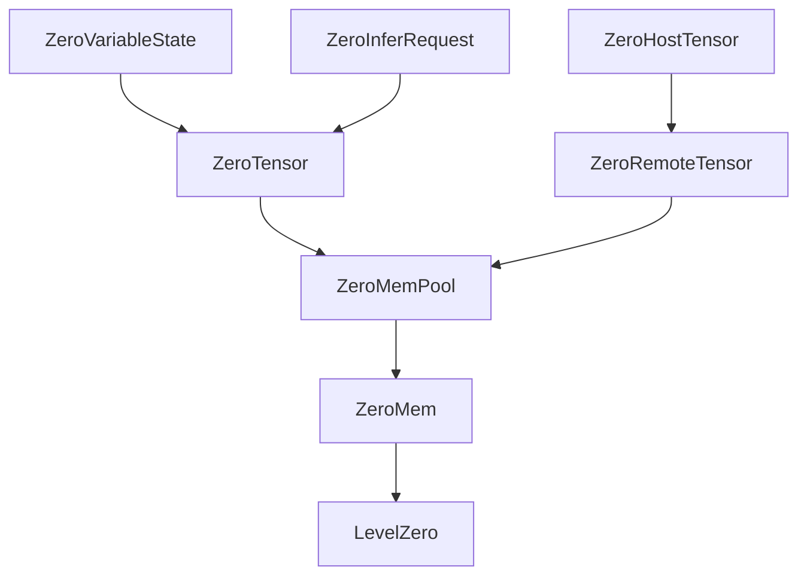

`ZeroInferRequest` offers a synchronous **execution pipeline** built on top of Intel Level Zero primitives capable of performing inferences of a compiled NPU model for a given set of inputs and outputs.

## Purpose of an Inference Request

- Creates and executes an inference **pipeline** that is based on Level Zero command lists, command queues, fences and the Level Zero graph extension API.
- Binds user-provided **input/output tensors** to **device memory allocations** accessible by the NPU hardware.
- Ensures correct synchronization and lifetime management of all tensors involved in the inference execution.

---

## Execution Pipeline

Each `ZeroInferRequest` creates and maintains an **execution pipeline** which consists of one or multiple command lists in which the graph execution task and other synchronization tasks are recorded. Command lists are submitted into a shared command queue.

---

## Memory Management

### Tracking Tensors

NPU Plugin keeps track of all `ov::Tensor` objects provided by the user through `set_tensor(...)`, regardless how they were created:

- Either using the **standard OpenVINO allocator** (host memory)
- Or as **RemoteTensors**, representing device memory already allocated within the current Level Zero context
- Or **retrieved from another `InferRequest`**, which were previously allocated by the plugin in the current Level Zero context

### Shadow Copies

If a tensor provided by the user:
- was not allocated in the current Level Zero context, or
- cannot be imported into the current context,

then the plugin will **create a shadow copy** in the current context and perform the required memory copies from/into the user tensor.
This guarantees that every tensor bound to a graph argument has valid residency in the current Level Zero context.

### States Handling

Although the NPU driver does not support model states directly, the **NPU Compiler** converts each state (variable) into a pair of **input/output ports**.
`ZeroInferRequest` allocates **a single buffer** and passes it to both input/ouput ports to preserve the expected behavior of model states.
Users can also set/get tensors associated with state variables. The `InferRequest` must monitor such updates and modify the arguments of the execution pipeline.

### Dynamic batching

Models can be compiled with a dynamic (unknown) batch size and the actual batch size is determined only when the user provides input tensors.
`ZeroInferRequest` performs all check to ensure that input/output dimensions are consistent and recreates the internal **execution pipeline** when needed.

---

## Class hierarchy

 

### ZeroTensor

All tensors provided by the user and all tensors created internally by the inference request are represented internally as **`ZeroTensor`** objects.

`ZeroTensor` is the NPU plugin’s implementation of `ov::Tensor` specifically designed for Level Zero interoperability.
It provides:

- Unified tracking of all Level Zero allocations inside the plugin
- Support for implicit import of user tensors into the current Level Zero context
- Support for memory reuse/sharing through its integration with **`ZeroMemPool`**
- Integration with **`ZeroMemPool`**, which manages the pool of Level Zero buffers created or imported within the active context

### ZeroMemPool

`ZeroMemPool` keeps a registry of all allocations made in the current Level Zero context.
It enables:
- Fast lookup of whether a user tensor was already imported
- Mapping buffers from across multiple inference requests to the same Level Zero memory (based on a Level Zero tracking ID)
- Correct lifetime tracking when buffers are shared between multiple requests

### ZeroMem
`ZeroMem` wraps all Level Zero API calls to allocate or import memory. Such objects can only be created by the `ZeroMemPool`. ZeroTensor and ZeroRemote tensor must always allocate or import memory through the pool.

### ZeroRemoteTensor

A **ZeroRemoteTensor** allows users to allocate memory in the Level Zero context dirrectly.

#### Reuse and Sharing

A `ZeroRemoteTensor` created in one context can be:
- Used as input or output in **any inference request** created under the same `ov::Core`
- Used to **chain multiple inference requests**, where the output of one request is the input of another
- Shared among multiple inference requests, provided proper synchronization is ensured

#### Creation Methods

A `ZeroRemoteTensor` can be created in several ways:

1. **Allocate new device memory**
2. **Import external memory:**
    * From Windows NT handle
    * From DMA-BUF file descriptors (Linux)
    * From memory-mapped files

