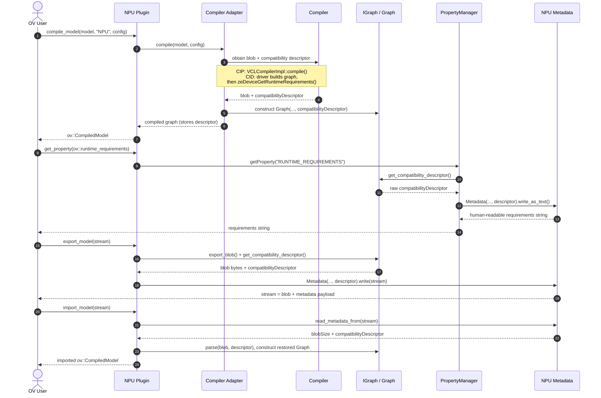

# NPU Runtime Requirements and Compatibility Check

This document describes the internal data flow behind the `ov::runtime_requirements`
and `ov::compatibility_check` properties across compilation, export, and import in the Intel NPU plugin.

For the user-facing description, supported values, and usage examples of these properties, see the
Supported Properties table in the [NPU plugin README](../README.md#supported-properties).

## Overview

- The compiler produces a compatibility descriptor for the generated blob.
- The plugin stores that descriptor in the graph object attached to the compiled model.
- When the user calls `compiled_model.get_property(ov::runtime_requirements)`, the plugin embeds that compiler-generated descriptor in its human-readable metadata string and returns it as the complete runtime requirements at the plugin level.
- During `export_model(...)`, the raw descriptor is written into NPU metadata.
- During `import_model(...)`, the raw descriptor is restored from metadata as an owning `std::string` passed to the parser (before the metadata object is discarded), attached to the parsed graph, and later exposed again through `ov::runtime_requirements`.

## Sequence

## Main Code Paths

- Descriptor-to-property generation: `compiled_model_property_manager.cpp`, `buildRuntimeRequirements(...)`
- Compiler-in-plugin descriptor fetch: `plugin_compiler_adapter.cpp`, `VCLCompilerImpl::compile(...)`
- Compiler-in-driver descriptor fetch: `driver_compiler_adapter.cpp`, `ze_graph_ext_wrappers.cpp`
- Graph storage: `graph.cpp`
- Export metadata write: `compiled_model.cpp`, `metadata.cpp`
- Import metadata read and graph reconstruction: `plugin.cpp`, `parser.cpp`, `metadata.cpp`
