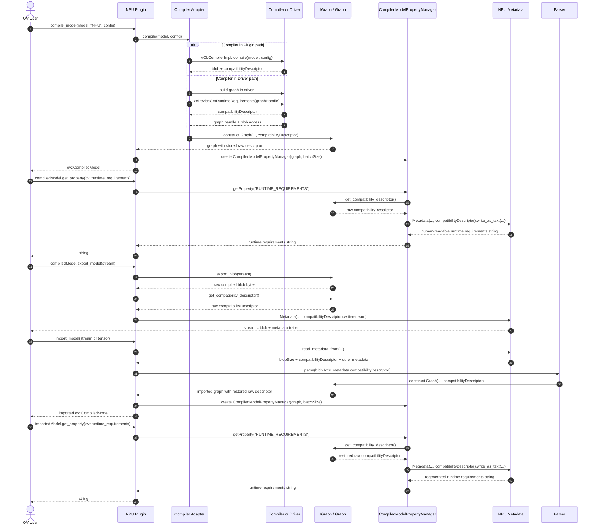

# NPU Runtime Requirements and Compatibility Check

This document describes how the Intel NPU plugin handles the data behind the `ov::runtime_requirements`
and `ov::compatibility_check` properties across compilation, export, and import.

For the user-facing description, supported values, and usage examples of these properties, see the
Supported Properties table in the [NPU plugin README](../README.md#supported-properties).

## Overview

- The compiler or driver produces a raw compatibility descriptor.
- The plugin stores that descriptor in the graph object attached to the compiled model.
- When the user calls `compiled_model.get_property(ov::runtime_requirements)`, the plugin converts that descriptor into the public human-readable metadata string.
- During `export_model(...)`, the raw descriptor is written into NPU metadata.
- During `import_model(...)`, the raw descriptor is restored from metadata, attached to the parsed graph, and later exposed again through `ov::runtime_requirements`.

## Sequence

## Notes

- `ov::runtime_requirements` is not the raw compiler string. The public property is generated on demand by serializing a small human-readable metadata object in `buildRuntimeRequirements(...)`.
- The raw value carried across compile, export, and import is the compatibility descriptor returned by the compiler or driver and stored in `Graph::_compatibilityDescriptor`.
- Export persists the raw descriptor in binary NPU metadata under the current metadata version (`CURRENT_METADATA_VERSION`).
- Import reads that same raw descriptor from metadata and passes an owning `std::string` into the parser before the metadata object is discarded.
- Because the property is regenerated from the restored raw descriptor, `compiled_model.get_property(ov::runtime_requirements)` remains available after import as well.
- The descriptor is only produced when the compiler or driver supports it. Weightless models, and Level Zero drivers older than 1.16, produce no descriptor; `get_property(ov::runtime_requirements)` then throws, and `ov::compatibility_check` returns `NOT_APPLICABLE`.

## Main Code Paths

- Descriptor-to-property generation: `compiled_model_property_manager.cpp`, `buildRuntimeRequirements(...)`
- Compiler-in-plugin descriptor fetch: `plugin_compiler_adapter.cpp`, `VCLCompilerImpl::compile(...)`
- Compiler-in-driver descriptor fetch: `driver_compiler_adapter.cpp`, `ze_graph_ext_wrappers.cpp`
- Graph storage: `graph.cpp`
- Export metadata write: `compiled_model.cpp`, `metadata.cpp`
- Import metadata read and graph reconstruction: `plugin.cpp`, `parser.cpp`, `metadata.cpp`
