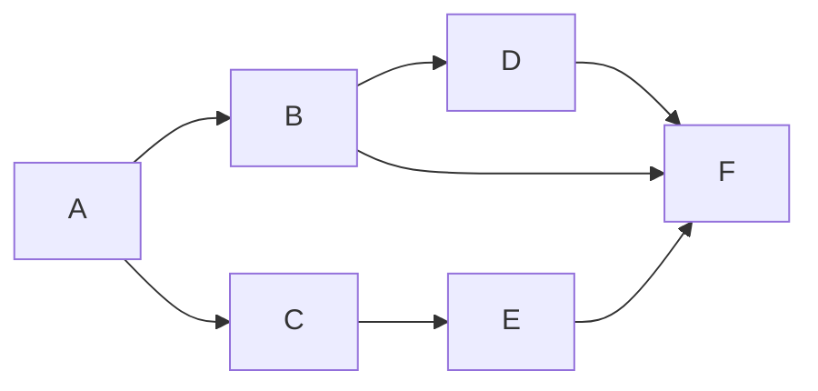
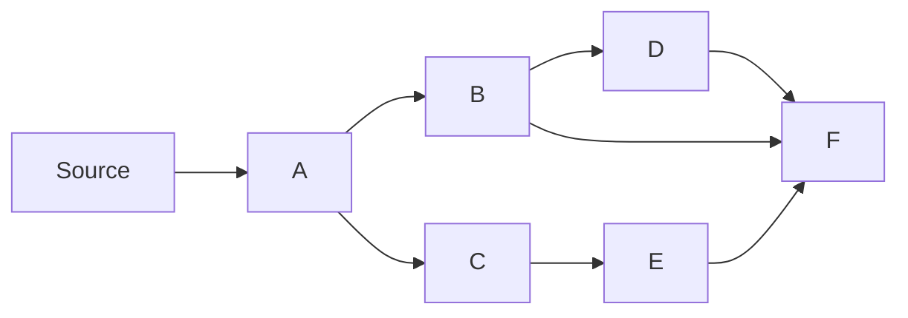
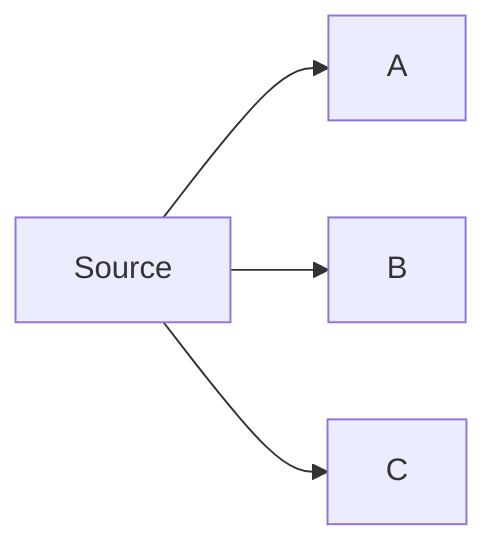
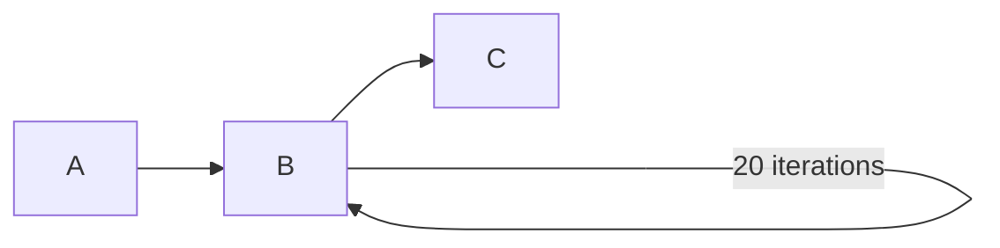
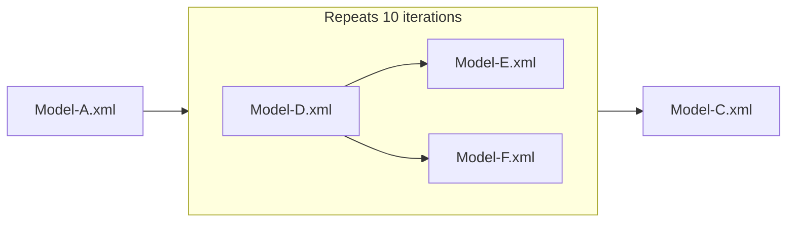
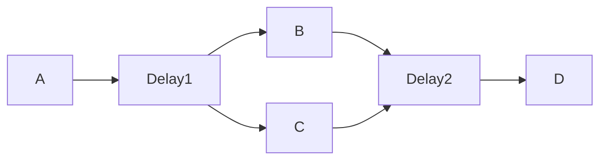

# Protopipe
Protopipe is the C++ tool for simulating performance and validating accuracy of the various AI scenarios.

Protopipe is built atop of [OpenCV G-API](https://github.com/opencv/opencv/wiki/Graph-API) and supports running inference through the [OpenVINO](https://github.com/openvinotoolkit/openvino) and [ONNXRuntime](https://github.com/microsoft/onnxruntime) frameworks.

## Table of Contents
* [Quick start](#quick-start)
* [How to configure](#how-to-configure)
	* [Global parameters](#global-parameters)
	* [Model parameters](#model-parameters)
    * [Graph structure](#graph-structure)
        * [Dependency Graph](#dependency-graph)
        * [Network sequence](#network-sequence)
    * [Scenario parameters](#scenario-parameters)
    * [Config example](#config-example)
* [How to run](#how-to-run)
* [Use cases](#use-cases)
	* [Measure Performance](#measure-performance)
	* [Generate Reference](#generate-reference)
	* [Validate Accuracy](#validate-accuracy)
* [How to build](#how-to-build)

## Quick start
Consider the following [Config example](#config-example) to start using Protopipe.

Learn more about available config parameters (see: [How to configure](#how-to-configure)) and explore different execution modes (see: [Use-cases](#use-cases)) for more advanced usage.

## How to configure
Protopipe uses **YAML** format file to describe the AI scenario structure and its parameters

### Global parameters
The **YAML** config starts with specifying the several global parameters:
- `model_dir` - **Optional**. Path to the models location. (**Default**: ".")
- `blob_dir` - **Optional**. Path to the models location. (**Default**: ".")
- `device_name` - **Optional**. OpenVINO device name: _CPU_, _GPU_, etc. (**Default**: _NPU_)
- `compiler_type` - **Optional**. NPU compiler type: _DRIVER_, _MLIR_. (**Default**: _DRIVER_)
- `log_level` - **Optional**. Log level: _NONE_, _INFO_, _DEBUG_. (**Default**: _NONE_)
- `disable_high_resolution_waitable_timer` - **Optional**. Disables high resolution timer used to perform delays on Windows. (**Default**: false)

Example:
```
model_dir:
  local: C:\workspace\models
device_name: NPU
compiler_type: MLIR
log_level: INFO
```
### Model parameters
#### Common parameters
- `name` or `path` - **Required**. Path to the model file.
- `framework` - **Optional**. Framework to use for inference: *onnxrt*, *openvino*. (**Default**: *openvino*)
- `input_data`, `output_data`, `metric`, `random` - **Optional**. Follow [Use-cases](#use-cases) to  learn the details.
#### OpenVINO parameters
- `priority` - **Optional**. Model priority: _HIGH_, _MEDIUM_, _LOW_. (Default: _MEDIUM_)
- `config` - **Optional**. OpenVINO Plugin specific parameters.
- `device` - **Optional**. OpenVINO device name. 
- `ip` - **Optional**. Input layer precision: _FP16_, _FP32_, _U8_, _I32_.
- `op` - **Optional**. Output layer precision: _FP16_, _FP32_, _U8_, _I32_.
- `il` - **Optional**. Input layer layout.
- `ol` - **Optional**. Output layer layout.
- `iml` - **Optional**. Input model layout.
- `oml` - **Optional**. Output model layout.

Examples:
```
- { name: model.xml, ip: FP16, iml: NHWC, il: NCHW }
- { name: model.xml, ip: { data: FP16 }, priority: HIGH }
- { name: model.xml, device: NPU, config: { PERFORMANCE_HINT: THROUGHPUT } }
```
#### ONNXRT parameters
- `ep` - **Optional**. Specifies the parameters for particular execution provider.
- `session_options` - **Optional**. Set various session options for the ONNX Runtime.

##### Supported Execution Providers
- [OpenVINO Execution Provider](https://onnxruntime.ai/docs/execution-providers/OpenVINO-ExecutionProvider.html)
  - `name: OV` - **Required**. Enables OpenVINO Execution Provider.
  - `device_type` - **Optional**.The device type: _NPU_U8_, _CPU_FP32_, etc.
  - `params` - **Optional**. Accepts a map of options and their corresponding values that can be passed to OV EP.

**Note**: If none of the supported execution providers are specified, the default `MLAS` will be used.

Examples:
```
- { name: model.onnx, framework: onnxrt } # Default (MLAS) EP will be used
- { name: model.onnx, framework: onnxrt, session_options: { session.disable_cpu_ep_fallback: 1 } } # Default (MLAS) EP with the sessions options will be used
- { name: model.onnx, framework: onnxrt, ep: { name: OV, device_type: NPU_U8, params: { enable_qdq_optimizer: False, model_priority: LOW } } } # OpenVINO EP will be used
```

### Graph structure
There are two ways to describe the execution graph structure in Protopipe:  
1. Using [Dependency Graph](#dependency-graph) (preferable)
2. Using [Network Sequence](#network-sequence) (old)

#### Dependency Graph
The dependency graph in Protopipe is specified by:
- `op_desc` - The list of operations, every operation has the following parameters:
  - `tag` - **Required**. The unique name of operation.
  - `type` - **Optional**. The operation type: _Infer_, _CPU_, _Compound_ (**Default**: _Infer_)
  - `repeat_count` - **Optional**. Runs operation over specified number of iterations.
  - `opt_level` - **Optional**. Configures optimization level for ONNX Runtime.
- `connections` - The list of connections between operations.

Supported operation types
1. `Infer` - Performs model inference. Follow [Model parameters](#model-parameters) for the details.
2. `CPU` - Simulates CPU load by performing the busy wait during `time_in_us` amount of time in microseconds
3. `Compound` - Defines a subgraphs that consists of `Infer` and `CPU` node types

```
op_desc:
  - { tag: A, path: Model-A.xml, ip: FP16, op: FP16 }
  - { tag: B, path: Model-B.onnx, framework: onnxrt, ep: { name: OV, device_type: CPU_FP32 } }
  - { tag: C, type: CPU, time_in_us: 5000 }
  - { tag: D, path: Model-D.onnx, framework: onnxrt }
  - { tag: E, path: Model-E.xml, il: NCHW, device: NPU, config: { PEFORMANCE_HINT: LATENCY } }
  - { tag: F, path: Model-F.xml }
connections:
  - [A, C, E, F]
  - [A, B, D, F]
  - [B, F]
```


The source **is not** reflected in graph structure, assume that all operations that don't have input connections are implicitly linked with the source, e.g for the graph above:

<ins>**Note:**</ins> The situation when all nodes don't have input connections is also possible, consider:
```
op_desc:
  - { tag: A, path: Model-A.xml }
  - { tag: B, path: Model-B.xml }
  - { tag: C, path: Model-C.xml }
```


In this case the section `connections` **can be omitted**.

<ins>**Note:**</ins> Graph must remain `DAG`, so any loops in graph are prohibited including the self-loops as well as double edges. These are examples of incorrect graphs:
```
#1: Invalid - The list must contain at least two operations to connect
- [A]
#2: Invalid - Self-loop is prohibited 
- [A, A]
#3: Invalid - Loop is prohibited
- [A, B, C, A]
#4: Invalid - Double edge [B->C] is prohibited
- [A, B, C]
- [B, C]
```
**Example of repeat_count usage**
```
- op_desc:
  - { tag: A, path: Model_A.xml, ... }
  - { tag: B, path: Model_B.xml, repeat_count: 20 }
  - { tag: C, path: Model_C.xml, ... }
  connections:
    - [A, B, C]
```
This defines the following pipeline:

**Example of "Compound" type operation**.
```
op_desc:
  - { tag: A, path: Model-A.xml }
  - tag: B,
    type: Compound,
    repeat_count: 10,
    op_desc:
      - { tag: D, path: Model-D.xml }
      - { tag: E, path: Model-E.xml }
      - { tag: F, path: Model-F.xml }
    connections:
      - [D, E]
      - [D, F]
  - { tag: C, path: Model-C.xml }
connections:
  - [A, B, C]
```
This defines the following pipeline:


#### Network Sequence
There is also a way to describe the graph by using chain-like structure:  
`network` - **Required**. List or list of lists of model parameters. Follow [Model Parameters](#model-parameters) for the details.  
`delay_in_us` - **Optional**. Delay between models in microseconds.  

```
input_stream_list:
- network:
  - { name: A.xml, ip: FP16, il: NCHW, device: CPU }
  - [{ name: B.xml, ip: FP16, op: FP16 }, { name: C.xml, ip: FP16, op: FP16 }]
  - { name: D.xml, ip: FP16, op: FP16, config: { PEROFMRANCE_HINT: LATENCY } }
  delay_in_us: 5000 
```



### Scenario parameters
The list of scenarios are specified by using `multi_inference` parameter, every scenario has the following parameters:
- `name` - **Optional**. The name of execution scenario.
- `input_stream_list` - **Required**. The list of the streams that will be run in parallel.  

Every stream has the following execution parameters:
- `name` - **Optional**. The name of the stream.  
- `iteration_count` - **Optional**. Number of iterations to execute.  
- `exec_time_in_secs` - **Optional**. Execute until timeout specified.  
- `frames_interval_in_ms` - **Optional**. Execution frequency of the stream (**Default**: 0 - Unbounded)  
- `target_fps` - **Optional**. Execution frequency of the stream. `target_fps = 1000 / frames_interval_in_ms`. `target_fps` and `frames_interval_in_ms` are mutually exclusive and cannot be provided together.
- `target_latency_in_ms` - **Optional**. When iteration isn't finished within specified interval, the next frame will be dropped from execution. (**Default**: Disabled)
- `op_desc`/`conections` or `network` - **Required**. Execution graph structure. Follow [Graph structure](#graph-structure) for the details.

### Config example
Consider the following scenario that consists of two parallel streams specified on `config.yaml`:  
```
model_dir:
  local: C:\workspace\models
device_name: NPU
compiler_type: MLIR
log_level: INFO

multi_inference:
- input_stream_list:
  - network:
    - { name: A.xml, ip: FP16, il: NCHW, device: CPU }
    - [{ name: B.xml, ip: FP16, op: FP16 }, { name: C.xml, ip: FP16, op: FP16 }]
    - { name: D.xml, ip: FP16, op: FP16, config: { PEROFMRANCE_HINT: LATENCY } }
    target_fps: 30
    exec_time_in_secs: 15
  - op_desc:
    - { tag: E, path: E.onnx, framework: onnxrt, ep: { name: OV, device_type: NPU_U8 } }
    - { tag: F, type: CPU, time_in_us: 5000 }
    - { tag: G, path: G.xml, ip: FP16, op: FP16, priority: HIGH }
    connections:
    - [E, F, G]
    target_fps: 100
    exec_time_in_secs: 15
```
- The first `stream` is defined by using [Network sequence](#network-sequence) syntax and will execute the following graph with `30` FPS cadence:
	```mermaid
	graph LR;
	A-->B;
	A-->C;
	B-->D;
	C-->D;
	```
- The second `stream` is defined by using [Dependency graph](#dependency-graph) syntax and will execute the following graph with `100` FPS cadence.
	```mermaid
	graph LR;
	E-->F;
	F-->G;
	```
 
Run:
```
./protopipe -cfg config.yaml --drop_frames
```
Both streams will be executed simultaneously in different threads during `15` seconds.

Output format:
```
stream 0: throughput: <number> FPS, latency: min: <number> ms, avg: <number> ms, max: <number> ms, frames dropped: <number>/<number>
stream 1: throughput: <number> FPS, latency: min: <number> ms, avg: <number> ms, max: <number> ms, frames dropped: <number>/<number>
```

## How to run
Protopipe has the following `CLI` options to configure the execution behaviour:  

`--cfg <path>` - Path to configuration file.       
`--drop_frames`- **Optional**. Drop frames if they come earlier than stream is completed. E.g if `stream` works with `target_fps: 10` (~`100ms` latency) but stream iteration takes `150ms` - the next iteration will be triggered only in `50ms` if option is enabled.           
`--pipeline` - **Optional**. Enables pipelined execution for all scenarios/streams.                      
`--niter <value>` - **Optional**. Number of iterations. If specified overwrites termination criterion specified in configuration file for all scenarios/streams.             
`-t <value>` - **Optional**. Time in seconds. If specified overwrites termination criterion specified in configuration file for all scenarios/streams.  
`--mode <value>` - **Optional**. Execution mode: *performance*, *reference*, *validation* (**Default**: *performance*)  
`--exec_filter <value>` - **Optional**. Run only the scenarios that match provided string pattern.  
`--inference_only` - **Optional**. Run only inference execution for every model excluding i/o data transfer (**Default**: true)  

### Filtering
Sometime it's needed to run particular set of scenarios specified in config file rather than all of them.   
For example consider the following config file with three scenarios specified in `scenarios.yaml`:
```
model_dir:
  local: /models/
device_name: CPU
multi_inference:
- input_stream_list:
  - network:
    - { name: A.xml }
- input_stream_list:
  - network:
    - { name: B.xml }
- input_stream_list:
  - network:
    - { name: C.xml }
```
By default all scenarios are assigned unique names according to the following `multi_inference_<number>` pattern.    
E.g scenario with model `A.xml` has default name `multi_inference_0`.    
Use `-exec_filter <value>` CLI option to control what scenarios from config should be executed:   
```
./protopipe -cfg scenarios.yaml -niter 100 -exec_filter=".*[0-1]"
```
Only `multi_inference_0` and `multi_inference_1` scenarios will be executed.  

It's also possible to overwrite the default names in config file:
```
model_dir:
  local: /models/
device_name: CPU
multi_inference:
- name: Model-A-Scenario
  input_stream_list:
  - network:
    - { name: A.xml }
- name: Model-B-Scenario
  input_stream_list:
  - network:
    - { name: B.xml }
- name: Model-C-Scenario
  input_stream_list:
  - network:
    - { name: C.xml }
```
and use them for filtering:
```
./protopipe --cfg scenarios.yaml --niter 100 --exec_filter ".*-[AB].*"
```
Only `Model-A-Scenario` and `Model-B-Scenario` scenarios will be executed.

**Note**: Protopipe uses [std::regex](https://en.cppreference.com/w/cpp/regex) rules for pattern matching.

## Use cases
Once scenario configuration is defined (see: [How to configure](#how-to-configure)) it can be used for various uses cases.
### Measure performance
`Protopipe` can report the performance statistics, consider the following run example:
```
./protopipe --cfg config.yaml --drop_frames -t 30
```
Example of output:
```
stream 0: throughput: 7.62659 FPS, latency: min: 93.804 ms, avg: 111.31 ms, max: 145.178 ms, frames dropped: 290/390
```
It might be also interesting to play with the following `CLI` options:
- `--drop_frames=false` - Disables frame drop. By default, if iteration doesn't fit into 1000 / `target_fps` latency interval, the next iteration will be skipped.
- `--inference_only=false` - Enables i/o data transfer for inference. By default only inference time is captured in performance statistics.
- `--pipeline` - Enables ***pipelined*** execution.

### Generate reference
As the prerequisite for accuracy validation it's useful to have a mechanism that provides an opportunity to generate the reference output data to compare with. In Protopipe in can be done by using the `reference` mode.
Use additional parameters to configure `reference` mode:
- `input_data` - **Required**. Path that contain input data for the model, if entity under the path is empty, input data will be generated randomly and dumped into the path specified.
- `output_data` - **Required**. Path where to dump reference output data.
- `random` - **Optional**. Initializer to generate input data randomly. (Default: ` { dist: uniform, low: 0.0, high: 255 }`)

Examples:
```
random: { dist: uniform, low: -1.0, high: 1.0 } # specified globally for all models
multi_inference:
- input_stream_list:
  - network:
    - { name: A.xml, ip: FP16, input_data: A-inputs/, output_data: B-inputs/ }
      # overwrites global initializer for the model B.xml
    - { name: B.xml, ip: FP16, input_data: B-inputs/, output_data: B-outptus/, random: { name: uniform, low: 0, high: 255.0 }
```

Run `Protopipe` in `reference` mode:
```
./protopipe -cfg config.yaml -mode reference -niter 10
```
Output:
```
stream 0: Reference data has been generated for 10 iteration(s)
```

### Validate accuracy
Protopipe has the dedicated `validation` mode to perform accuracy validation. Existing configuration file can be simply extended to perform accuracy validation:

- `save_validation_outputs` - **Optional**. Accepts the path where to dump actual execution outputs. (Default: disabled)
- `metric` - **Optional**. Accuracy metric to compare actual vs reference outputs. (Default: `{ name: norm, tolerance: 0.0 }`)
- `input_data` - **Required**. Path that contain input data for the model.
- `output_data` - **Required**. Path that contain **reference** data to compare with.  

**Note**: If folder is provided either for **input_data** or **output_data**, it must be in the following format:
```
input_data/
  <input_layer_name>/
    input_0.bin
	input_1.bin
	...
	input_N.bin

output_data/
  <output_layer_name>/
    output_0.bin
	output_1.bin
	...
	output_N.bin
```
**Note**: input and output data can be generated automatically by using `Protopipe` in **reference** mode. (see: [Generate reference](#generate-reference))

Examples:
```
- { name: model.xml, ip: FP16, input_data: input_data/, output_data: output_data/ }
- { name: model.xml, ip: FP16, input_data: input.bin, output_data: output.bin }
- { name: model.xml, ip: FP16, input_data: { data: input.bin }, output_data: { result: output.bin} }
```

### Supported metrics
1. L2 Norm: $$\text{Norm}(\mathbf{A}, \mathbf{B}) = \sqrt{\sum_{i,j} (A_{i,j} - B_{i,j})^2}$$  
Parameters:
    - `name: norm` - **Required**. Enables L2 Norm metric.
	- `tolerance` - **Required**. If value of metric is greater than **tolerance** it will be treated as **FAIL**.
3. Cosine similarity: $$\text{Cosine}(\mathbf{A}, \mathbf{B}) = \frac{\mathbf{A} \cdot \mathbf{B}}{\| \mathbf{A} \|_2 \| \mathbf{B} \|_2}$$  
Parameters:
    - `name: cosine` - **Required**. Enables cosine similarity metric.
	- `threshold` - **Required**. If value of metric is lower than **threshold** it will be treated as **FAIL**.
3. NRMSE : $$\text{NRMSE}(\mathbf{A}, \mathbf{B}) = \frac{1}{D}\sqrt{\frac{1}{N}\sum_{i=1}^N(A_i - B_i)^2}$$
Where,
$$D = \text{max}(0.001, \text{max}(A_{max}-A_{min}\text{, } B_{max}-B_{min}))$$
Parameters:
    - `name: nrmse` - **Required**. Enables nrmse metric.
	- `tolerance` - **Required**. If value of metric is greater than **tolerance** it will be treated as **FAIL**.

### Example
Consider the following `config.yaml`:
```
model_dir:
  local: C:\workspace\models
device_name: NPU
compiler_type: MLIR
log_level: INFO

save_validation_outputs: actual-outputs/
metric: { name: norm, tolerance: 0.01 }

multi_inference:
- input_stream_list:
  - network:
    - { name: A.xml, ip: FP16, input_data: A-inputs/, output_data: A-outputs/ }
      # overwrites the global metric for the model B.xml
    - { name: B.xml, ip: FP16, input_data: B-inputs/, output_data: B-outputs/, metric: { name: norm, tolerance: 0.0 }
```

Use `reference` mode to generate the input random data for every model and calculate reference outputs
**Note**: If reference device is different, it can be changed in config file (`device_name`) accordingly
```
./protopipe --cfg config.yaml --mode reference -niter 10
```
Use `validation` mode to perform accuracy validation:
```
./protopipe --cfg config.yaml --mode validation -t 15
```
Example of successful validation:
```
stream 0: Validation has passed for <number> iteration(s)
```
In case of accuracy issues the output will be the following:
```
stream 0: Accuraccy check failed on <number> iteration(s) (first 10):
Iteration <number>:
  Model: A, Layer: <name>, Metric: Norm{tolerance: 0.01}, Reason: <number> > 0.01;
```

## How to build
### Prerequisites
1. Clone `npu-plugin` repository
2. Build OpenCV G-API with OpenVINO/ONNXRT support
#### Build OpenCV G-API with OpenVINO/ONNXRT support
1. Clone OpenCV repo:
    ```
    git clone https://github.com/opencv/opencv
    cd opencv && git checkout 78195bc3df
    ```
2. Build OpenCV G-API:
	```
    mkdir -p build && cd build
    cmake ../ -DBUILD_LIST=gapi                             \
              -DCMAKE_BUILD_TYPE=Release                    \
              -DWITH_OPENVINO=ON                            \
              -DOpenVINO_DIR=<path-to-openvino-install-dir> \
              -DWITH_ONNX=ON                                \
              -DORT_INSTALL_DIR=<path-to-onnxrt-install-dir>
    cmake --build . --config Release --target opencv_gapi --parallel
	```
### In-plugin build

1. Clone and build [OpenVINO](https://github.com/openvinotoolkit/openvino) from sources
2. Build OpenCV G-API with OpenVINO / ONNXRT support
3. Clone `npu-plugin` repository
	```
	git clone https://github.com/openvinotoolkit/npu_plugin
	git submodule update --init --recursive
	```
4. Build `Protopipe` as part of the `npu-plugin` build:
	```
	mkdir build && cd build
	cmake ../ -DOpenCV_DIR=<path-to-opencv-build> -DOpenVINODeveloperPackage_DIR=<path-to-openvino-build>
	cmake --build . --config Release --target protopipe --parallel
	```

### Standalone build
1. Build `yaml-cpp`
	```
	mkdir -p yaml-cpp_build cd && yaml-cpp_build
	cmake ../<npu-plugin>/thirdparty/yaml-cpp -DCMAKE_INSTALL_PREFIX=install
	cmake --build . --config Release --target install --parallel
	```
2. Build `gflags`
	```
	git clone https://github.com/gflags/gflags
	cd gflags
	mkdir -p gflags_build cd && gflags_build
	cmake ../ -DCMAKE_INSTALL_PREFIX=install
	cmake --build . --config Release --target install --parallel
	```
3. Build `Protopipe`
	```
	mkdir -b protopipe_build && cd protopipe_build
	cmake <npu-plugin>/tools/protopipe/                              \
	      -DOpenCV_DIR=<path-to-opencv-build                         \
	      -Dyaml_cpp_DIR=<yaml-cpp_build/install/lib/cmake/yaml-cpp> \
	      -Dgflags_DIR=<gflags_build/install>                        \
	      -DOpenVINO_DIR=<path>                                      \
	           
	cmake --build . --config Release --target protopipe --parallel
	```
### Verify the installation
**Note**: Make sure `opencv_*` libraries are visible in the environment:
- Windows: 
	```
	set PATH=<path-to-opencv>\build\bin\Release\;%PATH%
	```
- Linux:
	```
	export LD_LIBRARY_PATH=<path-to-opencv>/build/lib/:$LD_LIBRARY_PATH
	```
**Note**: If `OpenCV` has been build with `ONNXRT` support, all `ONNXRT` related libraries must be located in the same folder as `protopipe` executable.

Run `Protopipe` with -h flag to verify installation:
```
> protopipe.exe -h
```
Successful build will show the information about `Protopipe` CLI options:
```
protopipe [OPTIONS]

 Common options:
    -h                      Optional. Print the usage message.
    -cfg <value>            Path to the configuration file.
    -pipeline               Optional. Enable pipelined execution.
    -drop_frames            Optional. Drop frames if they come earlier than pipeline is completed.
    -mode <value>           Optional. Simulation mode: performance (default), reference, validation.
    -niter <value>          Optional. Number of iterations. If specified overwrites termination criterion for all scenarios in configuration file.
    -t <value>              Optional. Time in seconds. If specified overwrites termination criterion for all scenarios in configuration file.
    -inference_only         Optional. Run only inference execution for every model excluding i/o data transfer. Applicable only for "performance" mode. (default: true).
    -exec_filter            Optional. Run the scenarios that match provided string pattern.
```
