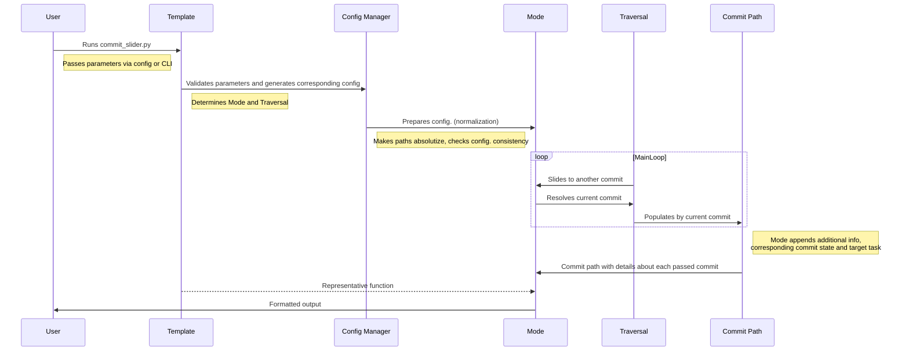
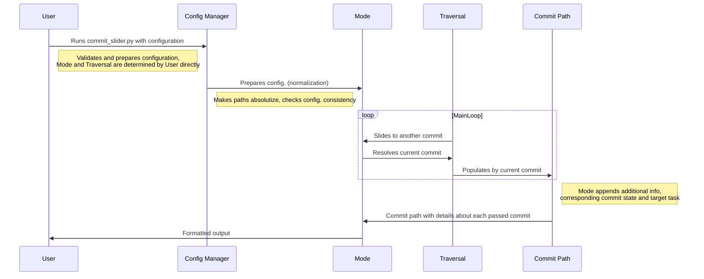

## CS workflow with template

There are two essential approaches to solving problems via CS: pure configuration and `Template`. In the first case we use full functional under-hood. `Template` gives opportunity to create custom API and output representation.

CS uses `Template` via configuration:
```
{
    'template' : {
        'name' : 'some_template',
        'parameter_1' : '...',
        ...
        'parameter_N' : '...'
    }
}
```
or via CLI:

`python3 commit_slider -t some_template <template parameters>`



## CS workflow without template (pure configuration)

