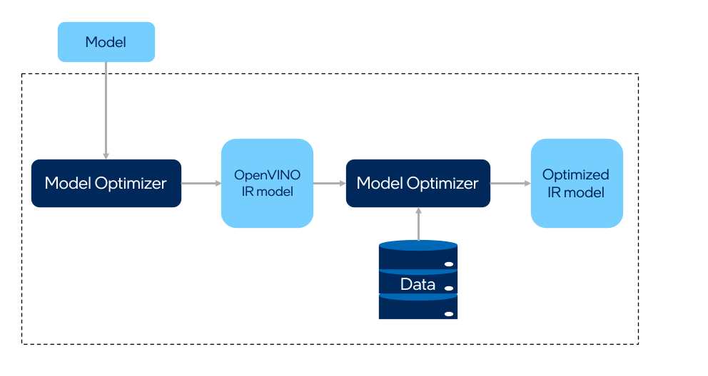

# Post-Training Optimization Tool

## Introduction

Post-training Optimization Tool (POT) is designed to accelerate the inference of deep learning models by applying
special methods without model retraining or fine-tuning, for example, post-training 8-bit quantization. Therefore, the tool does not
require a training dataset or a pipeline. To apply post-training algorithms from the POT, you need:
* A floating-point precision model, FP32 or FP16, converted into the OpenVINO&trade; Intermediate Representation (IR) format
and run on CPU with the OpenVINO&trade;.
* A representative calibration dataset representing a use case scenario, for example, 300 samples.

Figure below shows the optimization workflow:


To get started with POT tool refer to the corresponding OpenVINO&trade; [documentation](https://docs.openvino.ai/2023.2/openvino_docs_model_optimization_guide.html).

## Installation
### From PyPI
POT is distributed as a part of OpenVINO&trade; Development Tools package. For installation instruction please refer to this [document](https://docs.openvino.ai/2023.2/openvino_docs_install_guides_install_dev_tools.html).

### From GitHub
As prerequisites, you should install [OpenVINO&trade; Runtime](https://docs.openvino.ai/2023.2/openvino_docs_install_guides_overview.html) and other dependencies such as [Model Optimizer](https://docs.openvino.ai/2023.2/openvino_docs_MO_DG_Deep_Learning_Model_Optimizer_DevGuide.html) and [Accuracy Checker](https://docs.openvino.ai/2023.2/omz_tools_accuracy_checker.html).

To install POT from source:
- Clone OpenVINO repository
   ```sh
   git clone --recusive https://github.com/openvinotoolkit/openvino.git
   ```
- Navigate to `openvino/tools/pot/` folder
- Install POT package:
   ```sh
   python3 setup.py install
   ```

After installation POT is available as a Python library under `openvino.tools.pot.*` and in the command line by the `pot` alias. To verify it, run `pot -h`. 


## Examples

OpenVINO provides several examples to demonstrate the POT optimization workflow:

* Command-line example:
  * [Quantization of Image Classification model](https://docs.openvino.ai/2023.2/pot_configs_examples_README.html)
* API tutorials:
  * [Quantization of Image Classification model](https://github.com/openvinotoolkit/openvino_notebooks/tree/main/notebooks/301-tensorflow-training-openvino)
  * [Quantization of Object Detection model from Model Zoo](https://github.com/openvinotoolkit/openvino_notebooks/tree/main/notebooks/111-yolov5-quantization-migration)
  * [Quantization of Segmentation model for medical data](https://github.com/openvinotoolkit/openvino_notebooks/tree/main/notebooks/110-ct-segmentation-quantize)
  * [Quantization of BERT for Text Classification](https://github.com/openvinotoolkit/openvino_notebooks/tree/main/notebooks/105-language-quantize-bert)
* API examples:
  * [Quantization of 3D segmentation model](https://github.com/openvinotoolkit/openvino/tree/master/tools/pot/openvino/tools/pot/api/samples/3d_segmentation)
  * [Quantization of Face Detection model](https://github.com/openvinotoolkit/openvino/tree/master/tools/pot/openvino/tools/pot/api/samples/face_detection)
  * [Quantization of Object Detection model with controable accuracy](https://github.com/openvinotoolkit/openvino/tree/master/tools/pot/openvino/tools/pot/api/samples/object_detection)
  * [Quantizatin of speech model for GNA device](https://github.com/openvinotoolkit/openvino/tree/master/tools/pot/openvino/tools/pot/api/samples/speech)


## See Also

* [Performance Benchmarks](https://docs.openvino.ai/2023.2/openvino_docs_performance_benchmarks.html)
