# Ignored Patterns

## Introduction

This document provides a full list of the *ignored patterns* expressed in OpenVINO operation set and used across several
tools designed (POT, NNCF) to produce optimized models specifically for OpenVINO. The ignored pattern is a subgraph of 
the initial computational graph which excluded from any optimization process whether quantization or other methods.
In particular, during the quantization FakeQuantize operations are not inserted into this the subgraph. These patterns
can be established due to the following reasons:

* The subgraph can be executed by the runtime more efficiently in a full-precision rather than in low-precision
* Operations from the subgraph are not supported by the runtime

These patterns are not hardware specific now, but it may be changed in the future.

## List of the ignored patterns

Each ignored pattern is described by the following fields:
* Name - short identifier which reveals the meaning of the pattern;
* Examples of topologies - topologies where this pattern can be found;
* Pattern - flowchart which is used to display the ignored pattern. It is oriented from top to bottom.

Sometimes patterns can contain nodes that are necessary only for pattern matching. These nodes are included
in the optimization process and marked by blue on the flowchart.

All ignored patterns are presented below.

---
<!--IGNORED PATTERNS-->
**Name:** add_scale_shift<br/>
**Pattern:** <br/>

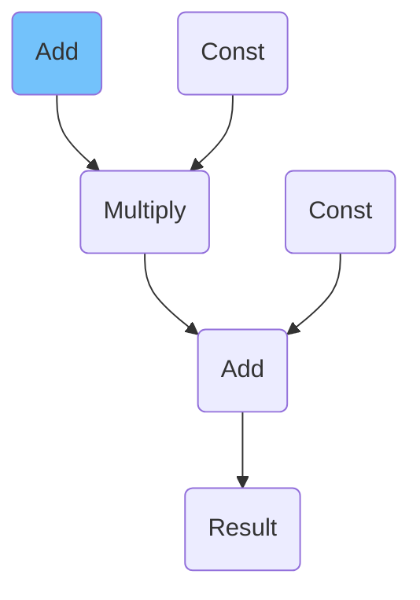

---

**Name:** batch_index<br/>
**Pattern:** <br/>

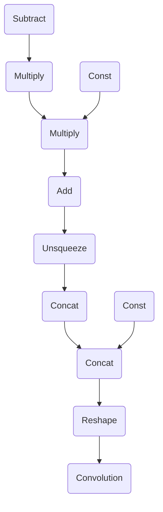

---

**Name:** equal_logicalnot<br/>
**Pattern:** <br/>

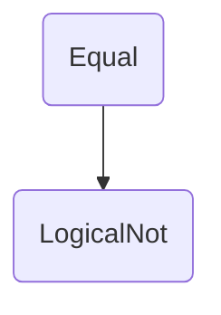

---

**Name:** experimental_detectron_detection_output_add<br/>
**Pattern:** <br/>

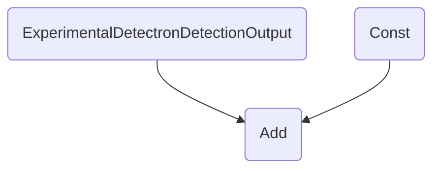

---

**Name:** experimental_detectron_roi_feature_extractor_add<br/>
**Pattern:** <br/>

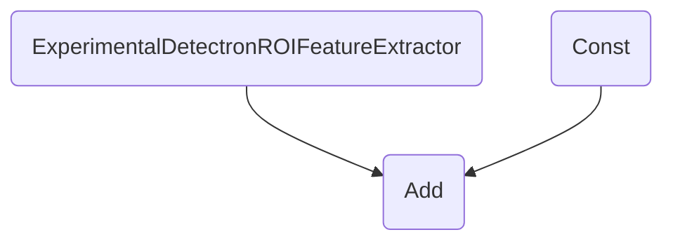

---

**Name:** fc_bn_hswish_activation<br/>
**Pattern:** <br/>

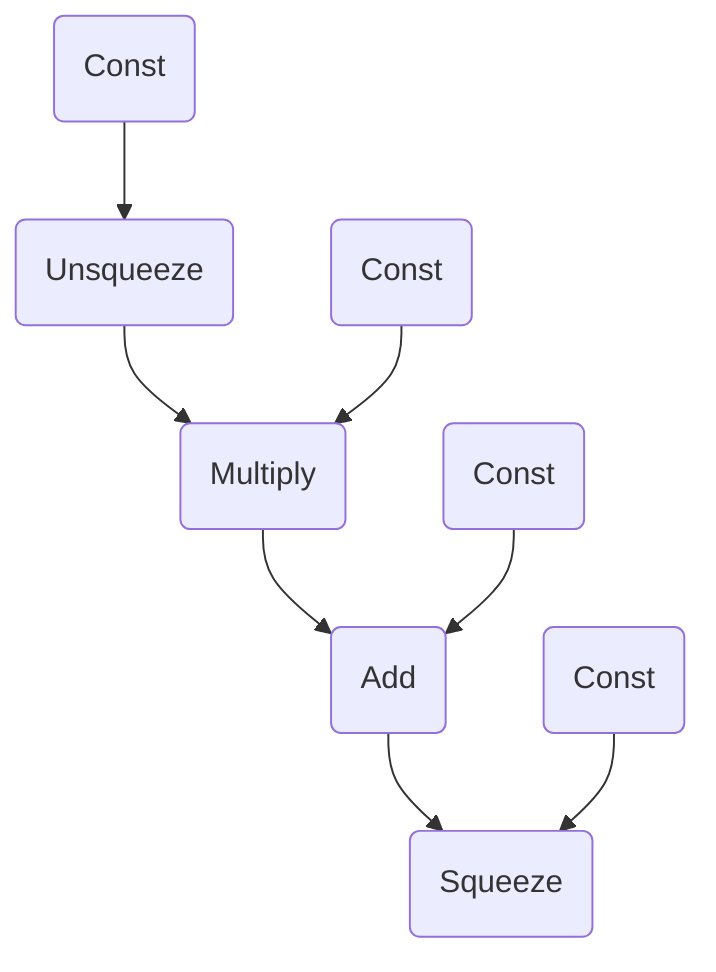

---

**Name:** hswish_activation<br/>
**Pattern:** <br/>

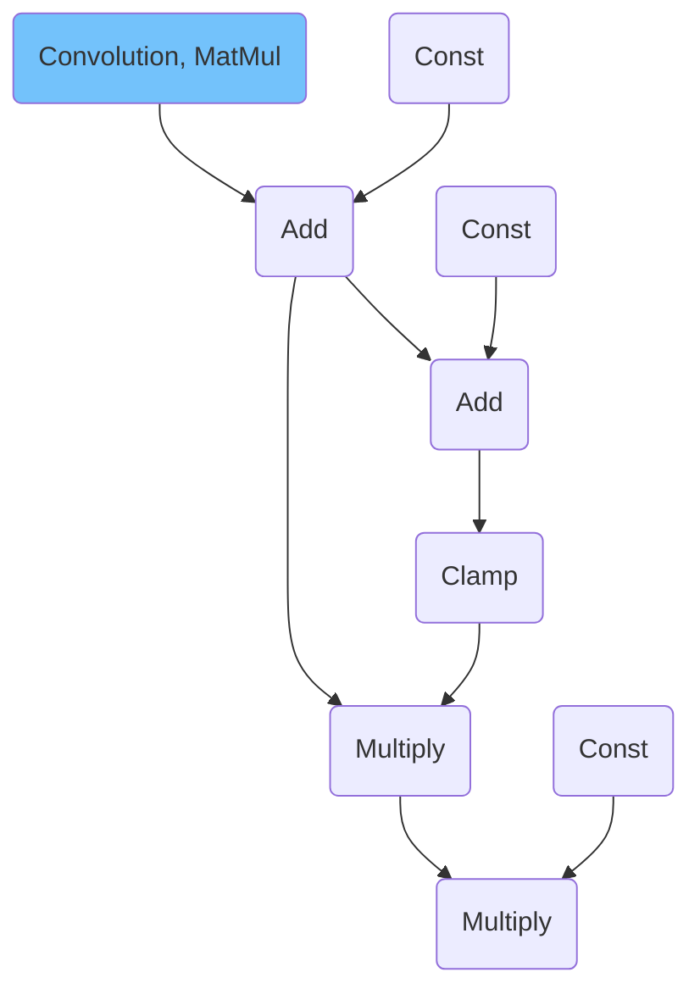

---

**Name:** hswish_activation_clamp_multiply<br/>
**Pattern:** <br/>

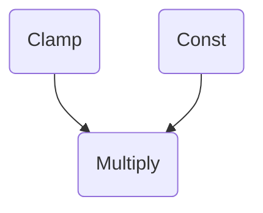

---

**Name:** hswish_activation_v2<br/>
**Pattern:** <br/>

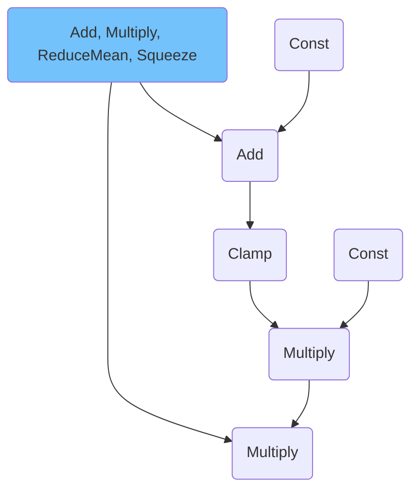

---

**Name:** hswish_activation_without_denominator<br/>
**Pattern:** <br/>

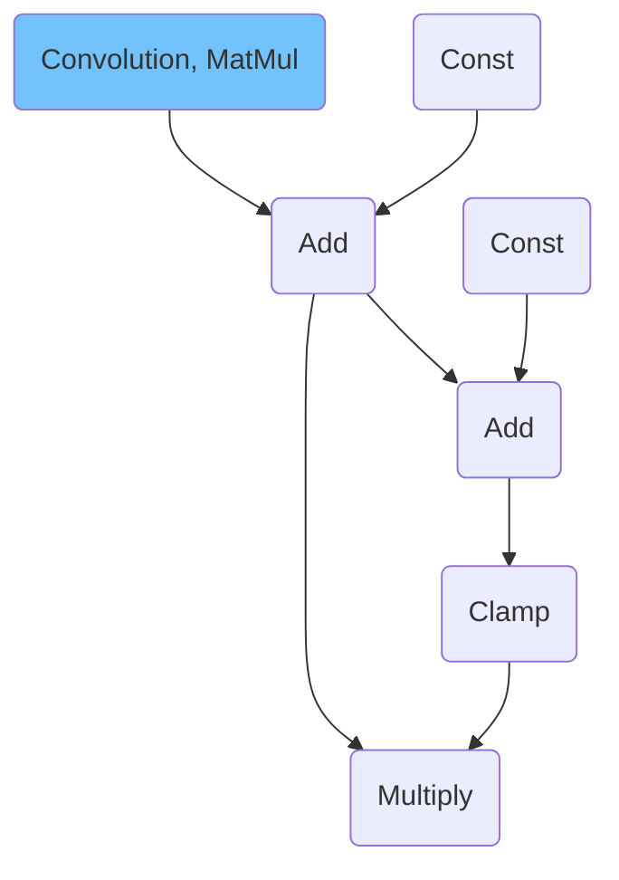

---

**Name:** input_add<br/>
**Pattern:** <br/>

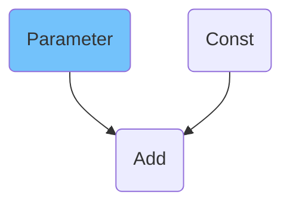

---

**Name:** input_subtract<br/>
**Pattern:** <br/>

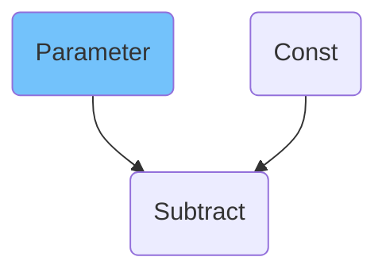

---

**Name:** input_transpose_add<br/>
**Pattern:** <br/>

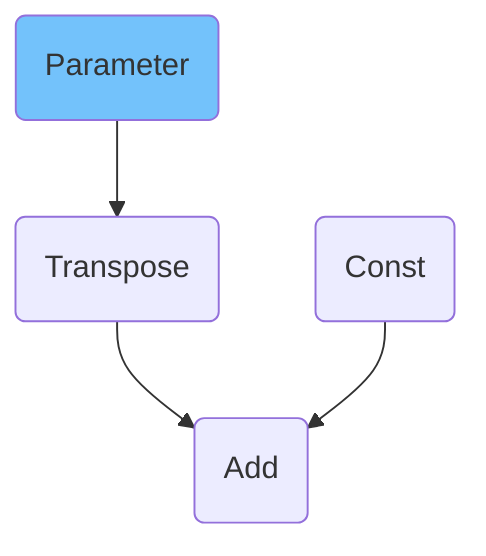

---

**Name:** input_convert_transpose_add<br/>
**Pattern:** <br/>

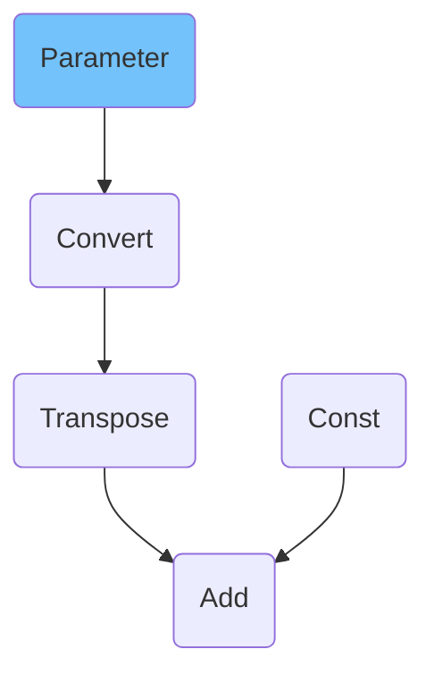

---

**Name:** input_multiply<br/>
**Pattern:** <br/>

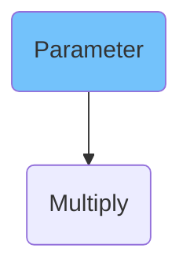

---

**Name:** input_transpose_multiply<br/>
**Pattern:** <br/>

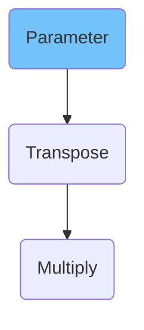

---

**Name:** input_convert_transpose_multiply<br/>
**Pattern:** <br/>

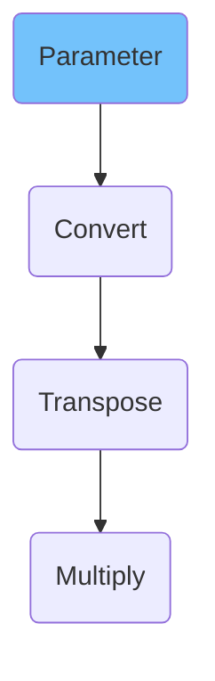

---

**Name:** input_reverse_input_channels_add<br/>
**Pattern:** <br/>

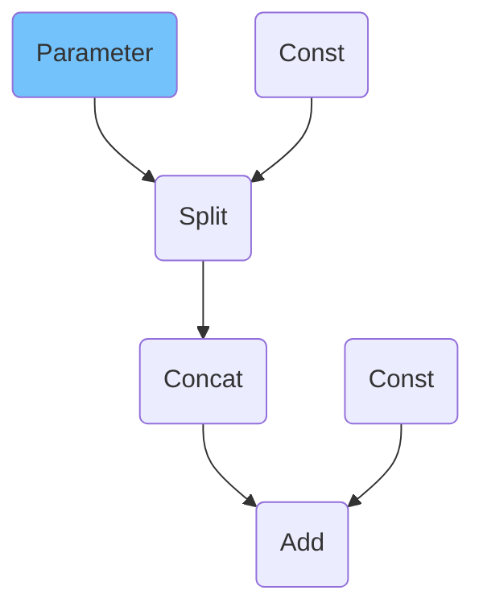

---

**Name:** input_transpose_reverse_input_channels_scale_shift<br/>
**Pattern:** <br/>

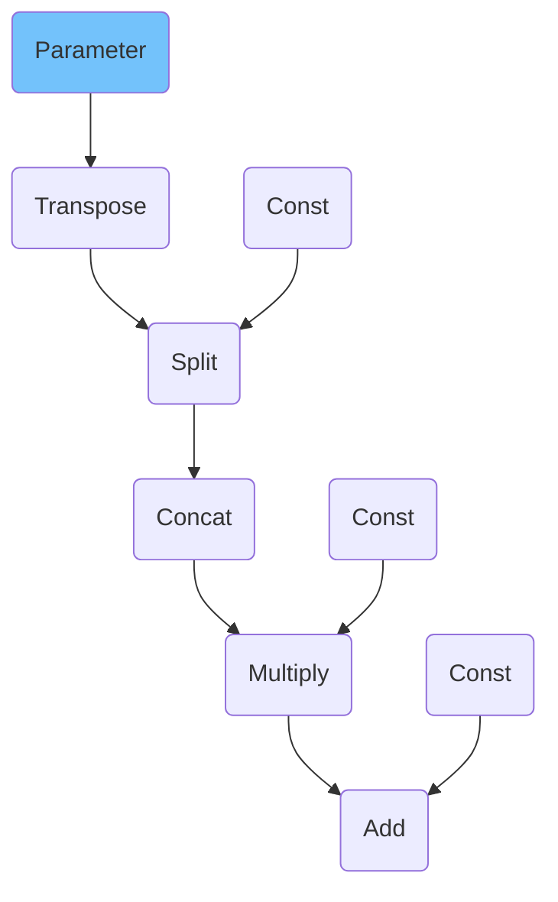

---

**Name:** input_convert_transpose_reverse_input_channels_scale_shift<br/>
**Pattern:** <br/>

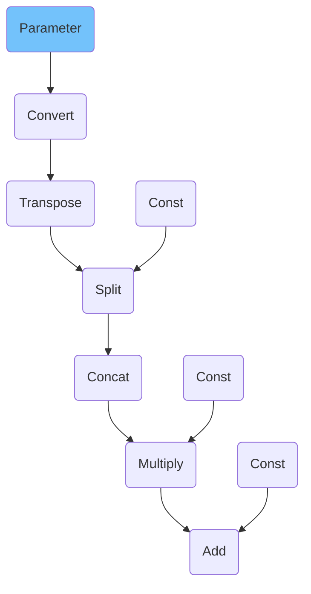

---

**Name:** input_reverse_input_channels_scale_shift<br/>
**Pattern:** <br/>

```mermaid
graph TB
    input(Parameter) --> split(Split)
    split_const(Const) --> split(Split)
    split(Split) --> concat(Concat)
    concat(Concat) --> scaleshift_multiply(Multiply)
    scaleshift_multiply_const(Const) --> scaleshift_multiply(Multiply)
    scaleshift_multiply(Multiply) --> scaleshift_add(Add)
    scaleshift_add_const(Const) --> scaleshift_add(Add)
    style input fill:#73C2FB
```

---

**Name:** input_scale_shift<br/>
**Pattern:** <br/>

```mermaid
graph TB
    input(Parameter) --> scaleshift_multiply(Multiply)
    scaleshift_multiply_const(Const) --> scaleshift_multiply(Multiply)
    scaleshift_multiply(Multiply) --> scaleshift_add(Add)
    scaleshift_add_const(Const) --> scaleshift_add(Add)
    style input fill:#73C2FB
```

---

**Name:** input_transpose_scale_shift<br/>
**Pattern:** <br/>

```mermaid
graph TB
    input(Parameter) --> transpose(Transpose)
    transpose(Transpose) --> scaleshift_multiply(Multiply)
    scaleshift_multiply_const(Const) --> scaleshift_multiply(Multiply)
    scaleshift_multiply(Multiply) --> scaleshift_add(Add)
    scaleshift_add_const(Const) --> scaleshift_add(Add)
    style input fill:#73C2FB
```

---

**Name:** input_convert_transpose_scale_shift<br/>
**Pattern:** <br/>

```mermaid
graph TB
    input(Parameter) --> convert(Convert)
    convert(Convert) --> transpose(Transpose)
    transpose(Transpose) --> scaleshift_multiply(Multiply)
    scaleshift_multiply_const(Const) --> scaleshift_multiply(Multiply)
    scaleshift_multiply(Multiply) --> scaleshift_add(Add)
    scaleshift_add_const(Const) --> scaleshift_add(Add)
    style input fill:#73C2FB
```

---

**Name:** mvn_scale_shift<br/>
**Pattern:** <br/>

```mermaid
graph TB
    input(MVN) --> scaleshift_multiply(Multiply)
    scaleshift_multiply_const(Const) --> scaleshift_multiply(Multiply)
    scaleshift_multiply(Multiply) --> scaleshift_add(Add)
    scaleshift_add_const(Const) --> scaleshift_add(Add)
    style input fill:#73C2FB
```

---

**Name:** normalize_l2<br/>
**Pattern:** <br/>

```mermaid
graph TB
    input(NormalizeL2) --> multiply(Multiply)
    style input fill:#73C2FB
```

---

**Name:** operation_with_bias<br/>
**Pattern:** <br/>

```mermaid
graph TB
    input(Convolution, MatMul, ConvolutionBackpropData, GroupConvolution, GroupConvolutionBackpropData) --> bias(Add)
    bias_const(Const) --> bias(Add)
    style input fill:#73C2FB
```

---

**Name:** scale_shift_add<br/>
**Pattern:** <br/>

```mermaid
graph TB
    input(Multiply) --> add(Add)
    add_const(Const) --> add(Add)
    style input fill:#73C2FB
```

---

**Name:** se_block<br/>
**Pattern:** <br/>

```mermaid
graph TB
    input(ReduceMean) --> conv_fc(Convolution, MatMul)
    conv_fc(Convolution, MatMul) --> bias(Add)
    bias_const(Const) --> bias(Add)
    bias(Add) --> act(ReLU, PReLU)
    act(ReLU, PReLU) --> conv_fc_1(Convolution, MatMul)
    conv_fc_1(Convolution, MatMul) --> bias_1(Add)
    bias_const_1(Const) --> bias_1(Add)
    bias_1(Add) --> act_1(Sigmoid)
    act_1(Sigmoid) --> output(Multiply)
    style input fill:#73C2FB
    style output fill:#73C2FB
```

---

**Name:** se_block_swish_activation<br/>
**Pattern:** <br/>

```mermaid
graph TB
    input(ReduceMean) --> conv_fc(Convolution, MatMul)
    conv_fc(Convolution, MatMul) --> bias(Add)
    bias_const(Const) --> bias(Add)
    bias(Add) --> swish(Swish)
    swish(Swish) --> conv_fc_1(Convolution, MatMul)
    conv_fc_1(Convolution, MatMul) --> bias_1(Add)
    bias_const_1(Const) --> bias_1(Add)
    bias_1(Add) --> act_1(Sigmoid)
    act_1(Sigmoid) --> output(Multiply)
    style input fill:#73C2FB
    style output fill:#73C2FB
```

---

**Name:** softmax<br/>
**Pattern:** <br/>

```mermaid
graph TB
    exp(Exp) --> reduce(ReduceSum)
    exp(Exp) --> mul(Multiply)
    reduce_const(Const) --> reduce(ReduceSum)
    reduce(ReduceSum) --> power(Power)
    power_const(Const) --> power(Power)
    power(Power) --> mul(Multiply)
```

---

**Name:** softmax<br/>
**Pattern:** <br/>

```mermaid
graph TB
    exp(Exp) --> reduce(ReduceSum)
    exp(Exp) --> divide(Divide)
    reduce_const(Const) --> reduce(ReduceSum)
    reduce(ReduceSum) --> divide(Divide)
```
---

**Name:** softmax_reshape_matmul<br/>
**Pattern:** <br/>

```mermaid
graph TB
    softmax(SoftMax) --> softmax_1(Reshape)
    softmax_const(Const) --> softmax_1(Reshape)
    softmax_1(Reshape) --> matmul(MatMul)
    add(Add) --> reshape(Reshape)
    reshape_const(Const) --> reshape(Reshape)
    reshape(Reshape) --> transpose(Transpose)
    transpose(Transpose) --> matmul(MatMul)
```

---

**Name:** softmax_reshape_transpose_matmul<br/>
**Pattern:** <br/>

```mermaid
graph TB
    softmax(SoftMax) --> matmul(MatMul)
    add(Add) --> reshape(Reshape)
    reshape_const(Const) --> reshape(Reshape)
    reshape(Reshape) --> transpose(Transpose)
    transpose(Transpose) --> matmul(MatMul)
```

---

**Name:** swish_activation<br/>
**Pattern:** <br/>

```mermaid
graph TB
    input(Convolution, MatMul) --> bias(Add)
    bias_const(Const) --> bias(Add)
    bias(Add) --> swish(Swish)
    style input fill:#73C2FB
```

---
